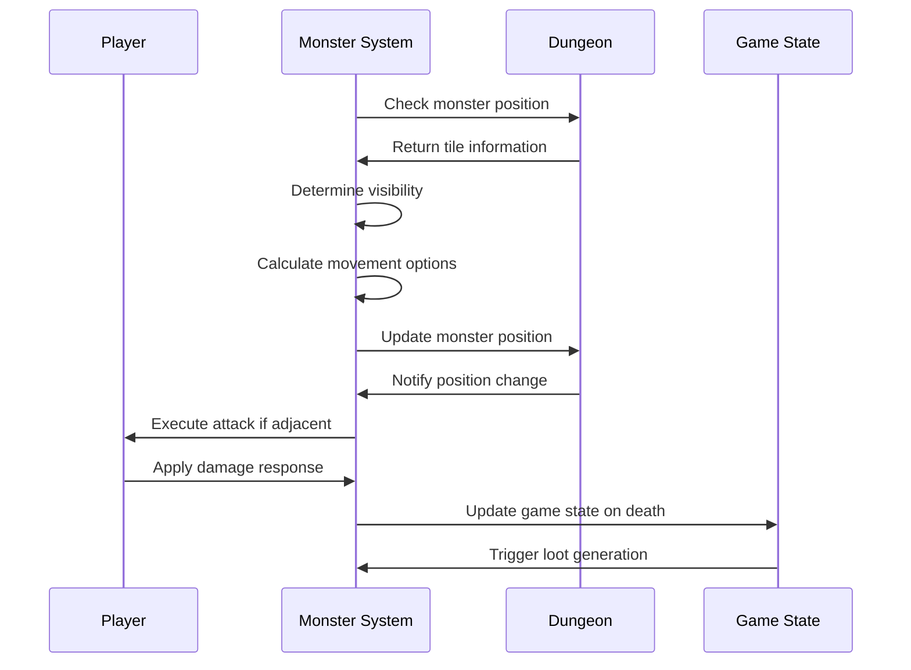

# monster_cpp Module Documentation

## Introduction

The `monster_cpp` module handles all aspects of monster behavior in the game, including movement, attacks, AI decision-making, and interactions with the player. This module is responsible for the core gameplay mechanics involving non-player characters and their strategic behavior within the dungeon environment.

## Architecture Overview

```mermaid
graph TD
    A[monster.cpp] --> B[Monster Movement System]
    A --> C[Monster Attack System]
    A --> D[Monster AI Decision Making]
    A --> E[Monster Combat Mechanics]
    A --> F[Monster Death & Loot System]
    
    B --> B1[Movement Rate Calculation]
    B --> B2[Visibility Management]
    B --> B3[Direction Selection]
    B --> B4[Pathfinding Logic]
    
    C --> C1[Attack Execution]
    C --> C2[Damage Calculation]
    C --> C3[Special Attack Effects]
    C --> C4[Spell Casting]
    
    D --> D1[Confusion Handling]
    D --> D2[Undead Behavior]
    D --> D3[Random Movement]
    D --> D4[Normal Movement]
    
    E --> E1[Combat Resolution]
    E --> E2[Hit Detection]
    E --> E3[Status Effect Application]
    E --> E4[Experience Gain]
    
    F --> F1[Loot Generation]
    F --> F2[Death Effects]
    F --> F3[Experience Distribution]
```

## Core Components and Functionality

### Monster Movement System

The monster movement system controls how creatures navigate the dungeon environment:

- **Movement Rate Calculation**: Determines how many moves a monster gets per turn based on speed and game state
- **Visibility Management**: Handles monster visibility detection based on lighting conditions and player status
- **Direction Selection**: Uses sophisticated algorithms to determine optimal movement directions toward the player
- **Pathfinding Logic**: Implements complex pathfinding that considers obstacles, doors, and special terrain features

### Monster Attack System

The attack system manages all combat interactions between monsters and players:

- **Attack Execution**: Processes different types of attacks with appropriate visual feedback
- **Damage Calculation**: Applies armor reduction and calculates final damage amounts
- **Special Attack Effects**: Handles unique attack types like poison, confusion, and status effects
- **Spell Casting**: Manages magical abilities and breath weapons used by monsters

### Monster AI Decision Making

The AI system governs monster behavior patterns:

- **Confusion Handling**: Manages confused monsters that move randomly
- **Undead Behavior**: Special handling for undead creatures that flee rather than fight
- **Random Movement**: Implements various random movement patterns based on creature properties
- **Normal Movement**: Standard movement logic for most creatures

### Monster Combat Mechanics

Core combat functionality includes:

- **Combat Resolution**: Processes attack outcomes and applies damage
- **Hit Detection**: Determines whether attacks connect based on monster type and player stats
- **Status Effect Application**: Handles various debuffs like blindness, paralysis, and confusion
- **Experience Gain**: Awards experience points to the player upon monster defeat

### Monster Death & Loot System

Handles post-combat scenarios:

- **Loot Generation**: Creates items and gold drops based on monster properties
- **Death Effects**: Triggers win conditions and special death behaviors
- **Experience Distribution**: Awards experience points to the player

## Data Flow and Interactions

## Key Dependencies

This module depends on several other system components:

- [headers.h](headers.h.md): Provides essential definitions and global variables
- [player.cpp](player.cpp.md): Handles player-related functions and interactions
- [dungeon.cpp](dungeon.cpp.md): Manages dungeon layout and object placement
- [inventory.cpp](inventory.cpp.md): Handles item management and player inventory
- [spell.cpp](spell.cpp.md): Contains spell implementation details
- [config.cpp](config.cpp.md): Provides configuration constants and settings

## Module Integration Points

The monster system integrates with the broader game architecture through:

1. **Game Loop Integration**: Called during each game turn to process monster actions
2. **Player Interaction**: Directly affects player health, status, and experience
3. **Dungeon Management**: Works with dungeon systems to handle creature placement and removal
4. **UI Updates**: Triggers screen refreshes when monsters become visible or hidden
5. **Save/Load System**: Maintains monster state for game persistence

## Performance Considerations

The monster system implements several optimizations:

- **Efficient Visibility Checks**: Only processes monsters within reasonable sight distance
- **Early Termination**: Stops processing when character is dead
- **Memory Management**: Properly handles monster deletion and cleanup
- **Conditional Processing**: Only performs expensive calculations when necessary

## Error Handling and Edge Cases

The module handles various edge cases:

- **Dead Monsters**: Prevents processing of monsters that have already died
- **Boundary Conditions**: Ensures coordinate validation for all operations
- **Resource Limits**: Manages monster list size and prevents overflow
- **State Consistency**: Maintains proper game state during complex operations

## Configuration Constants

The module relies on several configuration parameters defined in the config system:

- `MON_MAX_SIGHT`: Maximum distance monsters can see
- `MON_MAX_LEVELS`: Maximum monster level for calculations
- `MON_MULTIPLY_ADJUST`: Adjustment factor for monster multiplication
- Various movement and attack flags for creature behavior customization

This module forms a critical part of the game's core mechanics, providing the dynamic challenge that makes dungeon exploration engaging and unpredictable.
