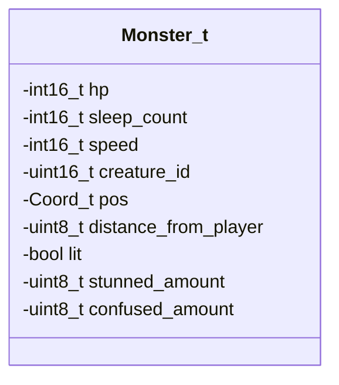
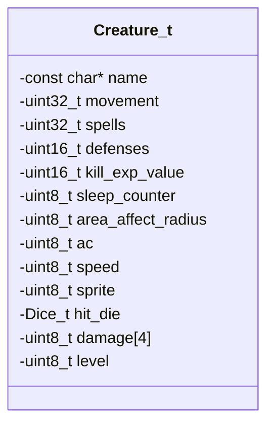
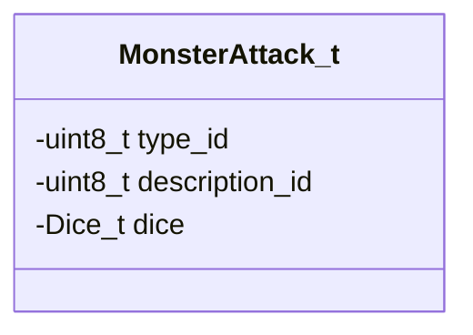

# Monster Handling Module Documentation

## Introduction

The `monster_h` module provides the core data structures and function declarations for managing monsters in the game. This module defines the fundamental data types representing monsters and their base creature properties, along with the interface for monster creation, management, and behavior within the dungeon environment.

## Data Structures

### Monster_t
The `Monster_t` structure represents an individual monster instance currently active in the dungeon. It contains both runtime state information and references to base creature data.



### Creature_t
The `Creature_t` structure defines the base characteristics of all creature types in the game. Each creature type has unique properties that determine its behavior, combat capabilities, and appearance.



### MonsterAttack_t
The `MonsterAttack_t` structure holds information about specific attack types that monsters can use, including damage dice and descriptive information.



## Constants

The module defines several important constants that govern monster behavior and system limits:

- `MON_MAX_CREATURES`: Maximum number of creature definitions (279)
- `MON_ATTACK_TYPES`: Total number of monster attack types (215)
- `MON_TOTAL_ALLOCATIONS`: Maximum monsters that can be allocated (125)
- `MON_MAX_LEVELS`: Maximum creature level (40)
- `MON_MAX_ATTACKS`: Maximum number of attacks per monster (4)

## Function Interface

The module exposes several key functions for monster management:

### Monster Creation and Placement
- `monsterPlaceNew()`: Places a new monster at a specified coordinate
- `monsterPlaceWinning()`: Places winning monsters
- `monsterPlaceNewWithinDistance()`: Places monsters within a specified distance
- `monsterSummon()`: Summons a monster at a random location
- `monsterSummonUndead()`: Summons undead monsters

### Monster Management
- `compactMonsters()`: Compacts monster list to free up space
- `monsterMultiply()`: Handles monster breeding/cloning
- `updateMonsters()`: Updates all monsters in the game
- `monsterDeath()`: Handles monster death and cleanup
- `monsterTakeHit()`: Processes damage taken by a monster

### Monster State Management
- `monsterSleep()`: Determines if a monster should sleep
- `monsterUpdateVisibility()`: Updates monster visibility status
- `printMonsterActionText()`: Prints monster action messages
- `monsterNameDescription()`: Generates monster name descriptions

## Module Relationships

This module works closely with the [creature](creature.md) module which provides the base creature definitions and [dungeon](dungeon.md) module which manages the dungeon layout and coordinate systems. The monster management functions interact with the [map](map.md) module to handle position tracking and visibility calculations.

## System Integration

The monster handling system integrates with the game's main loop through the `updateMonsters()` function, which is called periodically to advance monster AI and behavior. The module also interfaces with the [player](player.md) module to track monster-player interactions and distance calculations.

```mermaid
graph TD
    A[Game Loop] --> B[updateMonsters()]
    B --> C[monsterUpdateVisibility()]
    B --> D[monsterSleep()]
    B --> E[monsterTakeHit()]
    B --> F[monsterDeath()]
    C --> G[map.md]
    D --> H[player.md]
    E --> I[combat.md]
    F --> J[death_handling.md]
    G --> K[dungeon.md]
    H --> L[creature.md]
```

## Memory Management

The module implements a fixed-size allocation system for monsters with `MON_TOTAL_ALLOCATIONS` limiting the maximum number of active monsters. The `compactMonsters()` function handles memory compaction when needed to prevent fragmentation issues during monster breeding or cloning operations.

## Performance Considerations

Due to the fixed allocation model, the system must carefully manage monster spawning and removal to prevent memory exhaustion. The `next_free_monster_id` variable tracks available slots, and the `monster_multiply_total` variable monitors breeding activity to ensure system stability during high monster density situations.
