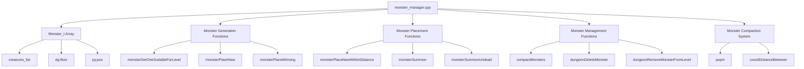
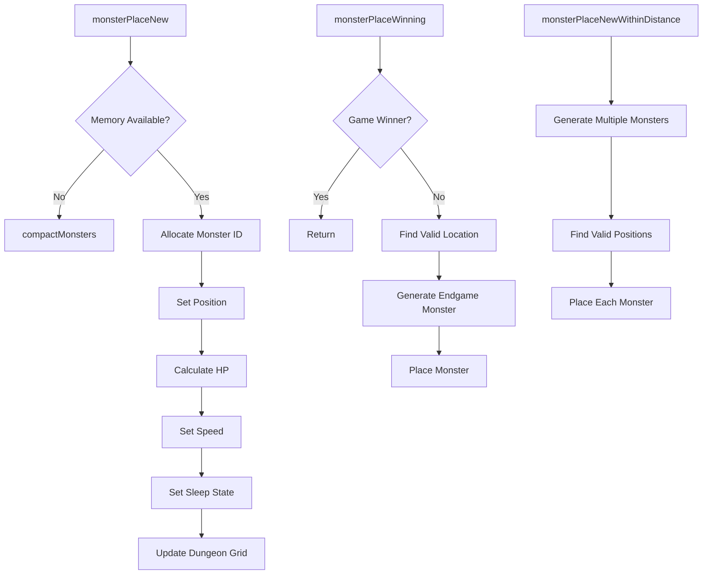
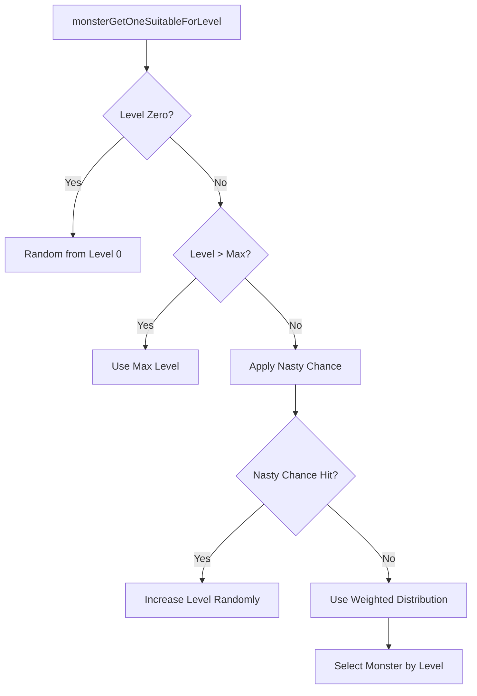
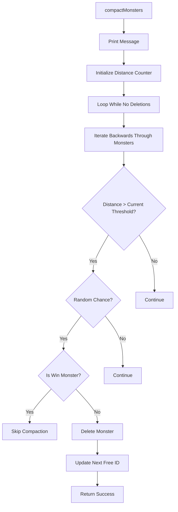

# Monster Manager C++ Module Documentation

## Brief Introduction

The `monster_manager_cpp` module handles the creation, placement, management, and cleanup of monsters within the game world. It provides core functionality for generating monsters at various levels, placing them strategically on dungeon floors, managing their attributes, and handling monster population control through compaction mechanisms.

## Module Overview

This module manages the entire lifecycle of monsters in the game, from initial creation to final removal. It maintains a fixed-size array of monster structures and implements sophisticated algorithms for monster placement, level-based generation, and population management.

### Key Responsibilities

- **Monster Generation**: Creates new monsters with appropriate stats based on creature definitions
- **Monster Placement**: Places monsters at specific coordinates with proper validation
- **Level-Based Spawning**: Generates monsters appropriate for current dungeon level
- **Population Management**: Handles monster compaction when memory limits are reached
- **Special Monster Handling**: Manages end-game monsters and summoned creatures

## Architecture and Component Relationships



## Data Structures and Dependencies

### Core Data Structures

The module uses several key data structures:

1. **Monster_t Array**: Fixed-size array storing all active monsters
2. **Monster_t Structure**: Contains all monster properties including position, health, speed, and state
3. **Coord_t Structure**: Coordinate system for positioning monsters
4. **Global Arrays**: 
   - `monsters[]`: Main monster storage array
   - `monster_levels[]`: Level-based monster distribution tracking

### External Dependencies

The module depends on several other modules for its functionality:

- [creatures_list](creatures_list.md): Provides creature definitions and properties
- [dungeon](dungeon.md): Accesses dungeon floor data for placement validation
- [player](player.md): Uses player position for distance calculations
- [config](config.md): Configuration values for monster behavior and limits

## Detailed Functionality

### Monster Creation and Placement

The core monster creation functions handle different scenarios:



### Level-Based Monster Generation

The monster generation system implements sophisticated level-based spawning:



### Monster Population Management

The compaction system handles memory pressure:



## Integration Points

### With Other Modules

The monster manager integrates with several core systems:

1. **Dungeon System**: Uses `dg.floor` for placement validation and coordinate access
2. **Player System**: References `py.pos` for distance calculations and monster placement
3. **Creature Database**: Depends on `creatures_list` for monster properties and behaviors
4. **Game State**: Interacts with global game state variables for win conditions

### Process Flows

#### Monster Generation Flow

1. Request for new monster placement
2. Check available monster slots
3. Allocate monster ID using `popm()`
4. Generate appropriate monster based on level/conditions
5. Set monster properties (HP, speed, position)
6. Update dungeon grid with monster reference
7. Handle special cases (sleeping dragons, etc.)

#### Monster Compaction Flow

1. Memory pressure detected
2. Begin compaction process
3. Iterate through monsters by distance from player
4. Apply deletion criteria based on distance and random chance
5. Remove distant monsters to free memory
6. Continue until sufficient space is available

## Implementation Details

### Memory Management

The module uses a fixed-size array approach with intelligent allocation:

```cpp
Monster_t monsters[MON_TOTAL_ALLOCATIONS];
int16_t next_free_monster_id;
```

The `popm()` function implements a simple but effective allocation strategy that triggers compaction when necessary.

### Monster Attributes

Each monster stores critical information:
- Position coordinates
- Creature type identifier
- Health points
- Speed modifier
- Sleep counter
- Distance from player
- Stun status

### Special Cases

The module handles several special scenarios:
- **End-game monsters**: Placed at specific locations with unique rules
- **Summoned creatures**: Generated adjacent to target locations
- **Undead summoning**: Special filtering for undead creatures only
- **Dragon placement**: Always created sleeping for fairness

## Performance Considerations

The implementation balances performance with functionality:
- Pre-calculated monster level distributions for fast selection
- Efficient coordinate validation using dungeon grid data
- Minimal memory allocations during normal operation
- Smart compaction that prioritizes distant monsters

## Error Handling

The module implements graceful error handling:
- Returns false on allocation failures
- Aborts on critical win monster allocation failures
- Validates all placements against dungeon constraints
- Handles edge cases in monster generation algorithms

## Configuration Dependencies

The module relies on configuration values defined in the config module:
- `MON_TOTAL_ALLOCATIONS`: Maximum monster capacity
- `MON_MAX_LEVELS`: Highest monster level supported
- Various monster-related constants for behavior control
- Level adjustment parameters for summoned creatures

This module forms a critical part of the game's procedural generation system, ensuring that monsters are appropriately placed and managed throughout gameplay.
