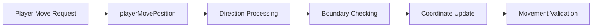
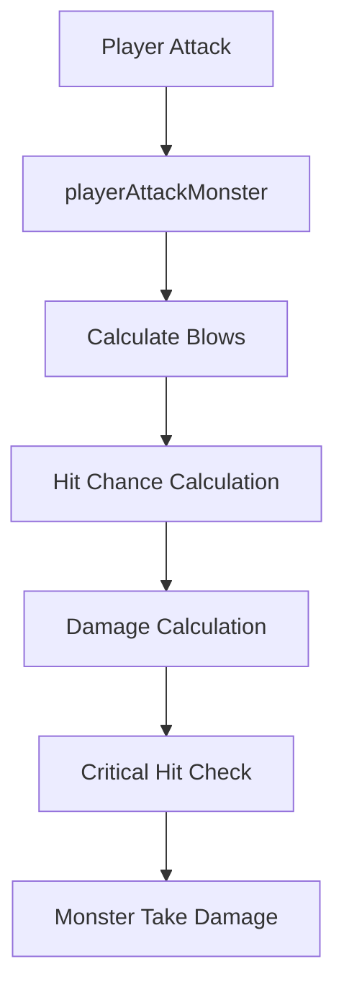
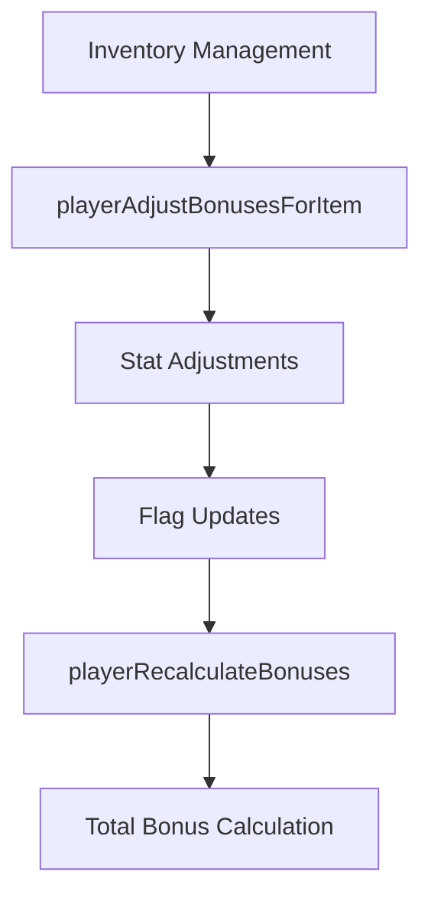
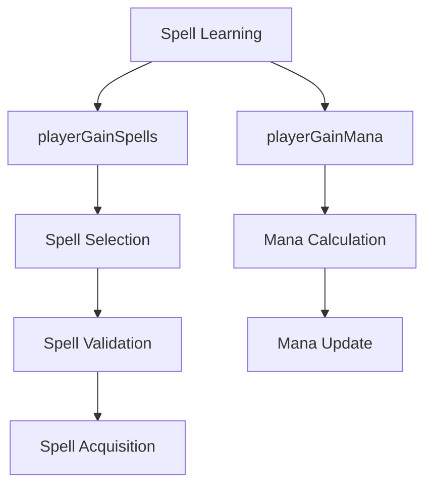
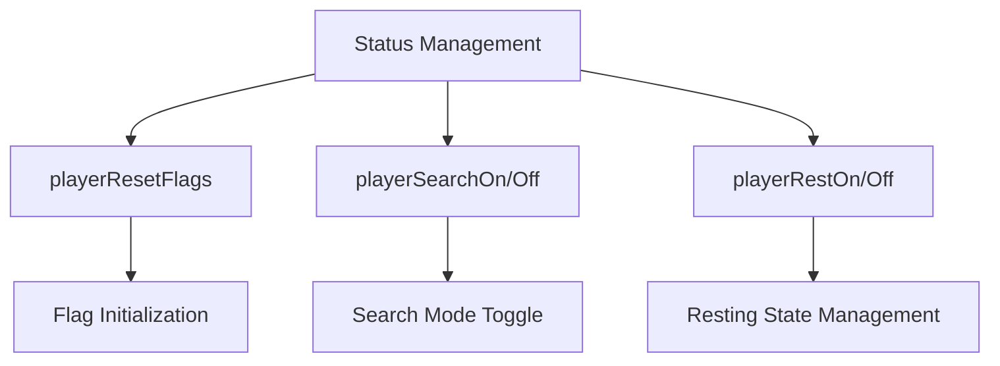
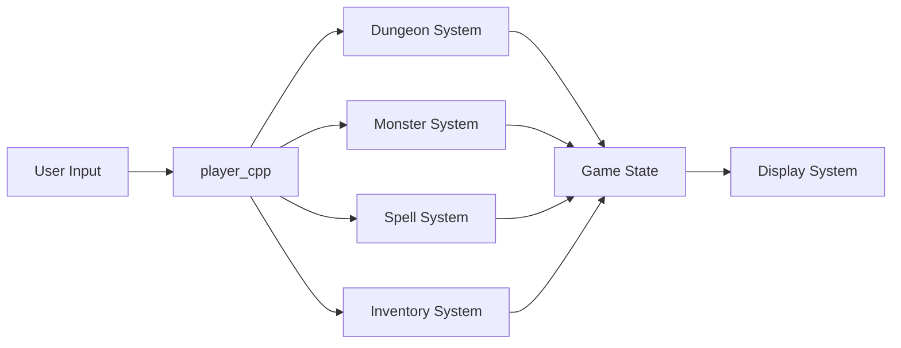

# player_cpp Module Documentation

## Introduction

The `player_cpp` module handles all player-related functionality in the Moria game engine. This module manages player attributes, inventory, combat mechanics, spell systems, and various player states. It serves as the central hub for player interactions with the game world, including movement, combat, inventory management, and magical abilities.

## Architecture Overview

```mermaid
graph TD
    A[player_cpp] --> B[Player_t Management]
    A --> C[Combat System]
    A --> D[Inventory & Equipment]
    A --> E[Spell System]
    A --> F[Status & Flags]
    A --> G[Movement & Positioning]
    
    B --> B1[Player Attributes]
    B --> B2[Player Status Flags]
    B --> B3[Player Statistics]
    
    C --> C1[Attack Mechanics]
    C --> C2[Hit Calculations]
    C --> C3[Damage Calculation]
    
    D --> D1[Inventory Management]
    D --> D2[Equipment Handling]
    D --> D3[Weight & Load]
    
    E --> E1[Spell Learning]
    E --> E2[Mana System]
    E --> E3[Spell Casting]
    
    F --> F1[Player State Tracking]
    F --> F2[Status Effects]
    F --> F3[Temporary Bonuses]
    
    G --> G1[Movement Logic]
    G --> G2[Position Updates]
    G --> G3[Direction Handling]
```

## Core Components and Functionality

### Player Data Structure

The module defines the main player data structure `Player_t` which contains:

- **Player Attributes**: Gender, statistics, level, experience
- **Player Status**: Flags, conditions, and temporary states
- **Player Position**: Current coordinates in the dungeon
- **Inventory Management**: Equipment, pack contents, weights
- **Spell System**: Learned spells, mana, spell learning capabilities

### Movement and Positioning

The module provides functions for player movement and position handling:

Key functions include:
- `playerMovePosition()`: Handles directional movement with boundary validation
- `playerTeleport()`: Implements teleportation mechanics
- `playerOpenClosedObject()`: Opens doors and chests
- `playerCloseDoor()`: Closes open doors

### Combat System

The combat system handles player attacks and damage calculations:

Core combat functions:
- `playerAttackMonster()`: Main attack implementation
- `playerTestBeingHit()`: Hit probability calculations
- `playerWeaponCriticalBlow()`: Critical hit determination
- `playerTakesHit()`: Damage application and death handling

### Inventory and Equipment Management

The module manages player inventory and equipment:

Key functions:
- `playerAdjustBonusesForItem()`: Applies item bonuses to player stats
- `playerRecalculateBonuses()`: Recalculates all player bonuses
- `playerTakeOff()`: Removes items from equipment
- `playerStrength()`: Checks carrying capacity and weapon weight

### Spell System

The spell system handles spell learning, casting, and mana management:

Important spell functions:
- `playerGainSpells()`: Manages spell acquisition
- `playerGainMana()`: Calculates and updates mana
- `playerCalculateAllowedSpellsCount()`: Manages spell limits
- `playerCanRead()`: Checks reading prerequisites

### Status and Flag Management

Player status flags and conditions are managed through:

### Player Statistics and Calculations

The module includes various statistical calculations:

- `playerCarryingLoadLimit()`: Calculates maximum carrying capacity
- `playerStatAdjustmentWisdomIntelligence()`: Stat-based adjustments
- `playerAttackBlows()`: Determines attack frequency
- `playerToHitAdjustment()`: Hit bonus calculations

## Integration Points

This module integrates with several other system components:

- **[dungeon_cpp](dungeon_cpp.md)**: Accesses dungeon data structures for position and tile information
- **[monster_cpp](monster_cpp.md)**: Interacts with monster systems for combat
- **[treasure_cpp](treasure_cpp.md)**: Manages treasure and inventory items
- **[spell_cpp](spell_cpp.md)**: Coordinates with spell systems for magical abilities
- **[input_cpp](input_cpp.md)**: Processes user input for commands

## Data Flow

## Key Constants and Configuration

The module references several configuration constants:

- `config::player::status::PY_SEARCH`: Search mode flag
- `config::player::status::PY_REST`: Resting state flag
- `config::player::status::PY_SPEED`: Speed adjustment flag
- `config::player::PLAYER_WEIGHT_CAP`: Weight capacity multiplier
- `BTH_PER_PLUS_TO_HIT_ADJUST`: Hit chance adjustment per point of to-hit bonus

## Usage Patterns

The player module follows these usage patterns:

1. **State Management**: Player flags and status are updated throughout gameplay
2. **Event Handling**: Functions respond to game events like combat, movement, and item usage
3. **Calculation Updates**: All player statistics are recalculated when equipment changes
4. **Input Processing**: Movement and action commands are processed through player functions

## Performance Considerations

- Frequent recalculation of bonuses when equipment changes
- Efficient hit probability calculations using precomputed tables
- Minimal memory allocation during gameplay operations
- Cached calculations where appropriate for performance

## Error Handling

The module implements robust error checking:
- Boundary validation for movement operations
- Input validation for spell learning and rest commands
- Safe handling of edge cases in calculations
- Graceful degradation when prerequisites aren't met

This module forms the foundation for all player interactions in the game, providing the essential interface between user actions and game mechanics.
