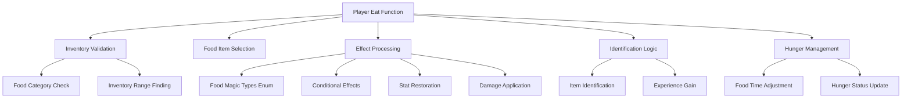
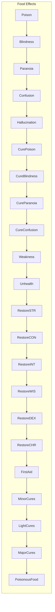
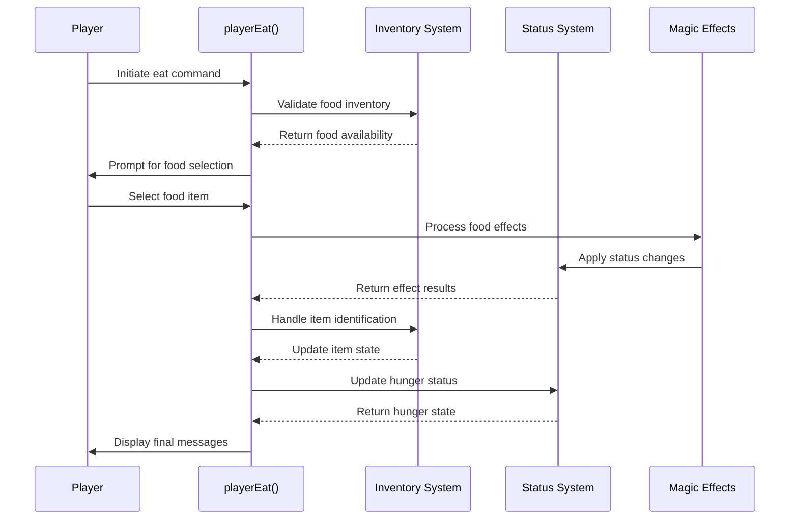

# player_eat_cpp Module Documentation

## Introduction

The `player_eat_cpp` module handles the player's ability to consume food items in the game. This module implements the core logic for eating food, including various effects that can occur when consuming different types of food items, such as healing, status effects, stat modifications, and hunger management.

## Architecture Overview



## Core Components

### Main Functions

#### `playerEat()` - Primary Eating Function
This function orchestrates the entire food consumption process:

1. **Turn Management**: Sets `game.player_free_turn = true` at start and resets it at end
2. **Inventory Validation**: Checks if player has any items and specifically food items
3. **Item Selection**: Prompts player to select a food item from inventory
4. **Effect Processing**: Processes all magic effects associated with the food item
5. **Identification Logic**: Handles item identification and experience gain
6. **Hunger Management**: Updates player's food status and displays hunger messages

#### `playerIngestFood(int amount)` - Hunger Management
Manages the player's food consumption and related effects:

1. **Food Time Adjustment**: Adds food value to player's current food status
2. **Overeating Detection**: Handles bloating when food exceeds maximum capacity
3. **Full Status**: Displays message when player becomes full
4. **Penalty System**: Applies penalties for overconsumption

### Data Structures

#### `FoodMagicTypes` Enum
Defines all possible magical effects that can occur when eating food items:



## Component Interactions



## Dependencies

This module depends on several other system components:

- **[inventory_system](inventory_system.md)**: For inventory validation and item handling
- **[player_status](player_status.md)**: For status effect management and hunger tracking
- **[magic_effects](magic_effects.md)**: For applying various magical effects
- **[character_stats](character_stats.md)**: For stat restoration functions
- **[combat_system](combat_system.md)**: For damage application functions

## Data Flow

```mermaid
flowchart TD
    A[Player Input] --> B[playerEat()]
    B --> C[Inventory Check]
    C --> D{Has Food?}
    D -- No --> E[Error Message]
    D -- Yes --> F[Item Selection]
    F --> G[Effect Processing]
    G --> H{Effect Type}
    H -->|Positive| I[Healing/Restore]
    H -->|Negative| J[Status Effect]
    H -->|Damage| K[Damage Application]
    I --> L[Identification]
    J --> L
    K --> L
    L --> M[Experience Gain]
    L --> N[Hunger Update]
    N --> O[Display Messages]
    O --> P[Return Control]
```

## Process Flow

1. **Initialization**: Set free turn flag and validate inventory
2. **Selection**: Find food items and prompt player for selection
3. **Processing**: 
   - Extract magic effects from item flags
   - Apply appropriate effects based on enum values
   - Handle special cases like stat restoration and healing
4. **Identification**: 
   - Mark items as identified if they have effects
   - Award experience points for identification
5. **Hunger Management**: 
   - Update food status
   - Handle overeating penalties
   - Display appropriate hunger messages
6. **Cleanup**: Remove consumed item from inventory

## Key Features

### Food Effect Types
The module supports 20+ different food effects including:
- Status effects (poison, blindness, paranoia, confusion, hallucination)
- Healing effects (cures, minor/medium/major healing)
- Stat restoration (strength, constitution, intelligence, wisdom, dexterity, charisma)
- Damage effects (poisonous food)
- Special effects (first aid, weakness, unhealth)

### Hunger System Integration
The module integrates with the player's hunger system to:
- Prevent overeating beyond maximum capacity
- Apply penalties for excessive consumption
- Provide feedback messages about hunger states
- Manage food time progression

### Identification System
When food items are consumed:
- Items with identifiable effects are marked as identified
- Players gain experience points for identifying items
- Items without effects are marked as tried
- Experience gain is calculated based on item depth and player level

## Error Handling

The module includes basic error handling for:
- Empty inventory conditions
- Invalid food selection
- Internal processing errors (should never occur due to exhaustive switch statement)
- Overeating scenarios with appropriate penalties

## Performance Considerations

- Minimal memory allocation during normal operation
- Efficient bit manipulation for effect processing
- Early returns for invalid conditions
- Direct access to player and inventory structures

## Related Modules

- [inventory_system](inventory_system.md): Provides inventory management functions used by this module
- [player_status](player_status.md): Manages player status effects and hunger states
- [magic_effects](magic_effects.md): Contains common magic effect application functions
- [character_stats](character_stats.md): Provides stat restoration capabilities
- [combat_system](combat_system.md): Supplies damage application functions for poisonous foods
