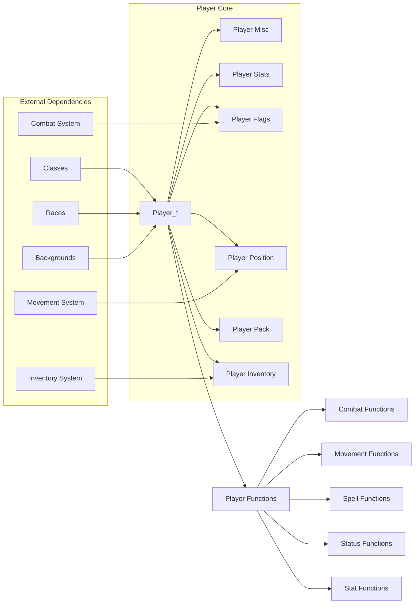
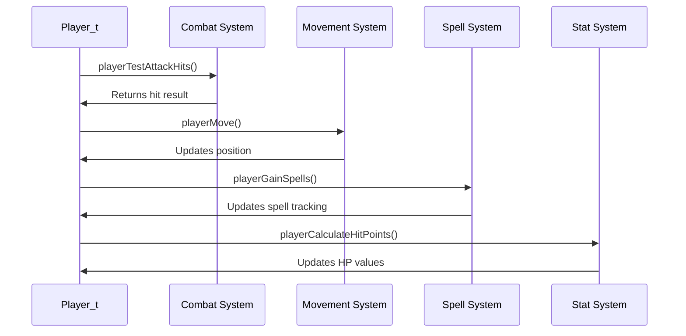

# player_h Module Documentation

## Introduction

The `player_h` module defines the core data structures and function declarations for the player character in the game. This module serves as the central interface for player-related operations including character attributes, inventory management, combat calculations, and status effects. It provides the foundation for all player interactions within the game world.

## Architecture Overview

```mermaid
graph TD
    A[Player_t Structure] --> B[Player Attributes]
    A --> C[Player Stats]
    A --> D[Player Status Flags]
    A --> E[Player Position]
    A --> F[Player Equipment]
    A --> G[Player Experience]
    A --> H[Player Calculations]
    
    B --> B1[Basic Info]
    B --> B2[Combat Stats]
    B --> B3[Physical Stats]
    B --> B4[History Records]
    
    C --> C1[Max Values]
    C --> C2[Current Values]
    C --> C3[Modified Values]
    C --> C4[Used Values]
    
    D --> D1[Status Effects]
    D --> D2[Timed Effects]
    D --> D3[Permanent Effects]
    D --> D4[Spell Tracking]
    
    E --> E1[Location Data]
    E --> E2[Direction Memory]
    
    F --> F1[Inventory Items]
    F --> F2[Equipment Count]
    F --> F3[Weight Management]
    
    G --> G1[Experience Levels]
    G --> G2[Score Tracking]
    G --> G3[Base HP Storage]
    
    H --> H1[Combat Calculations]
    H --> H2[Stat Adjustments]
    H --> H3[Movement Calculations]
    H --> H4[Spell Calculations]
```



## Core Data Structures

### Player_t Structure

The main player data structure that encapsulates all character information:

```c
typedef struct Player_t {
    struct {
        char name[PLAYER_NAME_SIZE];    // Name of character
        bool gender;                    // Gender of character
        int32_t date_of_birth;          // Unix time for when the character was created
        int32_t au;                     // Gold
        int32_t max_exp;                // Max experience
        int32_t exp;                    // Cur experience
        uint16_t exp_fraction;          // Cur exp fraction * 2^16
        uint16_t age;                   // Characters age
        uint16_t height;                // Height
        uint16_t weight;                // Weight
        uint16_t level;                 // Level
        uint16_t max_dungeon_depth;     // Max level explored
        int16_t chance_in_search;       // Chance in search
        int16_t fos;                    // Frequency of search
        int16_t bth;                    // Base to hit
        int16_t bth_with_bows;          // BTH with bows
        int16_t mana;                   // Mana points
        int16_t max_hp;                 // Max hit pts
        int16_t plusses_to_hit;         // Plusses to hit
        int16_t plusses_to_damage;      // Plusses to dam
        int16_t ac;                     // Total AC
        int16_t magical_ac;             // Magical AC
        int16_t display_to_hit;         // Display +ToHit
        int16_t display_to_damage;      // Display +ToDam
        int16_t display_ac;             // Display +ToTAC
        int16_t display_to_ac;          // Display +ToAC
        int16_t disarm;                 // % to Disarm
        int16_t saving_throw;           // Saving throw
        int16_t social_class;           // Social Class
        int16_t stealth_factor;         // Stealth factor
        uint8_t class_id;               // # of class
        uint8_t race_id;                // # of race
        uint8_t hit_die;                // Char hit die
        uint8_t experience_factor;      // Experience factor
        int16_t current_mana;           // Current mana points
        uint16_t current_mana_fraction; // Current mana fraction * 2^16
        int16_t current_hp;             // Current hit points
        uint16_t current_hp_fraction;   // Current hit points fraction * 2^16
        char history[4][60];            // History record
    } misc{};

    struct {
        uint8_t max[6];      // What is restored
        uint8_t current[6];  // What is natural
        int16_t modified[6]; // What is modified, may be +/-
        uint8_t used[6];     // What is used
    } stats{};

    struct {
        uint32_t status;          // Status of player
        int16_t rest;             // Rest counter
        int16_t blind;            // Blindness counter
        int16_t paralysis;        // Paralysis counter
        int16_t confused;         // Confusion counter
        int16_t food;             // Food counter
        int16_t food_digested;    // Food per round
        int16_t protection;       // Protection fr. evil
        int16_t speed;            // Cur speed adjust
        int16_t fast;             // Temp speed change
        int16_t slow;             // Temp speed change
        int16_t afraid;           // Fear
        int16_t poisoned;         // Poisoned
        int16_t image;            // Hallucinate
        int16_t protect_evil;     // Protect VS evil
        int16_t invulnerability;  // Increases AC
        int16_t heroism;          // Heroism
        int16_t super_heroism;    // Super Heroism
        int16_t blessed;          // Blessed
        int16_t heat_resistance;  // Timed heat resist
        int16_t cold_resistance;  // Timed cold resist
        int16_t detect_invisible; // Timed see invisible
        int16_t word_of_recall;   // Timed teleport level
        int16_t see_infra;        // See warm creatures
        int16_t timed_infra;      // Timed infra vision
        bool see_invisible;       // Can see invisible
        bool teleport;            // Random teleportation
        bool free_action;         // Never paralyzed
        bool slow_digest;         // Lower food needs
        bool aggravate;           // Aggravate monsters
        bool resistant_to_fire;   // Resistance to fire
        bool resistant_to_cold;   // Resistance to cold
        bool resistant_to_acid;   // Resistance to acid
        bool regenerate_hp;       // Regenerate hit pts
        bool resistant_to_light;  // Resistance to light
        bool free_fall;           // No damage falling
        bool sustain_str;         // Keep strength
        bool sustain_int;         // Keep intelligence
        bool sustain_wis;         // Keep wisdom
        bool sustain_con;         // Keep constitution
        bool sustain_dex;         // Keep dexterity
        bool sustain_chr;         // Keep charisma
        bool confuse_monster;     // Glowing hands.

        uint8_t new_spells_to_learn;      // Number of spells can learn.
        uint32_t spells_learnt;           // bit mask of spells learned
        uint32_t spells_worked;           // bit mask of spells tried and worked
        uint32_t spells_forgotten;        // bit mask of spells learned but forgotten
        uint8_t spells_learned_order[32]; // order spells learned/remembered/forgotten
    } flags{};

    Coord_t pos{};       // location in dungeon
    char prev_dir = ' '; // Direction memory. -CJS-

    // calculated base hp values at each level, store them so that
    // drain life + restore life does not affect hit points.
    uint16_t base_hp_levels[PLAYER_MAX_LEVEL]{};

    // Base experience levels, may be adjusted up for race and/or class
    uint32_t base_exp_levels[PLAYER_MAX_LEVEL]{};

    uint8_t running_tracker = 0;       // Tracker for number of turns taken during one run cycle
    bool temporary_light_only = false; // Track if temporary light about player

    int32_t max_score = 0; // Maximum score attained

    struct {
        int16_t unique_items = 0; // unique_inventory_items in pack
        int16_t weight = 0;       // Weight of currently carried items
        int16_t heaviness = 0;    // Heaviness of pack - used to calculate if pack is too heavy -CJS-
    } pack;

    Inventory_t inventory[PLAYER_INVENTORY_SIZE]{};

    int16_t equipment_count = 0;  // Number of equipped items
    bool weapon_is_heavy = false; // Weapon is too heavy -CJS-
    bool carrying_light = false;  // `true` when player is carrying light
} Player_t;
```

## Constants and Enums

### Player Class Level Adjustment Enum

```c
enum PlayerClassLevelAdj {
    BTH,
    BTHB,
    DEVICE,
    DISARM,
    SAVE,
};
```

### Player Attribute Enum

```c
enum PlayerAttr {
    A_STR,
    A_INT,
    A_WIS,
    A_DEX,
    A_CON,
    A_CHR,
};
```

### Player Constants

```c
constexpr uint8_t CLASS_MISC_HIT = 4;
constexpr uint8_t CLASS_MAX_LEVEL_ADJUST = 5;
constexpr uint8_t PLAYER_MAX_LEVEL = 40;
constexpr uint8_t PLAYER_MAX_CLASSES = 6;
constexpr uint8_t PLAYER_MAX_RACES = 8;
constexpr uint8_t PLAYER_MAX_BACKGROUNDS = 128;
constexpr uint8_t BTH_PER_PLUS_TO_HIT_ADJUST = 3;
constexpr uint8_t PLAYER_NAME_SIZE = 27;
```

## Component Relationships



## Data Flow



## Function Categories

### Basic Player Operations

```c
bool playerIsMale();
void playerSetGender(bool is_male);
const char *playerGetGenderLabel();
bool playerMovePosition(int dir, Coord_t &coord);
void playerTeleport(int new_distance);
bool playerNoLight();
void playerDisturb(int major_disturbance, int light_disturbance);
```

### Combat and Attack Functions

```c
void playerSearchOn();
void playerSearchOff();
void playerRestOn();
void playerRestOff();
void playerDiedFromString(vtype_t *description, const char *monster_name, uint32_t move);
bool playerTestAttackHits(int attack_id, uint8_t level);
void playerChangeSpeed(int speed);
void playerAdjustBonusesForItem(Inventory_t const &item, int factor);
void playerRecalculateBonuses();
void playerTakeOff(int item_id, int pack_position_id);
bool playerTestBeingHit(int base_to_hit, int level, int plus_to_hit, int armor_class, int attack_type_id);
void playerTakesHit(int damage, const char *creature_name);
void playerSearch(Coord_t coord, int chance);
```

### Spell and Magic Functions

```c
void playerGainSpells();
void playerGainMana(int stat);
int playerWeaponCriticalBlow(int weapon_weight, int plus_to_hit, int damage, int attack_type_id);
bool playerSavingThrow();
void playerCureConfusion();
bool playerCureBlindness();
bool playerCurePoison();
bool playerRemoveFear();
bool playerProtectEvil();
void playerBless(int adjustment);
void playerDetectInvisible(int adjustment);
int itemMagicAbilityDamage(Inventory_t const &item, int total_damage, int monster_id);
```

### Movement and Navigation

```c
void playerMove(int direction, bool do_pickup);
void playerFindInitialize(int direction);
void playerRunAndFind();
void playerEndRunning();
void playerAreaAffect(int direction, Coord_t coord);
```

### Statistics and Calculation Functions

```c
void playerInitializeBaseExperienceLevels();
void playerCalculateHitPoints();
int playerAttackBlows(int weight, int &weight_to_hit);
int playerStatAdjustmentWisdomIntelligence(int stat);
int playerStatAdjustmentCharisma();
int playerStatAdjustmentConstitution();
void playerSetAndUseStat(int stat);
bool playerStatRandomIncrease(int stat);
bool playerStatRandomDecrease(int stat);
bool playerStatRestore(int stat);
void playerStatBoost(int stat, int amount);
int16_t playerToHitAdjustment();
int16_t playerArmorClassAdjustment();
int16_t playerDisarmAdjustment();
int16_t playerDamageAdjustment();
```

### Equipment and Inventory Functions

```c
bool playerLeftHandRingEmpty();
bool playerRightHandRingEmpty();
bool playerIsWieldingItem();
bool playerWornItemIsCursed(PlayerEquipment id);
void playerWornItemRemoveCurse(PlayerEquipment id);
int playerCarryingLoadLimit();
void playerStrength();
```

## Integration Points

This module integrates with several other system components:

- **[inventory_h](inventory_h.md)**: Manages player inventory and equipment
- **[combat_h](combat_h.md)**: Handles combat calculations and attacks
- **[movement_h](movement_h.md)**: Controls player movement and positioning
- **[spell_h](spell_h.md)**: Manages spell learning and casting
- **[stat_h](stat_h.md)**: Handles player statistics and attribute management
- **[race_h](race_h.md)**: Provides race-specific player characteristics
- **[class_h](class_h.md)**: Defines class-specific player abilities and adjustments

## Usage Patterns

The `player_h` module follows a pattern where player state is maintained through the global `py` variable of type `Player_t`. All functions operate on this global instance, making it the central point for player data access and modification throughout the game engine.

Functions are organized by category to support different aspects of gameplay:
- Combat-related functions handle attacks, defenses, and damage calculations
- Movement-related functions manage player positioning and navigation
- Spell-related functions control magical abilities and effects
- Stat-related functions manage player attributes and their modifications
- Inventory-related functions handle equipment and carrying capacity

The module uses a combination of direct data access and function-based operations to maintain player state while providing a clean interface for other systems to interact with player data.
