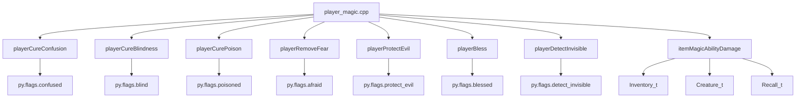
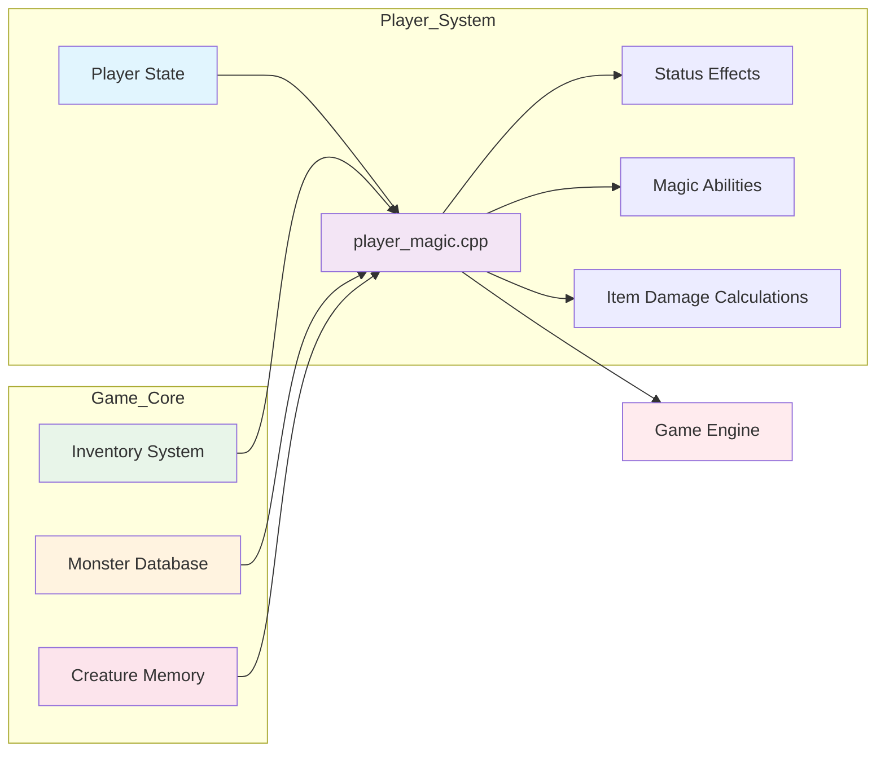
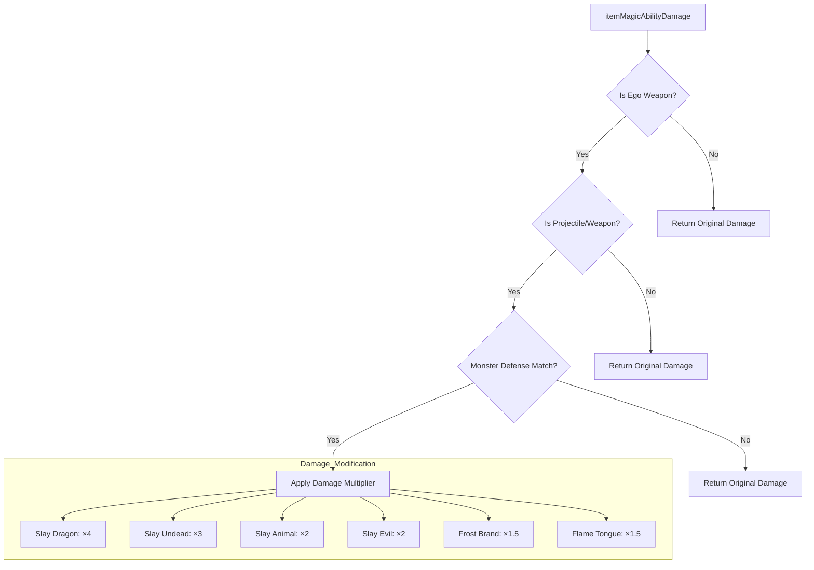

# player_magic_cpp Module Documentation

## Brief Introduction

The `player_magic_cpp` module contains core functions related to player magical abilities and effects in the game. This module handles various player status conditions, magical protections, and item-based damage calculations that affect combat interactions. It provides essential functionality for managing player magical states and weapon effectiveness against different monster types.

## Module Overview

This module implements several key player magic functionalities including:
- Status condition removal (confusion, blindness, poison, fear)
- Magical protection mechanisms
- Blessing effects
- Detection abilities
- Item magic ability damage calculations

## Architecture and Component Relationships

### Core Components

The module consists of a single C++ source file (`player_magic.cpp`) that implements multiple functions operating on player and inventory data structures.



### Data Flow and Dependencies



## Detailed Function Documentation

### Status Condition Removal Functions

#### `playerCureConfusion()`
Removes confusion status from the player by reducing the confusion counter to 1 if it's greater than 1.

#### `playerCureBlindness()`
Removes blindness status from the player by reducing the blindness counter to 1 if it's greater than 1.

#### `playerCurePoison()`
Removes poison status from the player by reducing the poisoned counter to 1 if it's greater than 1.

#### `playerRemoveFear()`
Removes fear status from the player by reducing the afraid counter to 1 if it's greater than 1.

### Magical Protection Functions

#### `playerProtectEvil()`
Implements the player's protection against evil creatures. Returns true if the player was previously unprotected, and increases the protection duration based on random factors and player level.

### Blessing and Detection Functions

#### `playerBless(int adjustment)`
Applies blessing effects to the player by adjusting the blessed status flag.

#### `playerDetectInvisible(int adjustment)`
Enables detection of invisible creatures for a specified period by adjusting the detect invisible status flag.

### Item Magic Ability Damage Calculation

#### `itemMagicAbilityDamage(Inventory_t const &item, int total_damage, int monster_id)`
Calculates modified damage based on item properties and monster defenses:

- **Ego Weapons**: Special damage multipliers for specific monster types
- **Slaying Properties**: Multipliers for dragons, undead, animals, evil creatures
- **Elemental Properties**: Frost and fire damage bonuses
- **Projectile/Weapon Types**: Only applies to appropriate item categories



## Integration Points

This module integrates with several other system components:

1. **Player State Management** ([player_state.md](player_state.md)): Directly modifies player flags and status variables
2. **Inventory System** ([inventory_system.md](inventory_system.md)): Processes item properties and flags
3. **Monster Database** ([monster_database.md](monster_database.md)): Accesses creature defense properties
4. **Combat System** ([combat_system.md](combat_system.md)): Provides damage calculation logic for weapon attacks

## Usage Examples

### Removing Status Conditions
```cpp
if (playerCureConfusion()) {
    // Handle confusion removal
}
```

### Applying Magical Protection
```cpp
if (playerProtectEvil()) {
    // Player was previously unprotected
}
```

### Damage Calculation
```cpp
int final_damage = itemMagicAbilityDamage(player_weapon, base_damage, monster_id);
```

## Performance Considerations

The module operations are lightweight and primarily involve simple flag manipulations and conditional checks. The damage calculation function performs bitwise operations and comparisons but maintains constant time complexity regardless of input size.

## Related Modules

- [player_state.md](player_state.md): Player state management and flags
- [inventory_system.md](inventory_system.md): Inventory and item handling
- [monster_database.md](monster_database.md): Monster definitions and properties
- [combat_system.md](combat_system.md): Combat mechanics and damage calculations
