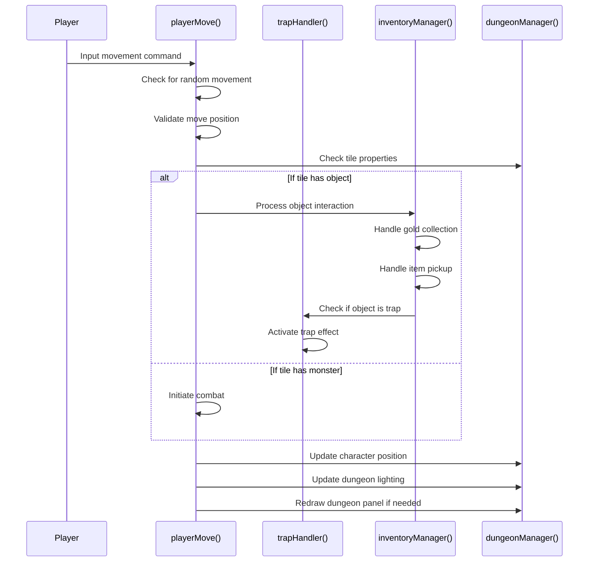

# player_move_cpp Module Documentation

## Introduction

The `player_move_cpp` module handles all player movement logic and interactions within the game world. This includes movement mechanics, trap detection and activation, object collection, and combat initiation. The module serves as the primary interface between player input and game state changes, managing how characters navigate the dungeon environment.

## Architecture Overview

```mermaid
graph TD
    A[playerMove] --> B[playerRandomMovement]
    A --> C[playerMovePosition]
    A --> D[carry]
    D --> E[inventoryCanCarryItemCount]
    D --> F[inventoryCanCarryItem]
    D --> G[inventoryCarryItem]
    D --> H[playerStepsOnTrap]
    H --> I[trapOpenPit]
    H --> J[trapArrow]
    H --> K[trapCoveredPit]
    H --> L[trapDoor]
    H --> M[trapSleepingGas]
    H --> N[trapHiddenObject]
    H --> O[trapStrengthDart]
    H --> P[trapTeleport]
    H --> Q[trapRockfall]
    H --> R[trapCorrodeGas]
    H --> S[trapSummonMonster]
    H --> T[trapFire]
    H --> U[trapAcid]
    H --> V[trapPoisonGas]
    H --> W[trapBlindGas]
    H --> X[trapConfuseGas]
    H --> Y[trapSlowDart]
    H --> Z[trapConstitutionDart]
    
    A --> AA[playerAttackPosition]
    A --> AB[drawDungeonPanel]
    A --> AC[playerSearch]
    A --> AD[dungeonLightRoom]
    A --> AE[dungeonMoveCharacterLight]
    A --> AF[dungeonMoveCreatureRecord]
    A --> AG[coordOutsidePanel]
    A --> AH[playerAreaAffect]
    A --> AI[playerEndRunning]
```

## Core Components

### Main Functions

#### `playerMove(int direction, bool do_pickup)`
The primary entry point for player movement operations. This function processes player input to move the character in a specified direction, handling various scenarios including:
- Random movement when confused
- Movement validation
- Object interaction (pickup, trap activation)
- Combat initiation against monsters
- Dungeon lighting updates
- Panel boundary checking

#### `playerStepsOnTrap(Coord_t coord)`
Handles trap activation when the player steps on a trap tile. This function:
- Determines the specific trap type from the treasure list
- Executes appropriate trap behavior based on trap type
- Manages trap visibility changes
- Processes damage calculations and effects

#### `carry(Coord_t coord, bool pickup)`
Manages object interactions when the player moves onto a tile containing an object. This function:
- Handles gold collection
- Processes item pickup with inventory management
- Manages inventory capacity checks
- Handles special object types like traps and doors

### Trap Handling Functions

The module implements numerous trap-specific functions that handle different trap behaviors:

- **Pit Traps**: `trapOpenPit`, `trapCoveredPit`
- **Projectile Traps**: `trapArrow`, `trapStrengthDart`, `trapSlowDart`, `trapConstitutionDart`
- **Environmental Traps**: `trapDoor`, `trapSleepingGas`, `trapRockfall`, `trapCorrodeGas`
- **Gas Traps**: `trapBlindGas`, `trapConfuseGas`, `trapPoisonGas`
- **Special Traps**: `trapTeleport`, `trapHiddenObject`, `trapSummonMonster`, `trapFire`, `trapAcid`

### Utility Functions

#### `playerRandomMovement(int dir)`
Determines whether the player should move randomly due to confusion status, implementing a 75% chance of random movement when confused.

#### `playerMovePosition(int direction, Coord_t& coord)`
Validates if a movement action is legal based on current position and destination tile properties.

## Data Flow

## Component Interactions

The `player_move_cpp` module interacts with several other core systems:

- **[inventory](inventory.md)**: Manages item pickup and inventory capacity checks
- **[dungeon](dungeon.md)**: Handles dungeon tile manipulation and lighting updates
- **[monster](monster.md)**: Coordinates combat actions when moving into monster positions
- **[player](player.md)**: Accesses player status flags and attributes
- **[game](game.md)**: Manages global game state variables like teleportation flags

## Dependencies

This module depends on:
- `headers.h`: Contains necessary type definitions and function declarations
- [inventory](inventory.md): For item handling and carrying logic
- [dungeon](dungeon.md): For dungeon tile management and lighting
- [monster](monster.md): For combat-related functions
- [player](player.md): For player status and attribute access
- [game](game.md): For global game state management

## Error Handling

The module implements basic error handling through:
- Movement validation to prevent illegal moves
- Inventory capacity checks to prevent overloading
- Trap type validation to ensure proper execution
- Status flag checks for special conditions (blindness, paralysis, etc.)

## Performance Considerations

The module is designed for efficient real-time processing of player actions. Key performance considerations include:
- Early exit conditions for invalid moves
- Minimal memory allocation during normal operation
- Efficient coordinate calculations
- Batch processing of dungeon updates

## Usage Patterns

The typical usage pattern involves:
1. Receiving player input via user interface
2. Calling `playerMove()` with direction and pickup flags
3. Processing movement validation and tile interactions
4. Updating game state and rendering as needed

This module forms the backbone of player interaction with the game world, making it essential for maintaining game flow and player engagement.
