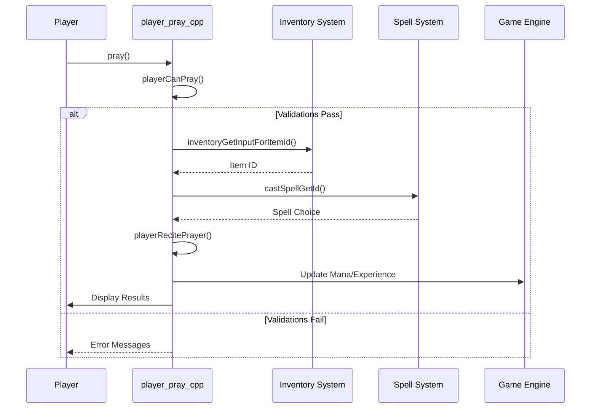

# player_pray_cpp Module Documentation

## Brief Introduction

The `player_pray_cpp` module implements the prayer system for priest characters in the game. This module handles the logic for praying, selecting prayers from holy books, and executing various priest spells. It provides the core functionality for players to use their divine abilities through prayer-based magic.

## Module Overview

This module contains the implementation for priest spell casting mechanics, including validation checks, spell selection, and execution of various divine abilities. The system integrates with the broader game engine through several key components:

- Player state validation before prayer
- Spell selection and casting interface
- Prayer execution with appropriate effects
- Mana management and spell cost handling
- Integration with character statistics and inventory systems

## Architecture and Component Relationships

### Core Components

The main components of this module are:

1. **`playerCanPray()`** - Validates whether the player can perform a prayer
2. **`playerRecitePrayer()`** - Executes specific priest spells based on type
3. **`pray()`** - Main prayer interface function that coordinates the entire process

### Data Flow

```mermaid
graph TD
    A[pray()] --> B[playerCanPray()]
    B --> C{Validations Pass?}
    C -->|No| D[Return]
    C -->|Yes| E[inventoryGetInputForItemId()]
    E --> F[castSpellGetId()]
    F --> G{Spell Selected?}
    G -->|No| H[Return]
    G -->|Yes| I[playerRecitePrayer()]
    I --> J{Success?}
    J -->|No| K[Print Concentration Loss]
    J -->|Yes| L[Update Experience]
    L --> M[Mana Cost Handling]
    M --> N[Print Mana Status]
```

### System Dependencies

This module depends on several other core systems:

- **Inventory Management** ([inventory.md](inventory.md)): For finding holy books and managing items
- **Spell System** ([magic_spells.md](magic_spells.md)): For spell data structures and casting mechanics
- **Player State Management** ([player_state.md](player_state.md)): For checking player conditions and status
- **Game Engine** ([game_engine.md](game_engine.md)): For game state variables and global settings

## Detailed Functionality

### Player Prayer Validation (`playerCanPray`)

The `playerCanPray` function performs essential checks to ensure a player can properly pray:

1. **Vision Check**: Ensures the player isn't blind
2. **Light Check**: Verifies the player has adequate lighting
3. **Confusion Check**: Confirmed players cannot pray effectively
4. **Class Validation**: Only priests can pray
5. **Inventory Check**: Player must carry items
6. **Book Availability**: Must have a holy book available

### Spell Execution (`playerRecitePrayer`)

The `playerRecitePrayer` function handles the actual execution of priest spells through a switch statement that maps spell types to their respective effects. The spell types include:

- **Detection Spells**: Detect evil, find traps, detect doors/stairs
- **Healing Spells**: Cure light/medium/serious/critical wounds
- **Buff Spells**: Bless, sanctuary, protection from evil
- **Utility Spells**: Call light, create food, sense surroundings
- **Combat Spells**: Blind creatures, earthquake, turn undead
- **Advanced Spells**: Holy word, glyph of warding, dispel evil

### Main Prayer Interface (`pray`)

The `pray` function serves as the central coordination point:

1. **Validation**: Calls `playerCanPray` to verify prerequisites
2. **Selection**: Uses inventory and spell selection interfaces
3. **Execution**: Calls `playerRecitePrayer` when a spell is chosen
4. **Mana Management**: Handles spell costs and player fatigue
5. **Experience Gain**: Awards experience for learned spells

## Process Flow



## Integration Points

### With Other Modules

1. **Inventory System**: Uses `inventoryFindRange()` and `inventoryGetInputForItemId()` for book selection
2. **Magic System**: Relies on `castSpellGetId()` and `magic_spells[]` array for spell data
3. **Player State**: Interacts with `py.flags` and `py.misc` for player conditions and stats
4. **Game Engine**: Accesses `game.player_free_turn` and manages game state variables

### Data Structures Used

- **PriestSpellTypes Enum**: Defines all available priest spell types
- **Spell_t Structure**: Contains spell properties like mana cost and experience gain
- **Dice_t Structure**: Used for damage calculation in healing spells
- **Player State Variables**: Various flags and attributes from the player structure

## Error Handling and Edge Cases

The module includes comprehensive error handling for:
- Invalid player states (blind, confused, etc.)
- Insufficient inventory or missing holy books
- Failed spell casting due to concentration loss
- Mana depletion and player fatigue
- Spell learning and experience tracking

## Performance Considerations

The module is designed to be lightweight and efficient, with minimal overhead during normal operation. All validation checks are performed early to prevent unnecessary processing, and spell execution uses direct function calls rather than complex dispatch mechanisms.

## Security and Safety

The module ensures proper validation of all inputs and maintains consistent player state throughout the prayer process. It prevents invalid spell casting through multiple validation layers and handles edge cases gracefully without crashing the game.
