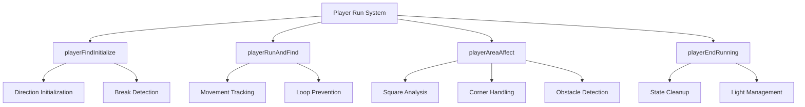
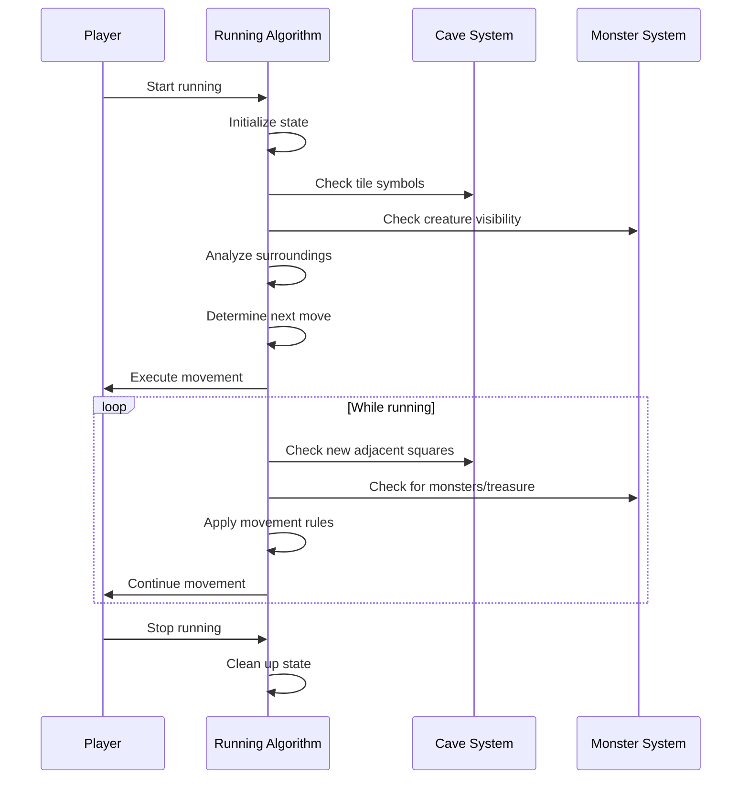

# player_run_cpp Module Documentation

## Introduction

The `player_run_cpp` module implements the core running algorithm for player movement in the game. This module handles the logic for continuous movement through dungeon environments, including corridor navigation, doorway detection, and corner handling. The implementation follows a sophisticated approach that considers visibility, environmental constraints, and strategic movement patterns.

## Architecture Overview

## Core Components

### 1. Static Variables and Constants

The module maintains several key state variables:

- `cycle[]`: Direction cycle array for movement calculations
- `chome[]`: Direction mapping array
- `find_openarea`: Tracks if player is in open area
- `find_breakleft/right`: Tracks wall presence on sides
- `find_prevdir`: Previous movement direction
- `find_direction`: Current movement direction

### 2. Key Functions

#### `playerFindInitialize(int direction)`
Initializes the running state and sets up break detection based on the starting direction.

#### `playerRunAndFind()`
Handles the actual running movement, tracking progress and preventing infinite loops.

#### `playerAreaAffect(int direction, Coord_t coord)`
Analyzes the current environment to determine next movement direction or stopping conditions.

#### `playerEndRunning()`
Cleans up running state and manages lighting effects.

### 3. Helper Functions

#### `playerCanSeeDungeonWall(int dir, Coord_t coord)`
Determines if a wall is visible in a given direction.

#### `playerSeeNothing(int dir, Coord_t coord)`
Checks if a square appears empty in a given direction.

#### `findRunningBreak(int dir, Coord_t coord)`
Sets up break detection based on surrounding walls.

#### `areaAffectStopLookingAtSquares(...)`
Core logic for analyzing newly adjacent squares during movement.

## Data Flow and Process Flow

## Component Interactions

The `player_run_cpp` module interacts with several other systems:

- **[cave_system](cave_system.md)**: Uses `caveGetTileSymbol()` to analyze terrain
- **[player](player.md)**: Accesses player state via `py` structure
- **[monster](monster.md)**: Checks creature visibility and positions
- **[lighting](lighting.md)**: Manages light effects and visibility
- **[game](game.md)**: Accesses global game state and configuration

## Movement Logic

The running algorithm follows these principles:

1. **Corridor Navigation**: When in enclosed spaces, follow walls and corners
2. **Open Area Movement**: Move straight until approaching enclosed areas
3. **Doorway Detection**: Stop before entering enclosed spaces
4. **Wall Following**: Handle situations where walls exist on one side only

## Configuration Dependencies

The module respects several configuration options:

- `run_print_self`: Controls player symbol display during running
- `run_ignore_doors`: Determines if doors should halt running
- `run_examine_corners`: Whether to examine potential corners
- `run_cut_corners`: Whether to cut corners when possible

## Error Handling and Safety

The module includes several safety mechanisms:

- Infinite loop prevention (stops after 100 moves)
- Visibility checks for blind players
- Proper cleanup of running state
- Light management during movement

## Performance Considerations

The algorithm is designed for efficiency by:
- Using precomputed direction arrays
- Limiting analysis to newly adjacent squares
- Early termination conditions
- Minimal memory allocation during runtime

This implementation provides robust player movement behavior that adapts to various dungeon layouts while maintaining performance characteristics suitable for real-time gameplay.
