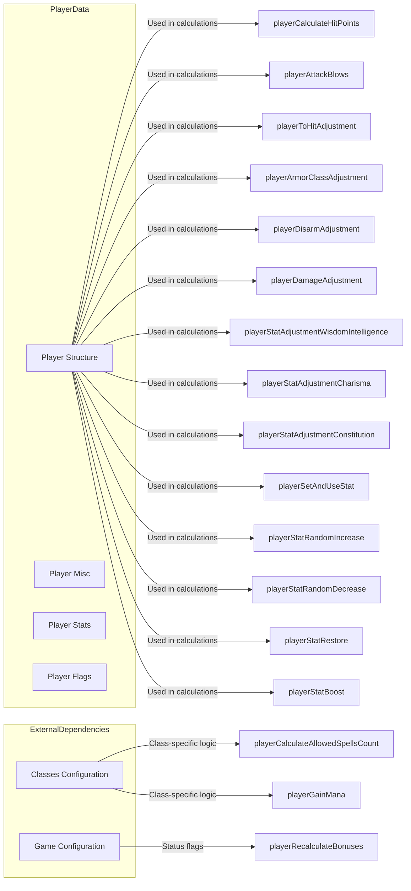
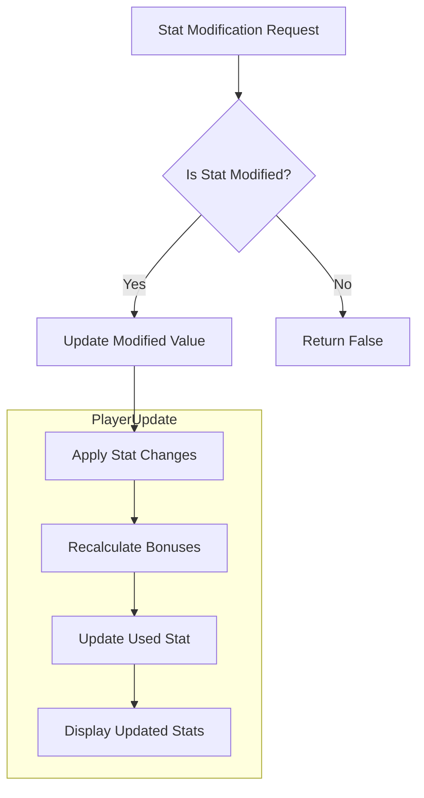
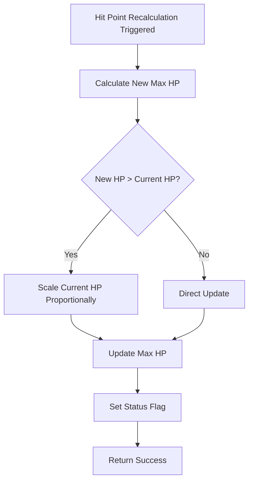

# Player Stats C++ Module Documentation

## Introduction

The `player_stats_cpp` module handles all player statistics calculations and management within the game engine. This module provides functions for initializing experience levels, calculating hit points, determining attack blows, and managing various attribute adjustments that affect gameplay mechanics.

## Module Overview

This module contains core C++ functions that manage player character statistics including:
- Experience level progression
- Hit point calculations
- Attack blow determination
- Stat modifications and adjustments
- Armor class and combat modifiers

## Architecture and Component Relationships

```mermaid
graph TD
    A[player_stats.cpp] --> B[Experience Management]
    A --> C[Hit Point Calculations]
    A --> D[Combat Statistics]
    A --> E[Stat Modifications]
    A --> F[Attribute Adjustments]
    
    B --> G[playerInitializeBaseExperienceLevels]
    C --> H[playerCalculateHitPoints]
    D --> I[playerAttackBlows]
    D --> J[playerToHitAdjustment]
    D --> K[playerArmorClassAdjustment]
    D --> L[playerDisarmAdjustment]
    D --> M[playerDamageAdjustment]
    E --> N[playerStatRandomIncrease]
    E --> O[playerStatRandomDecrease]
    E --> P[playerStatRestore]
    E --> Q[playerStatBoost]
    F --> R[playerStatAdjustmentWisdomIntelligence]
    F --> S[playerStatAdjustmentCharisma]
    F --> T[playerStatAdjustmentConstitution]
    F --> U[playerSetAndUseStat]
```

## Data Flow and Dependencies

## Core Functionality

### Experience Level Management

The `playerInitializeBaseExperienceLevels()` function initializes the base experience required for each level. This data is currently hardcoded but will be moved to an external data file in future implementations.

### Hit Point Calculations

The `playerCalculateHitPoints()` function computes a player's maximum hit points based on:
- Base HP levels
- Constitution adjustment
- Hero/Shero status bonuses
- Proportional adjustment of current hit points when maximum changes

### Combat Statistics

Several functions calculate combat-related statistics:

#### Attack Blows Calculation
The `playerAttackBlows()` function determines how many times a player can attack based on weapon weight, strength, and dexterity.

#### Combat Adjustments
- `playerToHitAdjustment()`: Calculates hit probability modifier
- `playerArmorClassAdjustment()`: Determines armor class bonus/penalty
- `playerDisarmAdjustment()`: Calculates disarm success chance
- `playerDamageAdjustment()`: Computes damage bonus/penalty

### Stat Management

The module provides comprehensive stat management through:
- `playerStatRandomIncrease()`: Randomly increases a stat
- `playerStatRandomDecrease()`: Randomly decreases a stat
- `playerStatRestore()`: Restores a stat to maximum value
- `playerStatBoost()`: Temporarily boosts a stat

### Attribute Adjustments

Various functions compute adjustments based on player attributes:
- Wisdom/Intelligence adjustment (`playerStatAdjustmentWisdomIntelligence`)
- Charisma adjustment (`playerStatAdjustmentCharisma`)
- Constitution adjustment (`playerStatAdjustmentConstitution`)

## Integration Points

This module integrates with several other system components:

- **[classes](classes.md)**: Uses class configuration for spell calculation
- **[config](config.md)**: References game configuration for status flags
- **[gameplay](gameplay.md)**: Provides core combat and stat calculations
- **[inventory](inventory.md)**: Manages stat modifications during equipment changes

## Process Flows

### Stat Modification Process

### Hit Point Recalculation Flow

## Key Constants and Configuration

The module references several key constants:
- `PLAYER_MAX_LEVEL`: Maximum player level
- `PlayerAttr` enum: Player attribute identifiers
- `blows_table[]`: Table for attack blow calculations

## Implementation Notes

1. **Hardcoded Experience Levels**: Currently stored in source code, planned for external file loading
2. **Stat Range Limits**: Values are constrained to valid ranges (3-118)
3. **Status Flags**: Various status flags are set when stats change
4. **Performance Considerations**: Functions are optimized for frequent calls during gameplay

## Related Modules

- [classes](classes.md): Class-specific spell calculations
- [config](config.md): Game configuration and status flag definitions
- [gameplay](gameplay.md): Core game mechanics and combat systems
- [inventory](inventory.md): Equipment-based stat modifications
