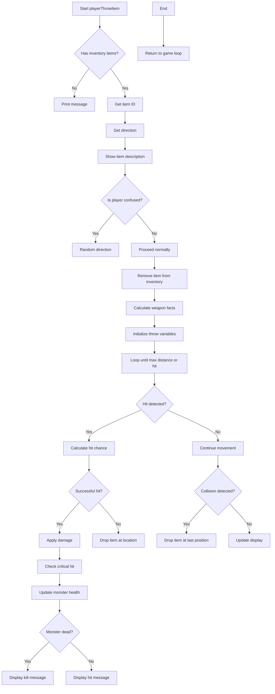

# player_throw_cpp Module Documentation

## Brief Introduction

The `player_throw_cpp` module implements the core functionality for throwing items in the game. This module handles the logic for selecting items from the player's inventory, calculating throw mechanics including hit chances and damage, managing projectile movement through the dungeon, and handling the consequences of successful or failed throws against monsters.

## Module Overview

This module contains the implementation of the `playerThrowItem()` function which governs the entire throwing process. It includes helper functions for inventory management during throwing operations, calculation of weapon and missile statistics, and the actual throwing mechanics including collision detection and damage application.

### Key Functions

- `inventoryThrow()` - Handles the removal of items from inventory during throwing
- `weaponMissileFacts()` - Calculates hit bonuses, damage, and distance for thrown items
- `inventoryDropOrThrowItem()` - Manages dropping items when throwing fails or reaches maximum distance
- `playerThrowItem()` - Main function orchestrating the throwing process

## Architecture and Component Relationships

```mermaid
graph TD
    A[playerThrowItem] --> B[inventoryThrow]
    A --> C[weaponMissileFacts]
    A --> D[inventoryDropOrThrowItem]
    A --> E[playerMovePosition]
    A --> F[playerTestBeingHit]
    A --> G[itemMagicAbilityDamage]
    A --> H[playerWeaponCriticalBlow]
    A --> I[monsterTakeHit]
    
    B --> J[inventoryDestroyItem]
    B --> K[py.pack.weight]
    B --> L[py.flags.status]
    
    C --> M[py.misc.bth_with_bows]
    C --> N[py.misc.plusses_to_hit]
    C --> O[py.inventory[Wield]]
    C --> P[py.stats.used[A_STR]]
    
    D --> Q[coordInBounds]
    D --> R[dg.floor]
    D --> S[dungeonLiteSpot]
    D --> T[printMessage]
    
    F --> U[monsters]
    F --> V[creatures_list]
    F --> W[playerMovePosition]
    
    G --> X[itemMagicAbilityDamage]
    H --> Y[playerWeaponCriticalBlow]
    I --> Z[monsterTakeHit]
```

## Data Flow and Process Flow



## Dependencies and Integration Points

This module integrates with several core systems:

- **Inventory Management** - Uses `inventoryThrow()` and `inventoryDestroyItem()` functions from the inventory system
- **Player Statistics** - Accesses player attributes through `py` structure including stats, misc, and flags
- **Dungeon Management** - Interacts with `dg.floor` for terrain and creature positions
- **Monster System** - Calls `monsterTakeHit()` and accesses `monsters[]` and `creatures_list[]`
- **Combat System** - Utilizes `playerTestBeingHit()`, `itemMagicAbilityDamage()`, and `playerWeaponCriticalBlow()`
- **Display System** - Uses `dungeonLiteSpot()`, `panelPutTile()`, and `printMessage()` for visual feedback

## Detailed Function Descriptions

### `inventoryThrow(int item_id, Inventory_t *treasure)`

Removes an item from the player's inventory for throwing. If the item stack has multiple items, it reduces the count by one and updates the player's weight. If only one item remains, it completely removes the item from inventory.

### `weaponMissileFacts(Inventory_t &item, int &base_to_hit, int &plus_to_hit, int &damage, int &distance)`

Calculates the throwing statistics for a specific item. This includes:
- Base hit chance adjusted for bow usage
- Additional hit bonuses from player and weapon
- Damage calculation considering weapon properties
- Maximum throw distance based on strength and item weight
- Special bonuses when using appropriate weapons with ammunition

### `inventoryDropOrThrowItem(Coord_t coord, Inventory_t *item)`

Handles the placement of thrown items when they either miss their target or reach maximum distance. It attempts to find a valid drop location within a 3x3 area around the target coordinates. If no valid spot is found, it displays a message indicating the item disappeared.

### `playerThrowItem()`

The main entry point for the throwing mechanic. This function:
1. Validates that the player has items to throw
2. Gets user input for which item to throw
3. Requests direction input for the throw
4. Displays item description and handles confusion effects
5. Processes the actual throwing with physics simulation
6. Handles combat results including hits, misses, and monster damage
7. Manages item dropping when throws fail or reach maximum range

## Configuration and Constants

This module references several configuration elements:
- `MAX_OPEN_SPACE` - Defines valid open space for item placement
- `TV_NOTHING`, `TV_BOW`, `TV_SLING_AMMO`, `TV_ARROW`, `TV_BOLT` - Item category identifiers
- `PlayerEquipment::Wield` - Equipment slot identifier
- `PlayerAttr::A_STR` - Strength attribute reference
- Various constants from `class_level_adj` for hit chance calculations

## Error Handling and Edge Cases

The module handles several edge cases:
- Confused players get random directions
- Items with zero weight are treated as weight 1
- Maximum throw distance capped at 10
- Invalid drop locations result in item disappearance messages
- Critical hit calculations prevent negative damage values
- Proper cleanup of thrown items from inventory

## Performance Considerations

The module is designed for efficient execution during gameplay:
- Minimal memory allocation during normal operation
- Early termination conditions for loops
- Direct access to global structures for performance
- Limited use of complex calculations that could impact frame rate

## Related Modules

This module works closely with:
- [inventory_system](inventory_system.md) - For inventory manipulation functions
- [combat_system](combat_system.md) - For hit testing and damage calculations
- [dungeon_system](dungeon_system.md) - For dungeon tile and creature interactions
- [player_system](player_system.md) - For player attribute access and status flags
