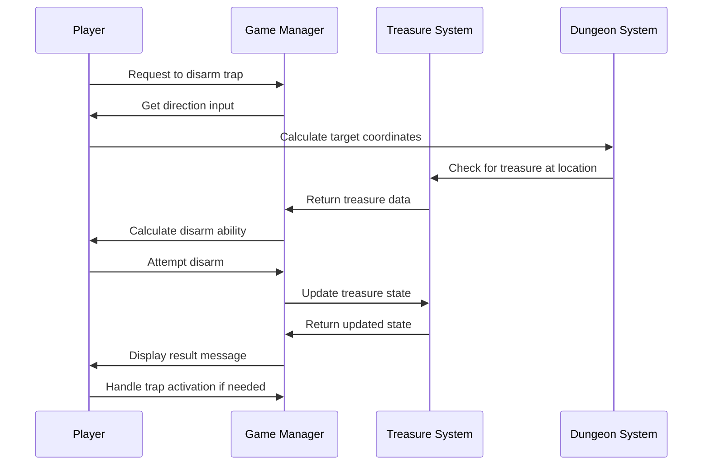
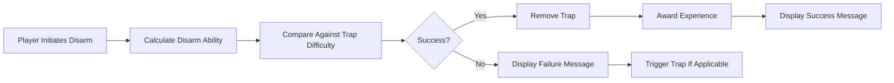
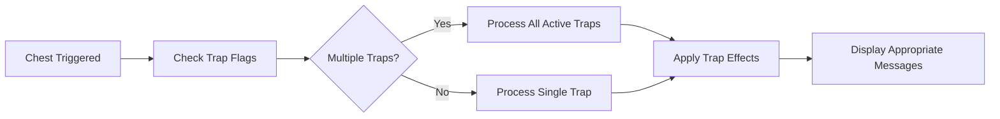

# player_traps_cpp Module Documentation

## Brief Introduction

The `player_traps_cpp` module handles all player-related trap mechanics in the game, including trap disarming capabilities, trap detection, and chest trap activation. This module provides the core logic for players to interact with various types of traps found in the dungeon environment.

## Module Overview

This module contains functions that manage player interactions with traps, both floor-based and chest-based. It implements the logic for determining player success when disarming traps, handling different types of chest traps, and managing the consequences when traps are triggered.

## Architecture and Component Relationships

### Core Components

The module consists of several key functions that work together to provide comprehensive trap handling:

1. **Player Trap Disarming Ability Calculation** - Calculates the player's chance to successfully disarm traps
2. **Floor Trap Disarming** - Handles disarming of visible floor traps
3. **Chest Trap Disarming** - Manages disarming of trapped chests
4. **Trap Disarming Interface** - Main entry point for player trap disarming actions
5. **Chest Trap Activation** - Executes effects when chest traps are triggered

### Data Flow

```mermaid
graph TD
    A[Player Disarm Trap Command] --> B[playerDisarmTrap()]
    B --> C[Get Direction Input]
    C --> D[Calculate Disarm Ability]
    D --> E{Valid Trap Found?}
    E -->|Yes| F[playerDisarmFloorTrap/playerDisarmChestTrap]
    E -->|No| G[Display No Trap Message]
    F --> H{Success?}
    H -->|Yes| I[Remove Trap/Update Experience]
    H -->|No| J[Trigger Trap or Fail Message]
    J --> K[Execute Trap Effect]
```

### Component Interactions



## Detailed Function Documentation

### `playerTrapDisarmAbility()` - Trap Disarming Ability Calculator

Calculates the player's ability to disarm traps based on multiple factors:
- Base disarm skill from player attributes
- Class level adjustments
- Wisdom/intelligence stat modifiers
- Environmental conditions (blindness, confusion, hallucination)
- Level-based modifiers

### `playerDisarmFloorTrap()` - Floor Trap Disarming Handler

Manages the process of disarming floor-based traps:
- Determines success probability based on player ability vs trap difficulty
- Handles successful disarm by removing the trap and awarding experience
- Processes failed attempts by triggering the trap
- Manages player movement during disarming attempts

### `playerDisarmChestTrap()` - Chest Trap Disarming Handler

Handles disarming of trapped chests:
- Checks if the chest has been identified as trapped
- Calculates success probability against chest trap level
- Updates chest properties upon successful disarming
- Triggers trap effects on failure

### `playerDisarmTrap()` - Main Disarming Interface

Primary entry point for player trap disarming:
- Gets player direction input
- Validates target location for traps
- Routes to appropriate disarming handler based on trap type
- Provides feedback messages to player

### `chestTrap()` - Chest Trap Activation Handler

Executes effects when chest traps are triggered:
- Processes multiple trap types simultaneously
- Handles strength loss, poisoning, paralysis, summoning, and explosion effects
- Manages damage calculation and status effect application

## Integration Points

This module integrates with several other core systems:

- **[headers.h](headers.md)** - Includes necessary game definitions and structures
- **[player_movement_cpp.md](player_movement_cpp.md)** - Uses player movement functions for trap activation
- **[dungeon_cpp.md](dungeon_cpp.md)** - Interacts with dungeon tile management
- **[treasure_cpp.md](treasure_cpp.md)** - Works with treasure and inventory systems
- **[monster_cpp.md](monster_cpp.md)** - Handles interactions with creatures blocking traps
- **[combat_cpp.md](combat_cpp.md)** - Uses combat-related functions for damage calculation

## Dependencies

The module depends on:
- Game state management structures (`py`, `dg`, `game`)
- Player attribute and status systems
- Random number generation utilities
- Message display systems
- Dungeon and treasure management systems

## Process Flows

### Trap Disarming Success Flow



### Chest Trap Activation Flow



## System Integration

This module forms part of the broader player interaction system and works alongside:
- [player_movement_cpp.md](player_movement_cpp.md) for movement during trap handling
- [inventory_cpp.md](inventory_cpp.md) for chest manipulation
- [status_effects_cpp.md](status_effects_cpp.md) for applying status effects from traps
- [experience_cpp.md](experience_cpp.md) for experience gain calculations

The module ensures that players can meaningfully interact with the dungeon environment through trap discovery, disarming, and activation, adding strategic depth to gameplay while maintaining balance through calculated probabilities and effects.
