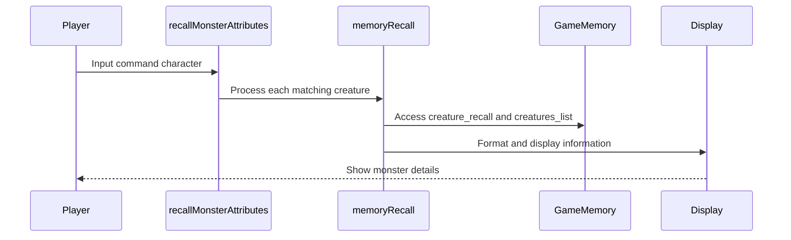
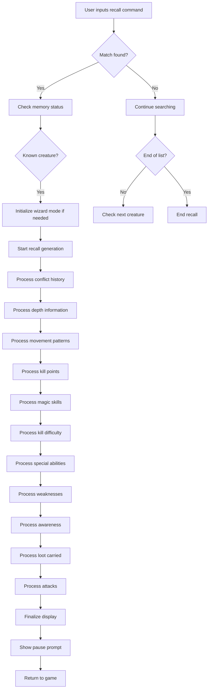

# recall_cpp Module Documentation

## Introduction

The `recall_cpp` module provides functionality for displaying detailed information about monsters in the game. This module handles the logic for recalling monster attributes, including combat abilities, movement patterns, special properties, and other characteristics that players can learn through gameplay. The module interfaces with the game's memory system to display previously learned information about creatures.

## Architecture Overview

```mermaid
graph TD
    A[recallMonsterAttributes] --> B[memoryRecall]
    B --> C[memoryPrint]
    B --> D[memoryMonsterKnown]
    B --> E[memoryWizardModeInit]
    B --> F[memoryConflictHistory]
    B --> G[memoryDepthFoundAt]
    B --> H[memoryMovement]
    B --> I[memoryKillPoints]
    B --> J[memoryMagicSkills]
    B --> K[memoryKillDifficulty]
    B --> L[memorySpecialAbilities]
    B --> M[memoryWeaknesses]
    B --> N[memoryAwareness]
    B --> O[memoryLootCarried]
    B --> P[memoryAttackNumberAndDamage]
    
    subgraph Memory Functions
        C
        D
        E
        F
        G
        H
        I
        J
        K
        L
        M
        N
        O
        P
    end
    
    style A fill:#e1f5fe
    style B fill:#f3e5f5
    style C fill:#e8f5e9
    style D fill:#fff3e0
    style E fill:#fce4ec
    style F fill:#f1f8e9
    style G fill:#e0f2f1
    style H fill:#fff8e1
    style I fill:#fce4ec
    style J fill:#f3e5f5
    style K fill:#e1f5fe
    style L fill:#ffebee
    style M fill:#f1f8e9
    style N fill:#fff3e0
    style O fill:#e8f5e9
    style P fill:#f3e5f5
```

## Component Relationships

### Main Entry Points

The module has two primary entry points:

1. **`recallMonsterAttributes`** - The main function called when players want to recall monster information. It iterates through all creatures looking for matches with the input command character and displays their recall information.

2. **`memoryRecall`** - The core function that generates and displays the detailed monster recall information.

### Data Flow

## Detailed Component Descriptions

### Core Data Structures

The module uses several key data structures:

- **`Recall_t`**: Stores memory information about creatures, including kills, deaths, movement patterns, attacks, and other attributes
- **`Creature_t`**: Contains the base creature information from the game's creature database
- **`vtype_t`**: Character buffer for string operations
- **`Dice_t`**: Damage dice information for attacks

### Key Functions

#### `recallMonsterAttributes`
This function serves as the primary interface for monster recall functionality. It:
- Takes a command character as input
- Searches through all creatures for matches
- Displays recall information for matching creatures
- Handles user confirmation and screen management

#### `memoryRecall`
The central function that generates monster recall information:
- Processes all aspects of monster knowledge
- Formats output using the line buffer system
- Handles wizard mode special cases
- Manages screen output and user interaction

#### `memoryPrint`
A utility function for formatted text output:
- Manages line wrapping and buffering
- Handles text formatting for display
- Ensures proper line breaks and continuation

### System Integration

This module integrates with several other system components:

- **[game_state](game_state.md)**: Accesses `game.wizard_mode` flag
- **[player_info](player_info.md)**: Uses player level information for calculations
- **[creature_system](creature_system.md)**: References `creatures_list` and `creature_recall` arrays
- **[input_output](input_output.md)**: Uses `putStringClearToEOL` and `getKeyInput` functions
- **[config](config.md)**: Depends on monster configuration constants

### Configuration Dependencies

The module relies on several configuration constants defined in the game's configuration system:

- **`MON_MAX_CREATURES`**: Maximum number of creatures in the game
- **`MON_MAX_ATTACKS`**: Maximum number of attacks per creature
- **`MORIA_MESSAGE_SIZE`**: Size limit for message buffers
- **Monster flags**: Various bit flags for movement, defense, and spell properties

### Wizard Mode Handling

In wizard mode, the module provides enhanced information:
- Sets all kills to maximum values
- Displays full movement pattern information
- Shows all attack types as known
- Enables detailed spell information display

### Memory Management

The module implements efficient memory usage:
- Uses static buffers for line processing
- Maintains separate memory states for wizard mode
- Properly manages temporary data during recall operations

## Process Flows

### Monster Recall Process

### Memory Information Processing

The module processes monster information in logical sections:
1. **Basic Information**: Name, location, movement patterns
2. **Combat Statistics**: Kill points, damage capabilities
3. **Special Properties**: Magic abilities, resistances, weaknesses
4. **Behavioral Traits**: Awareness levels, sleeping patterns
5. **Loot Information**: Treasure carrying capabilities
6. **Attack Details**: Physical and magical attack methods

## Technical Details

### Buffer Management

The module uses a static line buffer (`roff_buffer`) for efficient text processing:
- Prevents frequent memory allocations
- Handles automatic line wrapping
- Manages text continuation across lines

### Text Formatting Logic

The module implements sophisticated text formatting:
- Automatic word wrapping with hyphenation
- Proper punctuation handling
- Conditional sentence construction
- Dynamic content generation based on known information

### Knowledge Thresholds

The module implements knowledge-based display logic:
- Uses `knowdamage` macro to determine when damage information should be displayed
- Applies different thresholds for various types of information
- Considers monster level and attack frequency in knowledge calculations

### Error Handling

The module includes robust error handling:
- Bounds checking for array accesses
- Safe string operations with buffer limits
- Graceful degradation when information is incomplete
- Proper cleanup of temporary state variables

## External Dependencies

This module depends on several other system components:

- **Headers**: Requires standard headers and game-specific definitions
- **Game State**: Accesses global game state variables
- **Player Information**: Uses player level and other stats
- **Display System**: Integrates with the terminal output system
- **Input System**: Handles user input for navigation

## Performance Considerations

The module is designed for efficient operation:
- Minimal memory allocation during runtime
- Pre-calculated lookup tables for descriptions
- Early termination when information is insufficient
- Optimized string operations for frequent calls

## Security and Safety

The module follows safe programming practices:
- Bounds checking for all array accesses
- Proper initialization of all variables
- Safe string operations preventing buffer overflows
- Validation of input parameters before processing
