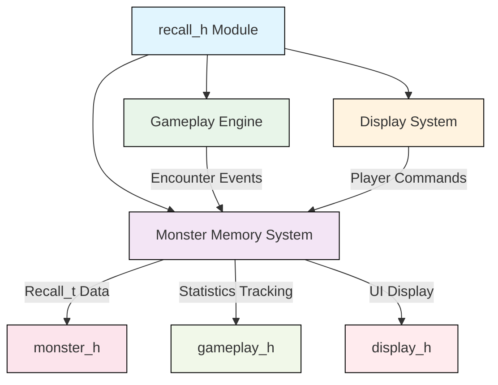
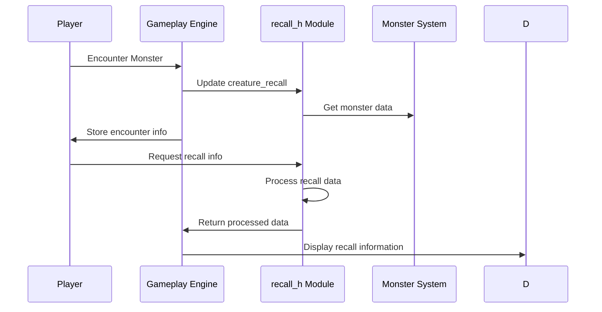

# recall_h Module Documentation

## Brief Introduction

The `recall_h` module provides the data structures and function declarations necessary for maintaining and accessing monster memory information in the game. This module implements the recall system that tracks player knowledge about monsters, including their behaviors, abilities, and combat statistics. It serves as the interface between the core game logic and the monster memory management system.

## Module Overview

The `recall_h` module defines the `Recall_t` structure that stores detailed information about monsters that players have encountered and learned about. This includes tracking monster movements, spellcasting abilities, kill/death statistics, and attack patterns. The module also declares functions for recalling monster information and handling monster attribute display.

## Data Structures

### Recall_t Structure

The core data structure in this module is `Recall_t`, which maintains a comprehensive record of player knowledge about each monster:

```c
typedef struct {
    uint32_t movement;        // Movement pattern flags
    uint32_t spells;          // Spellcasting ability flags
    uint16_t kills;           // Number of times player has killed this monster
    uint16_t deaths;          // Number of times player has been killed by this monster
    uint16_t defenses;        // Defense statistics
    uint8_t wake;             // Wake-up probability
    uint8_t ignore;           // Ignore probability
    uint8_t attacks[MON_MAX_ATTACKS]; // Attack type information
} Recall_t;
```

### Global Variables

- `creature_recall[MON_MAX_CREATURES]`: Array storing recall information for all creatures
- Various constant string arrays providing descriptive text for different monster attributes

## Function Declarations

### memoryRecall()
```c
int memoryRecall(int monster_id);
```
Retrieves and processes recall information for a specific monster ID, returning appropriate status codes.

### recallMonsterAttributes()
```c
void recallMonsterAttributes(char command);
```
Handles commands related to displaying monster attributes and recall information to the player.

## Component Relationships

This module interfaces with several other core modules:

- **[monster_h](monster_h.md)**: Depends on monster definitions and constants like `MON_MAX_CREATURES` and `MON_MAX_ATTACKS`
- **[gameplay_h](gameplay_h.md)**: Integrates with gameplay systems that track player encounters and kills
- **[display_h](display_h.md)**: Works with display systems to show monster recall information to players

## Architecture Diagram



## Data Flow



## Dependencies

This module depends on several other system components:

- **[monster_h](monster_h.md)**: Provides monster constants and definitions
- **[constants_h](constants_h.md)**: Contains system-wide constants like `MON_MAX_CREATURES`
- **[memory_h](memory_h.md)**: Handles memory allocation for recall data structures

## Integration Points

The recall system integrates with:

1. **Monster Encounter System**: Records new encounters and updates statistics
2. **Combat System**: Tracks kills and deaths for each monster type
3. **User Interface**: Displays recall information when requested
4. **Save/Load System**: Persists recall data between game sessions

## Usage Patterns

The typical usage pattern involves:
1. Updating recall data when players encounter monsters
2. Retrieving recall information during gameplay
3. Displaying monster attributes through user commands
4. Maintaining persistent knowledge across game sessions

## Related Modules

For complete system understanding, see:
- [monster_h](monster_h.md) - Monster definitions and constants
- [gameplay_h](gameplay_h.md) - Core gameplay mechanics
- [display_h](display_h.md) - User interface and display functions
- [memory_h](memory_h.md) - Memory management utilities
