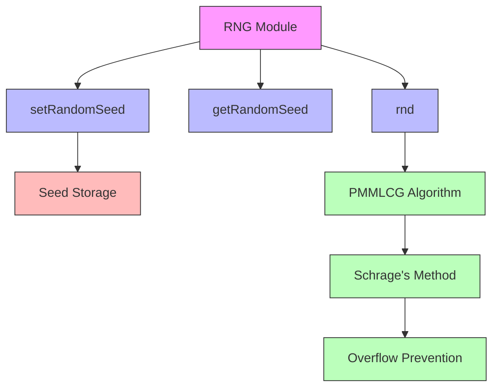
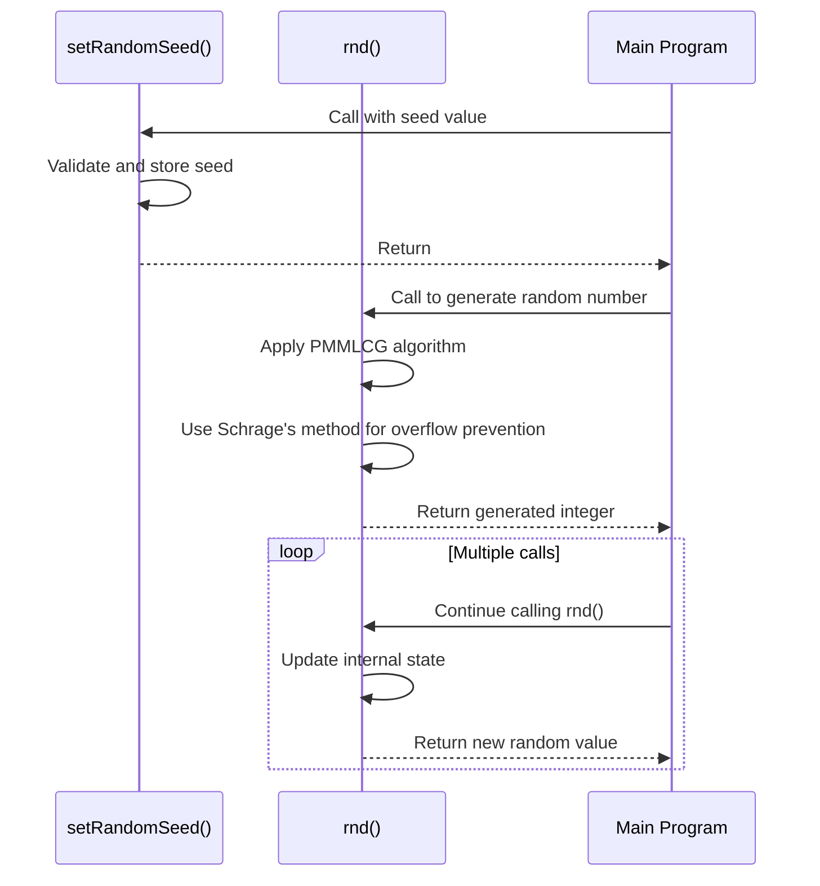

# rng_cpp Module Documentation

## Brief Introduction

The `rng_cpp` module implements a high-quality pseudo-random number generator based on the Prime Modulus Multiplicative Linear Congruential Generator (PMMLCG) algorithm, specifically the Lehmer generator variant. This implementation follows the well-established method described by Park and Miller, ensuring reproducible results across different platforms with 32-bit integer support. The module provides functions for seeding, generating random numbers, and retrieving the current seed state.

## Core Functionality

The module provides a complete random number generation system with the following key features:

- **Algorithm**: Implements the PMMLCG/Lehmer generator with parameters suitable for 32-bit systems
- **Period**: Achieves full period of 2³¹ - 1 (2,147,483,647) 
- **Range**: Generates integers in the range [1, 2³¹ - 1]
- **Seeding**: Supports setting and retrieving random seeds
- **Reproducibility**: Produces identical sequences when initialized with the same seed

## Architecture and Component Relationships



### Key Components

1. **Constants**:
   - `RNG_M`: Prime modulus (2³¹ - 1)
   - `RNG_A`: Multiplier (16807)
   - `RNG_Q`: Quotient (m div a)
   - `RNG_R`: Remainder (m mod a)

2. **State Management**:
   - `rnd_seed`: Static storage for current seed value

3. **Interface Functions**:
   - `setRandomSeed()`: Sets the seed value
   - `getRandomSeed()`: Retrieves current seed
   - `rnd()`: Generates next random number

## Implementation Details

The implementation uses Schrage's method to prevent integer overflow during calculations while maintaining mathematical correctness. This approach decomposes the multiplication operation into parts that can be computed safely within 32-bit integer limits.

### Algorithm Properties

The PMMLCG follows these mathematical properties:
1. **Modulus**: m = 2³¹ - 1 (large prime)
2. **Multiplier**: a = 16807 (valid multiplier for full period)
3. **Recurrence**: z[n+1] = a × z[n] mod m
4. **Output**: u[n] = z[n] / m (uniform distribution on (0,1))

### Data Flow



## Integration and Dependencies

This module depends on standard C++ headers for basic types and operations. It does not require external libraries beyond standard system headers.

The module integrates with other system components through:
- Seed management functions that interface with system initialization routines
- Random number generation functions that feed into statistical and simulation modules
- Testing infrastructure that validates algorithm correctness

## Usage Patterns

### Basic Usage
```cpp
// Initialize with seed
setRandomSeed(12345);

// Generate random numbers
int32_t random_value = rnd();
int32_t another_value = rnd();

// Retrieve current seed
uint32_t current_seed = getRandomSeed();
```

### Testing
The module includes built-in testing capability when compiled with `TEST_RNG` defined. This allows verification of the implementation against known test values.

## Performance Characteristics

- **Time Complexity**: O(1) for each random number generation
- **Space Complexity**: O(1) additional memory for state
- **Overflow Safety**: Uses Schrage's method to prevent intermediate overflow
- **Portability**: Works consistently across 32-bit systems

## Related Modules

For comprehensive system integration, this module works alongside:
- [system_init](system_init.md): For system-wide random number initialization
- [statistical](statistical.md): For statistical analysis of generated sequences
- [simulation](simulation.md): For Monte Carlo and simulation applications

## Validation and Verification

The implementation has been validated against the reference specification from Park and Miller's work, ensuring that with seed = 1, the 10,001st value equals 1,043,618,065. This provides confidence in the correctness of the algorithm implementation.

## Limitations

- Only generates 32-bit signed integers
- Requires 32-bit integer arithmetic for proper operation
- Not suitable for cryptographic purposes due to predictability
- Limited to the specific parameter set chosen for optimal performance and correctness

This module provides a solid foundation for pseudo-random number generation in applications requiring reproducible, high-quality random sequences within the constraints of 32-bit integer arithmetic.
