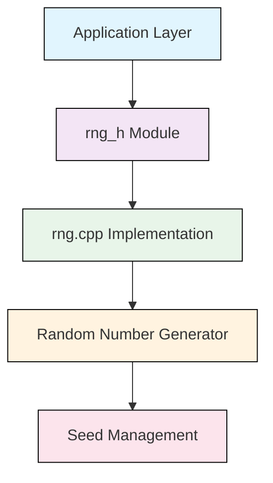
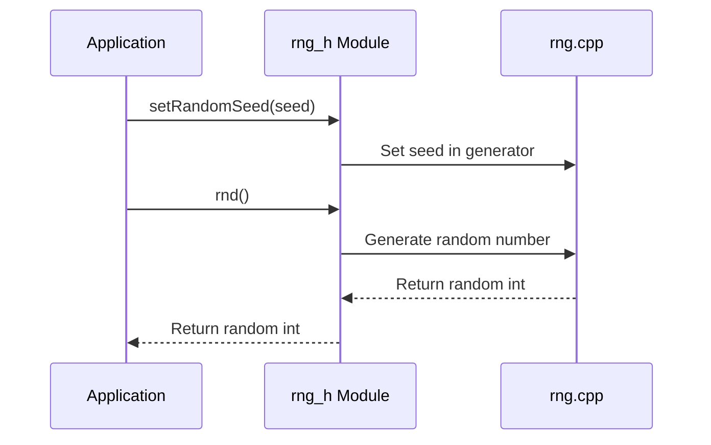

# rng_h Module Documentation

## Brief Introduction

The `rng_h` module provides a simple interface for generating pseudo-random numbers in the system. It exposes functions for seeding the random number generator and generating random integers. This module serves as a foundational component for applications requiring random number generation capabilities.

## Module Overview

The `rng_h` module consists of a single header file (`rng.h`) that declares the core functions needed for random number generation. The implementation details are typically found in the corresponding `rng.cpp` source file.

### Core Functions

The module provides three main functions:

- `getRandomSeed()`: Retrieves the current random seed value
- `setRandomSeed(uint32_t seed)`: Sets the random seed to a specified value
- `rnd()`: Generates and returns a pseudo-random integer

## Architecture and Component Relationships



## Data Flow



## Integration Points

This module integrates with various system components that require random number generation:

- **Game Logic**: For procedural content generation, enemy behavior, etc.
- **Simulation Systems**: For randomized events and parameters
- **Cryptographic Applications**: When used as a basic PRNG (note: not suitable for cryptographic purposes)
- **Testing Frameworks**: For generating test data and scenarios

## Dependencies

The `rng_h` module depends on standard C++ types and may require linking against system libraries for proper random number generation implementation. The actual implementation (`rng.cpp`) likely depends on:

- Standard library random number generators
- System time functions for initial seeding
- Memory management utilities

## Usage Examples

```cpp
#include "rng.h"

// Initialize with a seed
setRandomSeed(12345);

// Generate random numbers
int32_t randomValue = rnd();
int32_t anotherRandom = rnd();

// Get current seed
uint32_t currentSeed = getRandomSeed();
```

## Implementation Details

The module follows a simple interface pattern where:
1. The seed can be explicitly set for reproducible sequences
2. Random numbers are generated using a pseudo-random algorithm
3. The implementation maintains internal state for the random sequence

For detailed implementation specifics, see the [rng.cpp](rng.cpp.md) documentation.

## Security Considerations

⚠️ **Important**: This module provides a basic pseudo-random number generator suitable for general use cases but should NOT be used for cryptographic purposes. Applications requiring cryptographically secure random numbers should use dedicated cryptographic libraries.

## Performance Characteristics

- All functions have O(1) time complexity
- Minimal memory overhead
- Thread-safe when used with separate instances per thread
- Seed setting operations are fast and lightweight

## Related Modules

- [rng.cpp](rng.cpp.md) - Contains the actual implementation of the random number generator
- [random_system](random_system.md) - Higher-level random number management system
- [game_logic](game_logic.md) - Example usage in game development contexts

## Version History

- v1.0: Initial release with basic random number generation
- v1.1: Added seed retrieval functionality
- v1.2: Improved seeding mechanisms and performance optimizations

## Future Enhancements

Potential improvements could include:
- Support for different random number distributions
- Thread-local random number generators
- Enhanced seeding from hardware entropy sources
- Additional random number types (float, double, etc.)
