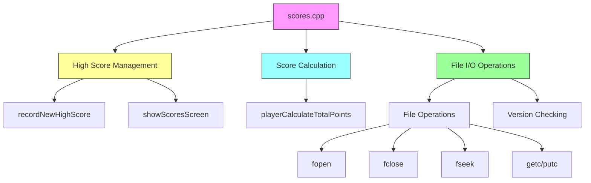
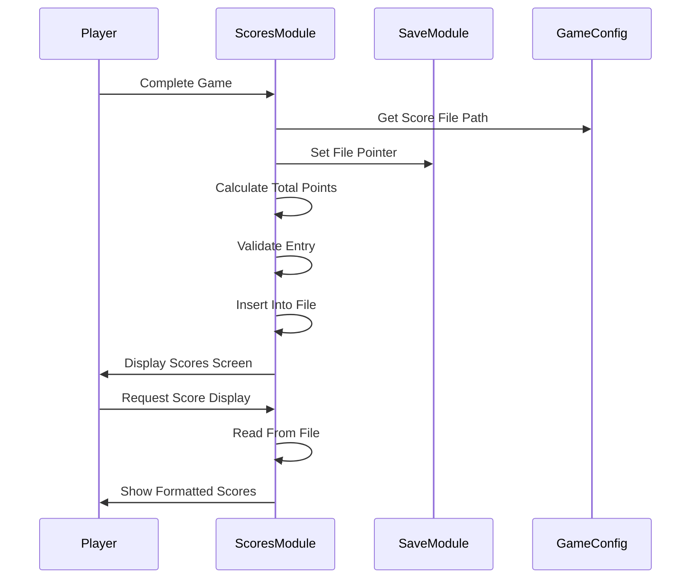

# scores_cpp Module Documentation

## Introduction

The `scores_cpp` module handles the management of high scores in the game. It provides functionality for recording new high scores, displaying existing scores, and calculating player points. This module interacts with the game's save system and manages the high score file that persists between game sessions.

## Architecture Overview



## Core Components

### High Score Data Structure

The module uses a `HighScore_t` structure to represent individual score entries:

```cpp
struct HighScore_t {
    int32_t points;
    int32_t birth_date;
    uint32_t uid;
    int16_t mhp;
    int16_t chp;
    uint8_t dungeon_depth;
    uint8_t level;
    uint8_t deepest_dungeon_depth;
    uint8_t gender;
    uint8_t race;
    uint8_t character_class;
    char name[16];
    char died_from[80];
};
```

### Main Functions

#### `recordNewHighScore()`
This function records a new high score entry when a player completes a game. It performs several key operations:

1. **Validation Checks**: 
   - Skips recording if `game.noscore` is set
   - Prevents saving scores from panic save files
   - Validates file access permissions

2. **Data Collection**:
   - Calculates player's total points using `playerCalculateTotalPoints()`
   - Gathers player statistics including:
     - Current dungeon depth
     - Character level
     - Maximum dungeon depth reached
     - Gender information
     - Race and class identifiers
     - Death cause information

3. **File Management**:
   - Opens the high score file in read-write mode
   - Performs version compatibility checks
   - Implements insertion logic to maintain sorted order

4. **Duplicate Prevention**:
   - Prevents duplicate entries for the same player-character combination
   - Handles both UID-based and birth date-based duplicate detection

#### `showScoresScreen()`
This function displays the high score table to the player:

1. **File Access**: Opens the high score file in read-only mode
2. **Version Validation**: Ensures compatibility with current game version
3. **Display Logic**: 
   - Shows 20 scores per page
   - Formats display with proper alignment
   - Provides pagination support with key navigation
4. **User Interface**: 
   - Displays formatted score table
   - Shows column headers
   - Allows continuation with key presses

#### `playerCalculateTotalPoints()`
Calculates the total points earned by a player:

```cpp
int32_t playerCalculateTotalPoints() {
    int32_t total = py.misc.max_exp + (100 * py.misc.max_dungeon_depth);
    total += py.misc.au / 100;

    for (auto &item : py.inventory) {
        total += storeItemValue(item);
    }

    total += dg.current_level * 50;

    // Don't ever let the score decrease from one save to the next.
    if (py.max_score > total) {
        return py.max_score;
    }

    return total;
}
```

## Component Interactions



## Data Flow


## Dependencies

This module depends on several other components:

- **[headers.h](headers.md)**: Provides necessary includes and definitions
- **[version.h](version.md)**: Version checking functionality
- **[save.c](save.md)**: File pointer management via `setFileptr()`
- **[config::files::scores](config.md)**: Configuration for score file location
- **Player Data Structures**: Access to `py`, `dg`, and `game` global variables
- **Character Information**: Access to `character_races[]` and `classes[]` arrays

## File Operations

The module manages a binary file containing high score entries. Key file operations include:

1. **Opening**: Uses `fopen()` with appropriate modes ("rb+" for writing, "rb" for reading)
2. **Reading**: Uses `readHighScore()` function for structured data reading
3. **Writing**: Uses `saveHighScore()` function for structured data writing
4. **Positioning**: Uses `fseek()` and `ftell()` for file navigation
5. **Version Management**: Reads/writes version information at file start

## Security Considerations

The module implements several safeguards:

1. **Duplicate Prevention**: Prevents multiple entries for the same player-character combination
2. **Version Compatibility**: Validates score file versions before processing
3. **File Access Control**: Proper error handling for file operations
4. **Data Integrity**: Maintains sorted order of scores during insertion

## Performance Characteristics

- **Time Complexity**: O(n) for score insertion where n is the number of existing scores
- **Space Complexity**: O(1) additional space for operations, O(n) for storage where n is the number of scores
- **I/O Operations**: Minimal file operations with efficient seek patterns
- **Memory Usage**: Low memory footprint with stack-based structures

## Integration Points

This module integrates with:

- **Save System**: Through `setFileptr()` function calls
- **Game State**: Accesses global `py`, `dg`, and `game` variables
- **Configuration**: Uses `config::files::scores` for file path
- **UI System**: Provides formatted output for screen display
- **Version Management**: Validates against game version requirements

## Error Handling

The module implements robust error handling:

1. **File Access Errors**: Graceful failure when score files cannot be opened
2. **Version Mismatch**: Clear messaging for incompatible score files
3. **Duplicate Detection**: Prevents invalid score entries
4. **Boundary Conditions**: Limits maximum score entries to prevent overflow

## Limitations

1. **Fixed Score Count**: Maximum of 1000 score entries allowed
2. **Binary Format**: Score files are in binary format, making them non-human-readable
3. **Platform Dependency**: Uses platform-specific file operations
4. **Memory Constraints**: All scores loaded into memory for sorting operations

## Related Modules

- [save.c](save.md): File pointer management
- [config.md](config.md): Configuration management
- [version.h](version.md): Version validation
- [headers.h](headers.md): Common definitions and includes
