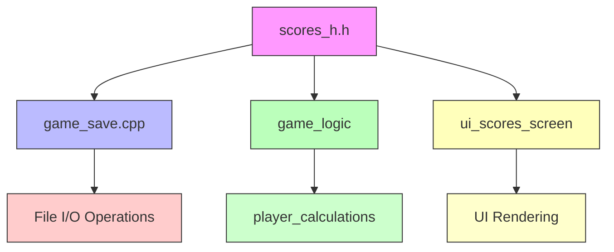
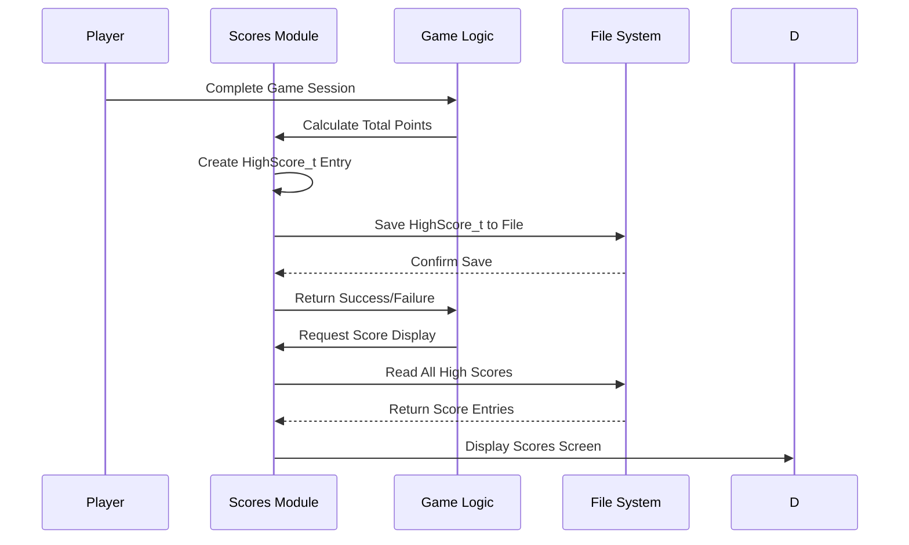
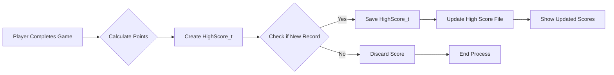

# scores_h Module Documentation

## Introduction

The `scores_h` module defines the high score data structure and related functions for managing game scores. This module provides the interface for storing, retrieving, and displaying high scores in the game system. It serves as the foundation for the high score management functionality that integrates with the broader game save/load system.

## Core Components

### Data Structure: HighScore_t

The `HighScore_t` structure represents a single high score entry with the following fields:

```c
typedef struct {
    int32_t points;                    // Total points earned
    int32_t birth_date;                // Player creation timestamp
    int16_t uid;                       // Unique identifier
    int16_t mhp;                       // Maximum hit points
    int16_t chp;                       // Current hit points
    uint8_t dungeon_depth;             // Current dungeon depth
    uint8_t level;                     // Player level
    uint8_t deepest_dungeon_depth;     // Deepest dungeon reached
    uint8_t gender;                    // Player gender
    uint8_t race;                      // Player race
    uint8_t character_class;           // Player class
    char name[PLAYER_NAME_SIZE];       // Player name
    char died_from[25];                // Cause of death
} HighScore_t;
```

This structure is exactly 64 bytes in size, making it efficient for storage in the high score file.

### Constants

- `MAX_HIGH_SCORE_ENTRIES`: Defines the maximum number of entries allowed in the high score file (1000 entries)

### External Dependencies

- `highscore_fp`: External file pointer for high score file operations
- `PLAYER_NAME_SIZE`: Referenced constant from [player.h](player.md) module

## Module Relationships

This module works closely with the [game_save](game_save.md) module, which implements the actual file I/O operations for high score persistence. The interface defined here is used by the game logic to manage high score records.

## Architecture Overview



## Data Flow



## Component Interactions

### High Score Management Flow



### File Operations Interface

The module exposes two key functions for file operations that are implemented in the [game_save](game_save.md) module:

1. `saveHighScore()`: Saves a high score entry to persistent storage
2. `readHighScore()`: Reads a high score entry from persistent storage

These functions work with the `highscore_fp` external file pointer to perform actual file I/O operations.

## Integration Points

### With Game Logic
The `playerCalculateTotalPoints()` function allows the game logic to compute final scores before high score evaluation.

### With UI System
The `showScoresScreen()` function provides the interface for displaying high scores to players.

### With Save System
The `recordNewHighScore()` function coordinates with the [game_save](game_save.md) module to persist new high scores.

## Implementation Notes

1. **Size Consideration**: The 64-byte fixed size of `HighScore_t` ensures consistent file layout and efficient storage
2. **External Dependencies**: The module relies on external constants like `PLAYER_NAME_SIZE` from the player module
3. **Future Work**: As noted in comments, the file I/O functions should be moved from [game_save.cpp](game_save.md) to this module for better separation of concerns

## Related Modules

- [game_save.md](game_save.md): Implements the actual file I/O operations
- [player.md](player.md): Provides player-related constants and definitions
- [ui_scores_screen.md](ui_scores_screen.md): Handles user interface for score display
