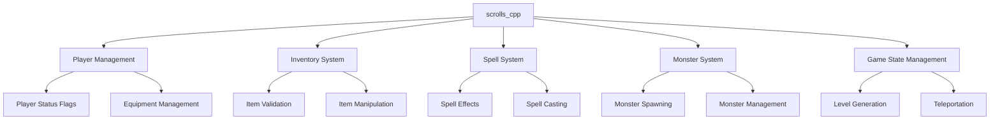
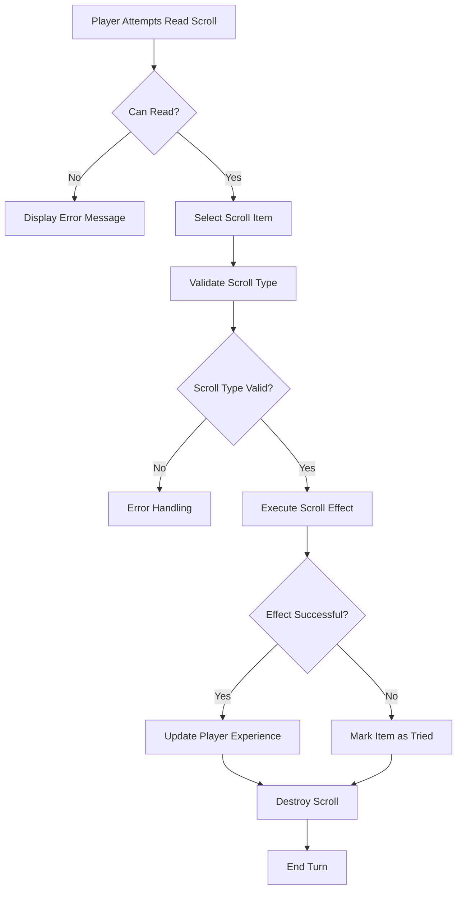
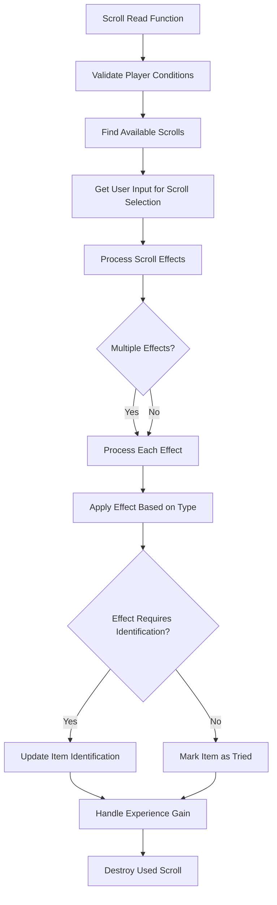

# scrolls_cpp Module Documentation

## Overview

The `scrolls_cpp` module handles the functionality related to reading scrolls in the game. This module implements the logic for processing scroll effects when a player attempts to read one, including validation checks, effect application, and inventory management. The module interfaces with various game systems such as player status, inventory management, monster spawning, and spell casting.

## Architecture and Component Relationships

The `scrolls_cpp` module is part of the core game mechanics and interacts with several other modules:

- **Player Management**: Accesses player status flags and equipment through `py` structure
- **Inventory System**: Uses inventory functions for item validation and manipulation
- **Spell System**: Calls various spell functions for scroll effects
- **Monster System**: Implements monster summoning capabilities
- **Game State Management**: Handles level generation and teleportation

### Module Dependencies

## Data Flow and Process Flow

### Scroll Reading Process

### Scroll Effect Processing

## Core Components

### Main Functions

#### `scrollRead()` - Primary Scroll Processing Function

The main entry point for scroll reading functionality. This function:
- Validates player conditions (blindness, light, confusion)
- Ensures player has scrolls in inventory
- Gets user selection for scroll to read
- Processes scroll effects based on type
- Handles identification and experience gain
- Manages scroll destruction

#### `playerCanReadScroll()` - Player Condition Validation

Validates whether the player can read a scroll:
- Checks for blindness
- Verifies player has light source
- Confirms player isn't confused
- Ensures player carries items
- Validates presence of scrolls in inventory

#### `inventoryItemIdOfCursedEquipment()` - Equipment Selection

Selects a random cursed piece of equipment from player's worn items:
- Checks all equipment slots (body, arms, outer, hands, head, feet)
- Returns ID of randomly selected cursed item
- Prioritizes cursed items over non-cursed ones

### Scroll Effect Functions

#### Enchantment Functions
- `scrollEnchantWeaponToHit()` - Enhances weapon hit bonus
- `scrollEnchantWeaponToDamage()` - Enhances weapon damage bonus
- `scrollEnchantItemToAC()` - Enhances armor class
- `scrollEnchantWeapon()` - Enhanced weapon enchantment
- `scrollEnchantArmor()` - Enhanced armor enchantment

#### Curse Functions
- `scrollCurseWeapon()` - Applies curse to weapon
- `scrollCurseArmor()` - Applies curse to armor

#### Summoning Functions
- `scrollSummonMonster()` - Summons monsters
- `scrollSummonUndead()` - Summons undead creatures

#### Utility Functions
- `scrollIdentifyItem()` - Identifies items
- `scrollRemoveCurse()` - Removes curses from all worn items
- `scrollTeleportLevel()` - Teleports player to different dungeon level
- `scrollConfuseMonster()` - Applies monster confusion effect
- `scrollWordOfRecall()` - Sets word of recall flag

## Integration Points

The `scrolls_cpp` module integrates with several other modules:

- **[inventory.md](inventory.md)**: Uses inventory functions for item validation and manipulation
- **[player.md](player.md)**: Accesses player status and equipment information
- **[spells.md](spells.md)**: Calls spell functions for scroll effects
- **[monsters.md](monsters.md)**: Implements monster summoning capabilities
- **[game_state.md](game_state.md)**: Handles level generation and teleportation

## Implementation Details

### Scroll Types and Effects

The module supports 42 different scroll types, each mapped to specific effects:
1. Weapon enchantment (to hit)
2. Weapon enchantment (to damage)
3. Armor enchantment (to AC)
4. Item identification
5. Curse removal
6. Light area
7. Monster summoning
8. Short teleportation
9. Long teleportation
10. Level teleportation
11. Monster confusion
12. Map area
13. Sleep monsters
14. Warding glyph
15. Detect treasure
16. Detect objects
17. Detect traps
18. Detect secret doors
19. Mass genocide
20. Detect invisible creatures
21. Aggravate monsters
22. Surround with traps
23. Destroy adjacent doors/traps
24. Surround with doors
25. Recharge item
26. Genocide
27. Darken area
28. Protect from evil
29. Create food
30. Dispel undead
31. Enhanced weapon enchantment
32. Weapon cursing
33. Enhanced armor enchantment
34. Armor cursing
35. Undead summoning
36. Blessing (short duration)
37. Blessing (medium duration)
38. Blessing (long duration)
39. Word of recall
40. Destroy area

### Error Handling and Validation

The module implements comprehensive validation:
- Player condition checks (blindness, light, confusion)
- Inventory validation (item existence, category matching)
- Scroll type verification
- Effect success/failure handling
- Experience calculation and display

### Resource Management

The module manages resources through:
- Proper item destruction upon use
- Experience gain calculations
- Player status flag updates
- Equipment modification handling
- Memory management for temporary variables

## Usage Patterns

### Typical Scroll Reading Flow

1. Player initiates scroll reading action
2. Module validates player readiness
3. Player selects scroll from inventory
4. Scroll effect is determined and executed
5. Player receives appropriate feedback
6. Scroll is destroyed or marked as used
7. Experience points are awarded if applicable

### Error Recovery

When scroll reading fails:
- Appropriate error messages are displayed
- Player retains scroll in inventory
- No experience points are awarded
- Player turn continues normally

## Performance Considerations

The module is designed for efficient execution:
- Minimal memory allocation during normal operation
- Early termination of validation checks
- Optimized random number generation
- Efficient item identification handling
- Proper resource cleanup after operations

## Security and Safety

The module includes safety measures:
- Comprehensive input validation
- Player state checks before actions
- Proper error handling for edge cases
- Resource management to prevent leaks
- Consistent state updates across all operations
