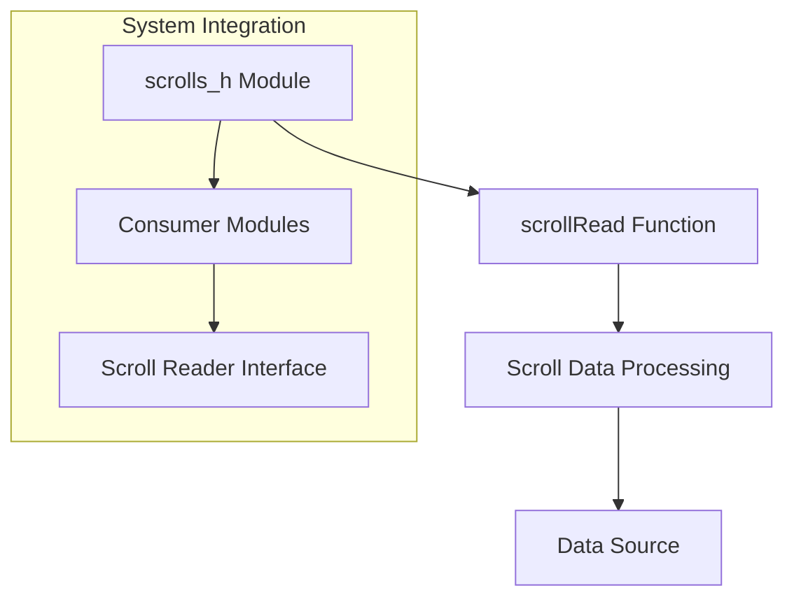
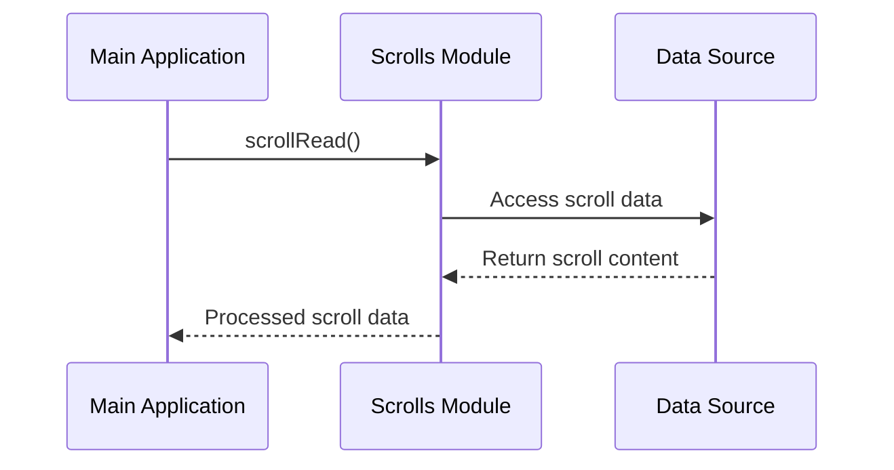

# scrolls_h Module Documentation

## Brief Introduction

The `scrolls_h` module provides the header interface for scroll reading functionality within the system. This module defines the public API contract for reading operations and serves as the primary interface for interacting with scroll data processing capabilities.

## Module Overview

The `scrolls_h` module exposes a single function declaration `scrollRead()` which represents the core functionality for reading scroll data. This header file establishes the interface contract that other modules can use to integrate scroll reading capabilities into their functionality.

## Architecture and Component Relationships

### Component Diagram


### Data Flow


## Core Functionality

### Function Declaration
```c
void scrollRead();
```

The `scrollRead()` function serves as the primary entry point for scroll reading operations. This function is responsible for:

- Initiating the scroll reading process
- Managing the data retrieval from scroll sources
- Processing scroll content according to system requirements

## Integration Points

This module integrates with the broader system through the following interfaces:

1. **Data Source Interfaces**: Connects to various scroll data sources
2. **Processing Modules**: Works with data processing components
3. **Application Layer**: Provides functionality to main application modules

## Dependencies

The `scrolls_h` module depends on:
- [scrolls_c](scrolls_c.md) - Implementation of scroll reading functionality
- System data handling components for scroll data management

## Usage Guidelines

Modules wishing to utilize scroll reading capabilities should include this header file and call the `scrollRead()` function to initiate scroll processing operations.

## Related Documentation

For implementation details, see [scrolls_c](scrolls_c.md)
For system integration patterns, see [system_integration](system_integration.md)
