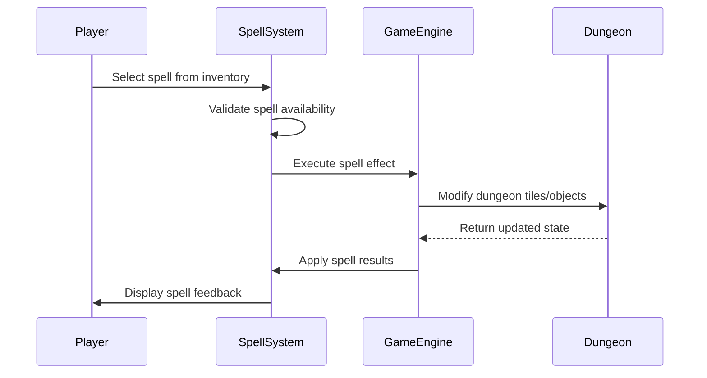

# spells_cpp Module Documentation

## Brief Introduction

The `spells_cpp` module contains the core implementation for spellcasting mechanics in the game. It handles player spell selection, spell execution, and various magical effects including combat spells, utility spells, and creature manipulation abilities. This module serves as the central hub for all spell-related functionality, interfacing with player inventory, monster systems, and dungeon management components.

## Architecture Overview

```mermaid
graph TD
    A[spells.cpp] --> B[Spell Selection System]
    A --> C[Spell Execution Engine]
    A --> D[Spell Effects Handler]
    A --> E[Creature Manipulation]
    A --> F[Area Effects]
    A --> G[Item Manipulation]
    
    B --> B1[castSpellGetId]
    B --> B2[spellGetId]
    
    C --> C1[spellFireBolt]
    C --> C2[spellFireBall]
    C --> C3[spellBreath]
    C --> C4[spellLightLine]
    C --> C5[spellStarlite]
    
    D --> D1[spellLightArea]
    D --> D2[spellDarkenArea]
    D --> D3[spellMapCurrentArea]
    D --> D4[spellIdentifyItem]
    D --> D5[spellDetectTreasureWithinVicinity]
    
    E --> E1[spellAggravateMonsters]
    E --> E2[spellDetectMonsters]
    E --> E3[spellDetectInvisibleCreaturesWithinVicinity]
    E --> E4[spellTeleportAwayMonster]
    E --> E5[spellTeleportPlayerTo]
    
    F --> F1[spellDestroyArea]
    F --> F2[spellEarthquake]
    F --> F3[spellMassGenocide]
    F --> F4[spellGenocide]
    
    G --> G1[spellRechargeItem]
    G --> G2[spellEnchantItem]
    G --> G3[spellRemoveCurseFromAllWornItems]
```

## Component Relationships

### Spell Selection System
The spell selection system provides the user interface for choosing spells from available spellbooks. It handles menu navigation, spell validation, and confirmation prompts.

**Key Functions:**
- `castSpellGetId()`: Main entry point for spell selection from inventory items
- `spellGetId()`: Core spell selection logic with menu handling

### Spell Execution Engine
This component manages the actual casting and execution of spells, including targeting, damage calculation, and visual effects.

**Key Functions:**
- `spellFireBolt()`: Single-target bolt spells
- `spellFireBall()`: Area-effect ball spells
- `spellBreath()`: Breath weapon effects
- `spellLightLine()`: Line-of-sight lighting effects

### Spell Effects Handler
Handles various magical effects that modify the game world or player state.

**Key Functions:**
- `spellLightArea()`: Illumination effects
- `spellDarkenArea()`: Darkness effects
- `spellMapCurrentArea()`: Map revelation
- `spellIdentifyItem()`: Item identification

### Creature Manipulation
Controls how spells affect monsters and creatures in the game world.

**Key Functions:**
- `spellAggravateMonsters()`: Monster anger effects
- `spellDetectMonsters()`: Monster detection
- `spellTeleportAwayMonster()`: Monster teleportation
- `spellConfuseMonster()`: Monster confusion

### Area Effects
Manages spells that affect multiple locations or creatures simultaneously.

**Key Functions:**
- `spellDestroyArea()`: Large-scale destruction
- `spellEarthquake()`: Dungeon structural changes
- `spellMassGenocide()`: Mass creature elimination

### Item Manipulation
Handles spells that modify or interact with player inventory items.

**Key Functions:**
- `spellRechargeItem()`: Item recharging
- `spellEnchantItem()`: Item enchantment
- `spellRemoveCurseFromAllWornItems()`: Curse removal

## Data Flow

## Process Flows

### Spell Casting Process
1. Player selects spell from inventory
2. System validates spell availability and prerequisites
3. Spell parameters are determined (targeting, damage, etc.)
4. Spell effect is executed with appropriate visual feedback
5. Game state is updated based on spell results
6. Player receives appropriate messages and notifications

### Spell Selection Process
1. User interface presents spell options
2. Input validation occurs for spell choice
3. Spell confirmation prompt appears
4. Spell parameters are retrieved
5. Mana cost verification occurs
6. Spell execution proceeds if conditions met

## Integration Points

This module integrates with several other core systems:

- **Player System**: Accesses player stats, inventory, and status flags
- **Monster System**: Interacts with creature data and behavior
- **Dungeon System**: Modifies dungeon tiles, features, and objects
- **Inventory System**: Handles item identification and manipulation
- **Combat System**: Implements damage calculations and effects
- **UI System**: Provides user interface elements for spell selection

## Dependencies

The `spells_cpp` module depends on:
- [headers.h](headers.md): Core game definitions and constants
- [player.h](player.md): Player character data structures
- [monsters.h](monsters.md): Monster data and behavior
- [dungeon.h](dungeon.md): Dungeon layout and tile management
- [inventory.h](inventory.md): Item handling and identification
- [config.h](config.md): Game configuration constants

## Key Constants and Configuration

The module uses several important configuration values:
- `NAME_OFFSET_SPELLS`: Spell name offset for mage spells
- `NAME_OFFSET_PRAYERS`: Prayer name offset for priest spells
- `OBJECT_BOLTS_MAX_RANGE`: Maximum range for bolt spells
- Various spell type flags and constants for different magical effects

## Error Handling

The module implements robust error handling for:
- Invalid spell selections
- Insufficient mana conditions
- Out-of-bounds targeting
- Spell failure conditions
- Item manipulation errors

## Performance Considerations

The spell system is designed with performance in mind:
- Efficient coordinate checking and bounds validation
- Minimal memory allocation during spell execution
- Optimized loops for area-effect spells
- Early termination of spell effects when possible

## Security and Validation

All spell operations include:
- Input validation for spell choices
- Bounds checking for coordinates
- Mana cost verification
- Spell level requirements
- Item validity checks

This module forms a critical part of the game's magic system, providing the foundation for all spell-based gameplay mechanics while maintaining tight integration with the broader game engine architecture.
