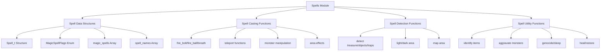
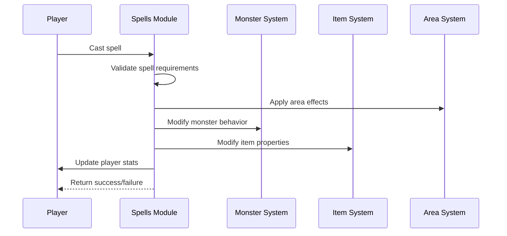

# Spells Module Documentation

## Introduction

The `spells_h` module defines the core spell system for the game, including spell types, data structures, and function declarations for various magical abilities. This module serves as the foundation for spell casting mechanics and provides the interface for spell-related operations throughout the game engine.

## Architecture Overview



## Core Components

### Spell Types Enumeration

The `MagicSpellFlags` enum defines the different spell types used throughout the spell system:

```c
enum MagicSpellFlags {
    MagicMissile,
    Lightning,
    PoisonGas,
    Acid,
    Frost,
    Fire,
    HolyOrb,
};
```

This enumeration is used by functions like `get_flags()`, `breathe()`, `fire_bolt()` and `fire_ball()` to identify spell properties and effects.

### Spell Data Structure

The `Spell_t` structure holds the base game data for each spell:

```c
typedef struct {
    uint8_t level_required;
    uint8_t mana_required;
    uint8_t failure_chance;
    uint8_t exp_gain_for_learning; // 1/4 of exp gained for learning spell
} Spell_t;
```

This structure contains essential spell parameters that determine spell availability, cost, and progression mechanics.

### Global Spell Arrays

```c
extern Spell_t magic_spells[PLAYER_MAX_CLASSES - 1][31];
extern const char *spell_names[62];
```

The `magic_spells` array stores spell data organized by player class and spell index, while `spell_names` provides localized names for all spells (with priest spells offset by 31).

## Spell Function Categories

### Spell Casting Functions

These functions handle the execution of specific spell effects:

```c
void spellFireBolt(Coord_t coord, int direction, int damage_hp, int spell_type, const std::string &spell_name);
void spellFireBall(Coord_t coord, int direction, int damage_hp, int spell_type, const std::string &spell_name);
void spellBreath(Coord_t coord, int monster_id, int damage_hp, int spell_type, const std::string &spell_name);
```

### Area Effect Spells

Functions that affect areas around the caster or target coordinates:

```c
bool spellLightArea(Coord_t coord);
bool spellDarkenArea(Coord_t coord);
void spellLightLine(Coord_t coord, int direction);
void spellStarlite(Coord_t coord);
void spellDestroyArea(Coord_t coord);
void spellEarthquake();
```

### Monster Manipulation Spells

Functions that directly affect monsters in the game world:

```c
bool spellChangeMonsterHitPoints(Coord_t coord, int direction, int damage_hp);
bool spellDrainLifeFromMonster(Coord_t coord, int direction);
bool spellSpeedMonster(Coord_t coord, int direction, int speed);
bool spellConfuseMonster(Coord_t coord, int direction);
bool spellSleepMonster(Coord_t coord, int direction);
bool spellPolymorphMonster(Coord_t coord, int direction);
bool spellCloneMonster(Coord_t coord, int direction);
void spellTeleportAwayMonster(int monster_id, int distance_from_player);
void spellTeleportAwayMonsterInDirection(Coord_t coord, int direction);
```

### Player Modification Spells

Functions that modify player attributes and status:

```c
bool spellChangePlayerHitPoints(int adjustment);
void spellLoseSTR();
void spellLoseINT();
void spellLoseWIS();
void spellLoseDEX();
void spellLoseCON();
void spellLoseCHR();
void spellLoseEXP(int32_t adjustment);
bool spellSlowPoison();
bool spellRestorePlayerLevels();
```

### Detection and Identification Spells

Functions that reveal hidden information or identify items:

```c
bool spellDetectTreasureWithinVicinity();
bool spellDetectObjectsWithinVicinity();
bool spellDetectTrapsWithinVicinity();
bool spellDetectSecretDoorssWithinVicinity();
bool spellDetectInvisibleCreaturesWithinVicinity();
bool spellDetectMonsters();
bool spellIdentifyItem();
void spellMapCurrentArea();
```

### Utility and Special Spells

Specialized spell functions for various game mechanics:

```c
bool spellRechargeItem(int number_of_charges);
bool spellDisarmAllInDirection(Coord_t coord, int direction);
bool spellSurroundPlayerWithTraps();
bool spellSurroundPlayerWithDoors();
bool spellDestroyAdjacentDoorsTraps();
bool spellAggravateMonsters(int affect_distance);
bool spellMassGenocide();
bool spellGenocide();
bool spellSpeedAllMonsters(int speed);
bool spellSleepAllMonsters();
bool spellMassPolymorph();
bool spellDetectEvil();
bool spellDispelCreature(int creature_defense, int damage);
bool spellTurnUndead();
void spellWardingGlyph();
bool spellEnchantItem(int16_t &plusses, int16_t max_bonus_limit);
bool spellRemoveCurseFromAllWornItems();
void spellCreateFood();
void spellTeleportPlayerTo(Coord_t coord);
void spellBuildWall(Coord_t coord, int direction);
```

## Component Interactions



## Integration Points

This module integrates with several other systems in the game:

- **Player System**: Manages spell learning, casting costs, and player attribute modifications
- **Monster System**: Handles monster manipulation and behavior changes
- **Item System**: Manages item enchantments, recharging, and curse removal
- **Map System**: Provides area mapping and detection capabilities
- **Combat System**: Implements spell-based combat mechanics

## Dependencies

The spells module depends on:
- [coord.h](coord.md) for coordinate handling
- [player.h](player.md) for player state management
- [monster.h](monster.md) for monster interactions
- [item.h](item.md) for item manipulation
- [game.h](game.md) for core game state

## Data Flow


## Usage Patterns

The spell system follows these usage patterns:
1. Spell selection through user interface
2. Validation against player capabilities and resources
3. Execution of appropriate spell functions
4. Game state updates based on spell effects
5. Feedback to player about spell outcomes

This module forms the backbone of the game's magical system, providing both the data structures and functional interfaces needed to implement complex spellcasting mechanics across multiple character classes and game scenarios.
