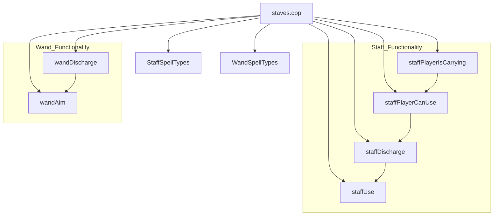
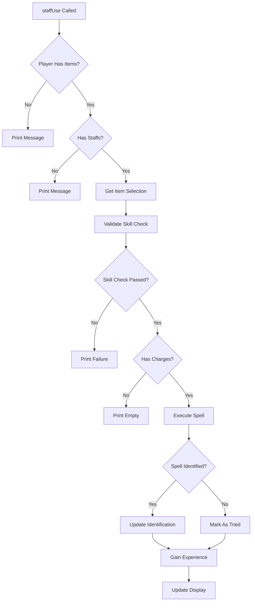
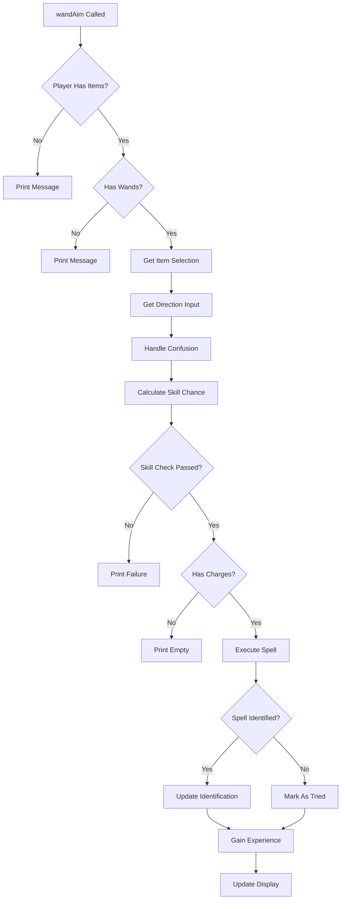

# staves_cpp Module Documentation

## Brief Introduction

The `staves_cpp` module implements the core functionality for using magical staves and wands in the game. This module handles the logic for staff usage, including charge management, spell casting, and identification mechanics. It also includes wand aiming functionality with directional targeting.

## Module Overview

This module contains the implementation for two primary game mechanics:
1. **Staff Usage** - Players can use magical staves that have various spell effects
2. **Wand Aiming** - Players can aim wands at specific directions to cast spells

Both systems handle player skill checks, charge consumption, spell effects, and item identification.

## Architecture and Component Relationships

### Core Components



### Data Flow


## Detailed Functionality

### Staff System

The staff system implements the following key features:

1. **Player Validation**: Checks if player is carrying staffs and has valid items
2. **Skill Checks**: Implements difficulty calculations based on player attributes and level
3. **Charge Management**: Handles staff charge consumption and empty state detection
4. **Spell Casting**: Executes various spell effects based on staff properties
5. **Identification**: Manages item identification and experience gain

### Wand System

The wand system provides:

1. **Directional Targeting**: Allows players to aim wands in specific directions
2. **Spell Effects**: Implements various wand spell effects with different damage types
3. **Aiming Mechanics**: Includes confusion handling and random direction generation
4. **Similar Identification**: Shares similar identification logic with staffs

## Integration Points

This module integrates with several other core systems:

- **[inventory](inventory.md)**: Uses inventory functions for item validation and selection
- **[spells](spells.md)**: Calls various spell functions for actual spell effects
- **[player](player.md)**: Interacts with player statistics and status flags
- **[identification](identification.md)**: Manages item identification and experience calculation
- **[game](game.md)**: Accesses global game state variables

## Key Constants and Enums

### StaffSpellTypes Enum
```cpp
enum class StaffSpellTypes {
    StaffLight = 1,
    DetectDoorsStairs,
    TrapLocation,
    TreasureLocation,
    ObjectLocation,
    Teleportation,
    Earthquakes,
    Summoning,
    Destruction = 10,
    Starlight,
    HasteMonsters,
    SlowMonsters,
    SleepMonsters,
    CureLightWounds,
    DetectInvisible,
    Speed,
    Slowness,
    MassPolymorph,
    RemoveCurse,
    DetectEvil,
    Curing,
    DispelEvil,
    Darkness = 25,
    StoreBoughtFlag = 32,
};
```

### WandSpellTypes Enum
```cpp
enum class WandSpellTypes {
    WandLight = 1,
    LightningBolt,
    FrostBolt,
    FireBolt,
    StoneToMud,
    Polymorph,
    HealMonster,
    HasteMonster,
    SlowMonster,
    ConfuseMonster,
    SleepMonster,
    DrainLife,
    TrapDoorDestruction,
    WandMagicMissile,
    WallBuilding,
    CloneMonster,
    TeleportAway,
    Disarming,
    LightningBall,
    ColdBall,
    FireBall,
    StinkingCloud,
    AcidBall,
    Wonder,
};
```

## Process Flows

### Staff Usage Process



### Wand Aiming Process



## Dependencies

This module depends on:
- **headers.h**: Standard game headers and definitions
- **[inventory](inventory.md)**: For inventory management functions
- **[spells](spells.md)**: For spell execution functions
- **[player](player.md)**: For player statistics and status
- **[identification](identification.md)**: For item identification logic
- **[game](game.md)**: For global game state access

## Implementation Details

### Staff Usage Logic
The staff system implements a complex skill check algorithm that considers:
- Player saving throw
- Wisdom/Intelligence adjustment
- Item depth
- Player class level adjustment
- Confusion status

### Wand Aiming Logic
Wand aiming includes additional complexity for:
- Directional targeting
- Confusion handling with random direction generation
- Similar skill check mechanics to staffs

### Identification System
Both systems implement a shared identification mechanism that:
- Updates item identification when spells are successfully cast
- Marks items as tried when spells fail to identify
- Provides experience gains for successful identification
- Handles special cases like store-bought items

## Error Handling

The module includes robust error handling for:
- Empty inventory conditions
- Invalid item selections
- Failed skill checks
- Empty charge states
- Internal consistency checks

## Performance Considerations

The implementation is designed to be efficient by:
- Using bit manipulation for spell flag handling
- Minimizing redundant calculations
- Early termination of invalid paths
- Efficient memory access patterns

## Future Enhancements

Potential improvements could include:
- Enhanced spell effect customization
- Additional staff/wand types
- Improved user interface for spell selection
- More sophisticated identification algorithms
- Better integration with existing game systems
