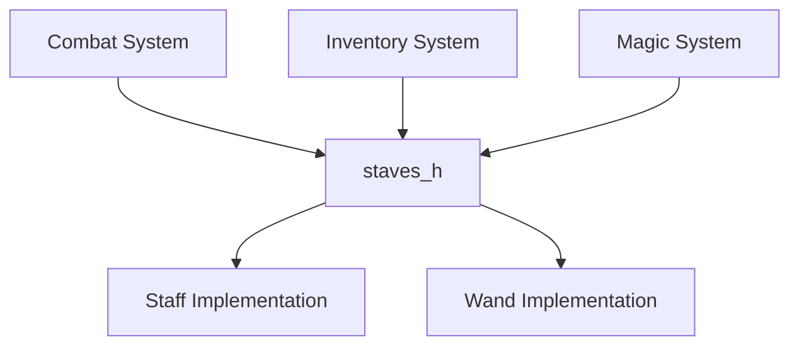
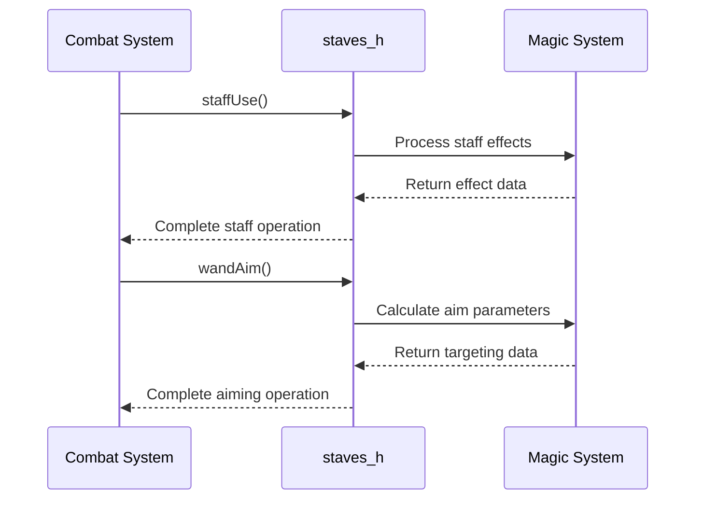
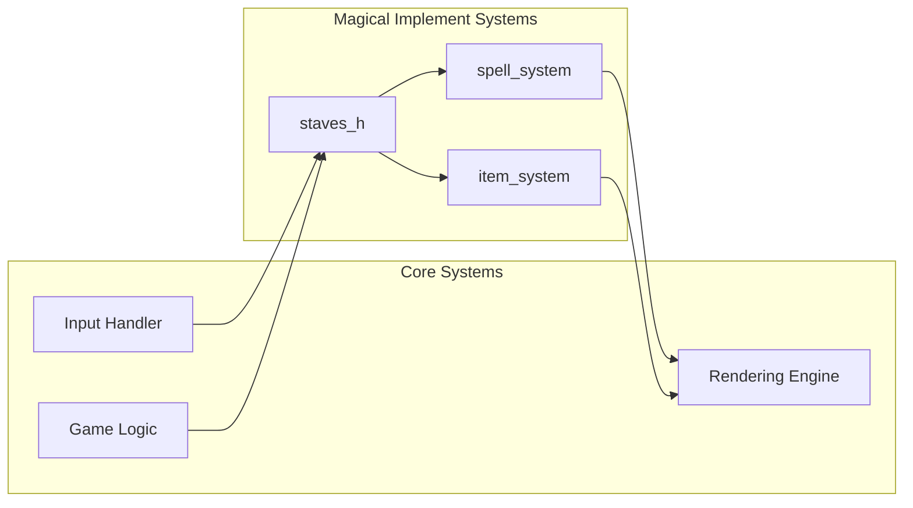
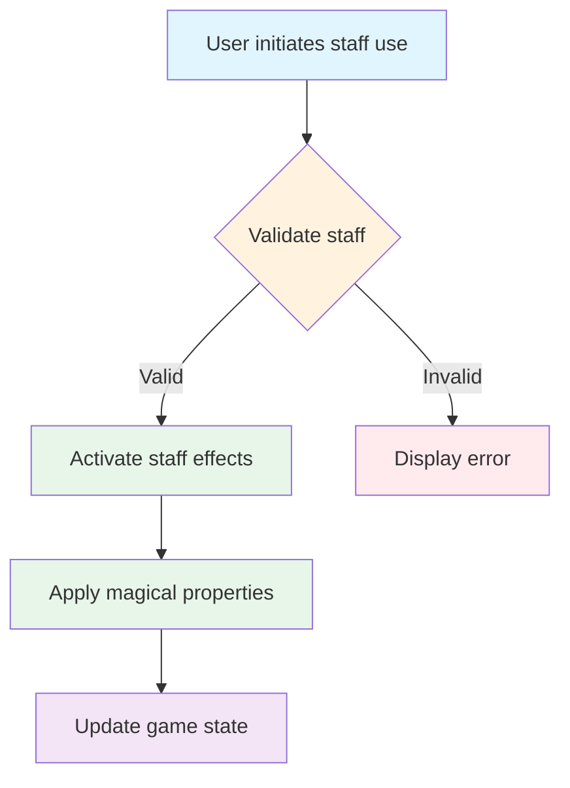
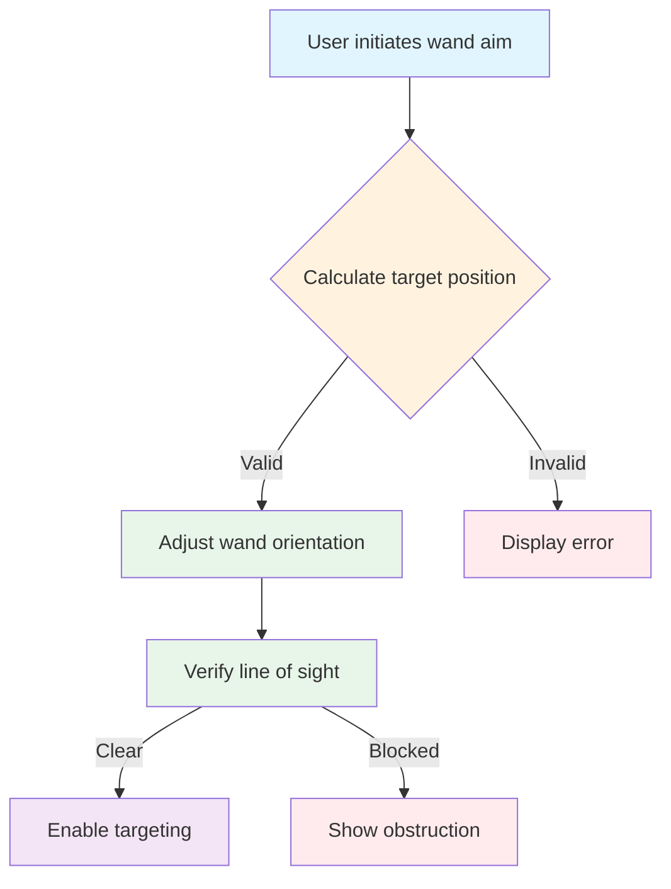

# staves_h Module Documentation

## Brief Introduction

The `staves_h` module provides the interface definitions for staff-related functionalities within the system. This header file declares the core functions that enable staff usage and wand aiming operations, serving as a contract between different components that interact with magical implements.

## Comprehensive Documentation

This module defines the public API for staff manipulation functionality. It contains function declarations that allow other modules to utilize staff-based operations without requiring knowledge of implementation details.

### Function Declarations

The module exposes two primary functions:

- `staffUse()`: Handles the activation and utilization of staff objects
- `wandAim()`: Manages wand targeting and aiming mechanics

These functions form the foundation for magical implement interactions within the system architecture.

### Module Relationships

The `staves_h` module serves as an interface layer that connects to various subsystems including:
- [magic_system](magic_system.md) - For magical effect processing
- [inventory_management](inventory_management.md) - For staff and wand handling
- [combat_engine](combat_engine.md) - For targeting and spell casting

### Data Flow

### Component Interaction

### Architecture Integration

The `staves_h` module fits into the broader system architecture as follows:

### Process Flows

#### Staff Usage Process

#### Wand Aiming Process

## References

This module depends on and integrates with several other system components:
- [magic_system.md](magic_system.md) - Provides magical effect processing capabilities
- [inventory_management.md](inventory_management.md) - Handles staff and wand inventory management
- [combat_engine.md](combat_engine.md) - Integrates with combat targeting systems

The module's interface design follows the principles established in [system_architecture.md](system_architecture.md) for maintaining clean separation of concerns while enabling effective communication between subsystems.
