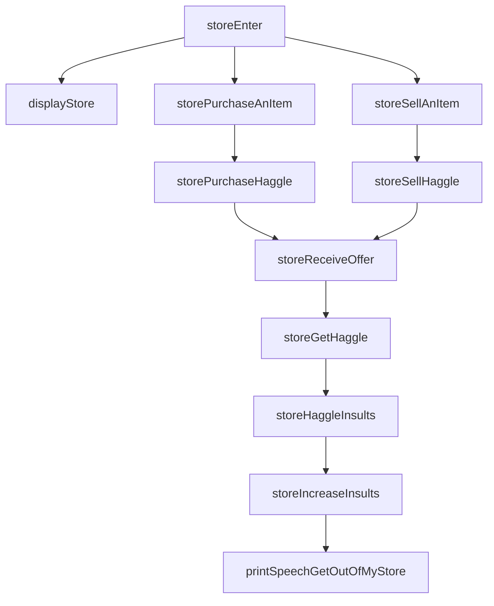
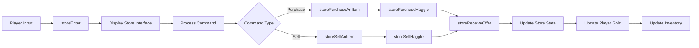

# Store C++ Module Documentation

## Introduction

The `store_cpp` module implements the store system functionality for the Moria game, handling player interactions with various store types including purchasing, selling, and haggling mechanics. This module manages the core store operations, including inventory management, pricing calculations, and player-store interactions.

## Module Overview

The store system provides the interface through which players can interact with different types of stores in the game world. It handles both buying and selling operations with sophisticated haggling mechanics that consider player charisma, store owner characteristics, and historical bargaining performance.

## Architecture and Components

### Core Components

The main component in this module is `store.cpp`, which contains all the store-related functionality:

- **Store Initialization**: Sets up store owners and inventory
- **Haggling System**: Implements complex buying/selling negotiation mechanics
- **Inventory Management**: Handles item display, purchase, and sale operations
- **Store Commands**: Processes user input for store interactions
- **Bargaining Skills**: Tracks player negotiation history and adjusts future negotiations

### Component Relationships

### Data Flow

## Detailed Functionality

### Store Initialization

The `storeInitializeOwners()` function sets up all stores with their respective owners, initializing key attributes like owner IDs, insult counters, and inventory structures. Each store gets assigned an owner from the available owner pool, ensuring proper distribution across the game world.

### Haggling Mechanics

The haggling system implements sophisticated negotiation logic with multiple phases:

1. **Initial Price Setting**: Calculates base prices considering item values, owner characteristics, and player charisma
2. **Offer Processing**: Handles player offers with incremental haggling support
3. **Insult Management**: Tracks customer behavior and responds appropriately to repeated insults
4. **Price Adjustment**: Dynamically adjusts asking prices based on negotiation progress

### Inventory Operations

The module handles both displaying and managing store inventories:

- **Display Logic**: Shows items in a scrollable format with appropriate pricing
- **Item Selection**: Processes user selection of items for purchase or sale
- **Inventory Updates**: Manages item additions/removals from store inventories

### Command Processing

The store command system supports multiple actions:

- **Purchase** (`p`): Buy items from the store
- **Browse** (`b`): Navigate through store inventory
- **Sell** (`s`): Sell items to the store
- **Inventory/Equipment** (`i/e/t/w/x`): Access player inventory and equipment
- **Exit** (`ESC`): Leave the store

## Integration Points

This module integrates with several other core systems:

- **Player System** ([player.md](player.md)): Uses player statistics like charisma for pricing calculations
- **Inventory System** ([inventory.md](inventory.md)): Manages item transfers between player and store
- **Game State** ([game_state.md](game_state.md)): Interacts with global game state variables
- **Graphics System** ([graphics.md](graphics.md)): Handles screen display and user interface elements

## Dependencies

The store module depends on several other modules:

- **Headers**: Includes standard headers and game-specific definitions
- **Player Statistics**: Requires access to player charisma and other attributes
- **Inventory Management**: Depends on inventory manipulation functions
- **Message System**: Uses message printing and display functions
- **Random Number Generation**: Utilizes random number generation for various game elements

## Key Constants and Configuration

The module uses several important constants:

- `MAX_STORES`: Maximum number of stores in the game
- `MAX_OWNERS`: Maximum number of store owners
- `MORIA_OBJ_DESC_SIZE`: Size limit for object descriptions
- `MORIA_MESSAGE_SIZE`: Size limit for messages

## Performance Considerations

The store system is designed to handle frequent user interactions efficiently:

- **Memory Management**: Uses static variables for persistent store state
- **Display Optimization**: Implements efficient screen updates and redrawing
- **Input Handling**: Processes user commands quickly without blocking gameplay

## Error Handling

The module includes robust error handling for:

- **Insufficient Funds**: Prevents purchases exceeding player gold
- **Inventory Limits**: Checks capacity constraints before transactions
- **Invalid Input**: Validates user selections and offers
- **Store Closure**: Handles closed stores appropriately

## Security and Validation

All user inputs are validated before processing:

- **Item Selection**: Ensures selected items exist and are valid
- **Price Offers**: Validates numerical input and range constraints
- **Command Processing**: Filters invalid commands and provides feedback
- **Insult Tracking**: Prevents integer overflow in insult counters

This documentation provides a comprehensive overview of the store system's functionality and integration within the larger Moria game architecture.
