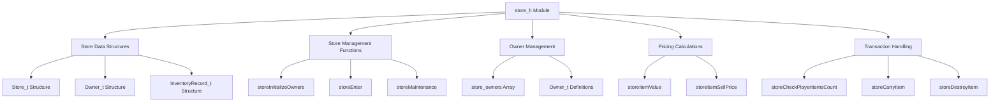

# Store Handling Module Documentation

## Overview

The `store_h` module provides the core data structures and functions for managing store systems within the game. This module handles store inventory management, owner interactions, pricing calculations, and player-store transactions. It serves as the foundation for all store-related gameplay mechanics.

## Architecture



## Core Data Structures

### Store_t Structure
The `Store_t` structure represents a single store in the game world:

```c
typedef struct {
    int32_t turns_left_before_closing;
    int16_t insults_counter;
    uint8_t owner_id;
    uint8_t unique_items_counter;
    uint16_t good_purchases;
    uint16_t bad_purchases;
    InventoryRecord_t inventory[STORE_MAX_DISCRETE_ITEMS];
} Store_t;
```

This structure maintains:
- **turns_left_before_closing**: Time remaining before store closes
- **insults_counter**: Player insult tracking for store owner
- **owner_id**: Reference to the store owner
- **unique_items_counter**: Count of unique items in inventory
- **good/bad_purchases**: Purchase history tracking
- **inventory**: Array of inventory records for store items

### Owner_t Structure
The `Owner_t` structure defines store owner characteristics:

```c
typedef struct {
    const char *name;
    int16_t max_cost;
    uint8_t max_inflate;
    uint8_t min_inflate;
    uint8_t haggles_per;
    uint8_t race;
    uint8_t max_insults;
} Owner_t;
```

Key attributes include:
- **name**: Owner's name for dialogue
- **max_cost**: Maximum price adjustment limit
- **price ranges**: Inflation parameters (max/min inflate)
- **haggles_per**: Haggling frequency settings
- **race**: Owner's racial characteristics
- **max_insults**: Maximum insults before store closure

### InventoryRecord_t Structure
```c
typedef struct {
    int32_t cost;
    Inventory_t item;
} InventoryRecord_t;
```

This structure combines item data with its current market value for store inventory management.

## Constants

The module defines several important constants:
- `MAX_OWNERS`: 18 possible store owners
- `MAX_STORES`: 6 different stores in the game
- `STORE_MAX_DISCRETE_ITEMS`: 24 maximum items per store inventory
- `STORE_MAX_ITEM_TYPES`: 26 possible item types to stock
- `COST_ADJUSTMENT`: Base price adjustment factor of 100

## External Dependencies

The module references several other system components:

- **[player.h](player.md)**: Uses `PLAYER_MAX_RACES` constant for racial adjustments
- **[inventory.h](inventory.md)**: Depends on `Inventory_t` type for item handling
- **[dialogue.h](dialogue.md)**: References various speech arrays for store interactions

## Module Components

### Store Management Functions

#### `storeInitializeOwners()`
Initializes all store owners with their respective properties and behaviors.

#### `storeEnter(int store_id)`
Handles player entry into a specific store, including initialization of store state and dialogue setup.

#### `storeMaintenance()`
Manages periodic store operations such as inventory restocking and status updates.

### Pricing and Value Functions

#### `storeItemValue(Inventory_t const &item)`
Calculates the base value of an inventory item for store pricing.

#### `storeItemSellPrice(Store_t const &store, int32_t &min_price, int32_t &max_price, Inventory_t const &item)`
Determines the sell price range for an item based on store owner characteristics and market conditions.

### Inventory Operations

#### `storeCheckPlayerItemsCount(Store_t const &store, Inventory_t const &item)`
Verifies if a player has sufficient items for purchase or sale.

#### `storeCarryItem(int store_id, int &index_id, Inventory_t &item)`
Handles adding items to a store's inventory.

#### `storeDestroyItem(int store_id, int item_id, bool only_one_of)`
Removes items from store inventory, either completely or partially.

## Data Arrays and References

### Owner Data
```c
extern Owner_t store_owners[MAX_OWNERS];
```
Array containing definitions for all possible store owners.

### Store Data
```c
extern Store_t stores[MAX_STORES];
```
Array storing all active stores in the game world.

### Item Selection
```c
extern uint16_t store_choices[MAX_STORES][STORE_MAX_ITEM_TYPES];
```
Maps store IDs to available item types for inventory selection.

### Function Pointers
```c
extern bool (*store_buy[MAX_STORES])(uint8_t);
```
Function pointers for store-specific buy operations.

### Speech Arrays
Multiple arrays contain dialogue strings for various store interactions:
- Sale acceptance messages
- Haggling conversations
- Insult responses
- Store closing messages

## Integration Points

This module integrates with:
- **[game_state.h](game_state.md)**: For turn-based store operations
- **[player_inventory.h](player_inventory.md)**: For player-item transactions
- **[dialogue_system.h](dialogue_system.md)**: For store owner conversations
- **[world_map.h](world_map.md)**: For store location management

## Usage Patterns

The store system follows these typical usage patterns:
1. Initialize store owners at game start
2. Enter stores during gameplay for transactions
3. Maintain store inventories through regular maintenance
4. Handle player purchases and sales with proper pricing
5. Manage owner reactions to player behavior (insults, haggling)

## Performance Considerations

The module uses fixed-size arrays to ensure predictable memory usage and performance. All operations are designed to be efficient for real-time gameplay, with constant-time lookups for store and owner data access.
