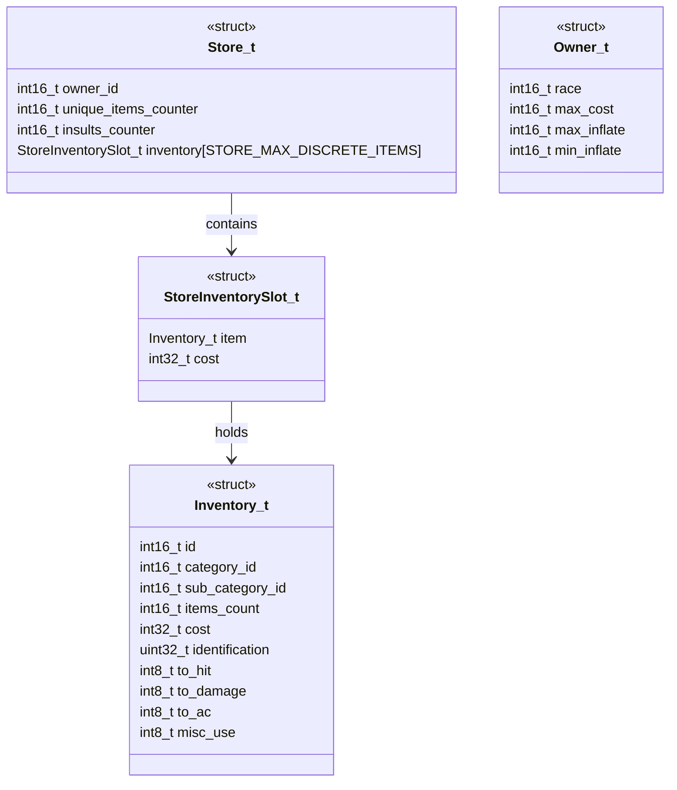
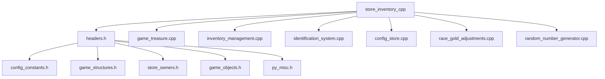
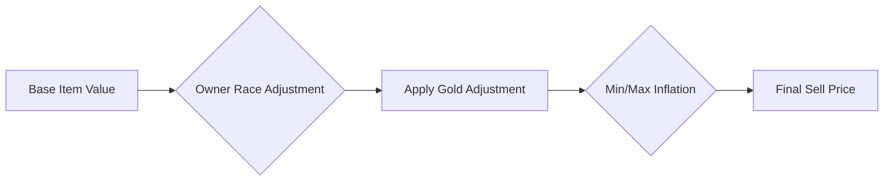

# Store Inventory C++ Module Documentation

## Introduction

The `store_inventory_cpp` module handles the management of store inventories within the game system. This module is responsible for maintaining store stock levels, calculating item values and prices, managing item insertion and removal from store inventories, and ensuring proper inventory constraints are maintained. It works closely with the game's treasure generation system and player inventory management components.

## Module Overview

This module provides core functionality for store inventory management including:
- Automatic store maintenance and stock replenishment
- Item value calculation based on item properties and identification status
- Price determination considering store owner characteristics
- Inventory insertion, deletion, and stacking logic
- Item creation and placement within store inventories

## Architecture and Component Relationships

### Core Data Structures



### Module Dependencies



## Data Flow and Processing

### Store Maintenance Process

```mermaid
flowchart TD
    A[storeMaintenance()] --> B{unique_items_counter < STORE_MIN_AUTO_SELL_ITEMS?}
    B -- Yes --> C[Calculate turnaround]
    B -- No --> D{unique_items_counter > STORE_MAX_AUTO_BUY_ITEMS?}
    D -- Yes --> E[Reduce inventory]
    D -- No --> F[Calculate turnaround]
    C --> G[Remove items]
    E --> G
    F --> G
    G --> H{unique_items_counter > STORE_MAX_AUTO_BUY_ITEMS?}
    H -- Yes --> I[Calculate additional turnaround]
    I --> J[Add items]
    H -- No --> J
    J --> K[Add items]
```

### Item Value Calculation Flow

```mermaid
flowchart TD
    A[storeItemValue()] --> B{Item cursed?}
    B -- Yes --> C[Return 0]
    B -- No --> D{Item category}
    D --> E{Weapon/Armor}
    E --> F[getWeaponArmorBuyPrice()]
    D --> G{Ammunition}
    G --> H[getAmmoBuyPrice()]
    D --> I{Potion/Scroll}
    I --> J[getPotionScrollBuyPrice()]
    D --> K{Food}
    K --> L[getFoodBuyPrice()]
    D --> M{Ring/Amulet}
    M --> N[getRingAmuletBuyPrice()]
    D --> O{Wand/Staff}
    O --> P[getWandStaffBuyPrice()]
    D --> Q{Digging tool}
    Q --> R[getPickShovelBuyPrice()]
    D --> S[Return item.cost]
    F --> T[Calculate weapon value]
    H --> U[Calculate ammo value]
    J --> V[Calculate potion/scroll value]
    L --> W[Calculate food value]
    N --> X[Calculate ring/amulet value]
    P --> Y[Calculate wand/staff value]
    R --> Z[Calculate digging tool value]
```

## Key Functions and Their Interactions

### Main Store Management Functions

1. **`storeMaintenance()`** - Controls automatic inventory adjustments based on current stock levels and configuration parameters
2. **`storeItemValue()`** - Calculates base value of items considering identification status and item properties
3. **`storeItemSellPrice()`** - Determines final selling price after applying owner-specific multipliers
4. **`storeCheckPlayerItemsCount()`** - Validates whether items can be added to store inventory
5. **`storeCarryItem()`** - Inserts items into store inventory with proper stacking logic
6. **`storeDestroyItem()`** - Removes items from store inventory with appropriate handling of stacks
7. **`storeItemCreate()`** - Generates new items and adds them to store inventory

### Price Calculation Logic

The module implements sophisticated pricing algorithms that consider multiple factors:



## Integration Points

This module integrates with several other system components:

- **Game Treasure System**: Uses `magicTreasureMagicalAbility()` for generating magical items
- **Inventory Management**: Leverages `inventoryItemStackable()` and related functions
- **Identification System**: Depends on `spellItemIdentified()` and `itemSetColorlessAsIdentified()`
- **Configuration System**: Uses constants from `config::stores` namespace
- **Random Number Generation**: Utilizes `randomNumber()` for various stochastic operations

## Configuration Dependencies

The module relies on several configuration parameters defined in the store configuration system:

- `STORE_MIN_AUTO_SELL_ITEMS`: Minimum items before auto-replenishment begins
- `STORE_MAX_AUTO_BUY_ITEMS`: Maximum items before auto-reduction occurs  
- `STORE_STOCK_TURN_AROUND`: Base turn count for inventory adjustments
- `STORE_MAX_DISCRETE_ITEMS`: Maximum discrete items per store
- `ITEM_GROUP_MIN` and `ITEM_SINGLE_STACK_MIN`: Stack behavior thresholds

## Implementation Details

### Inventory Management

The module maintains a sorted inventory list where items are ordered by category ID. When inserting new items, it uses binary search-like logic to maintain proper ordering.

### Item Stacking Rules

Items can stack under specific conditions:
- Single-stackable items (like torches) cannot stack beyond 24 units
- Group stackable items (like arrows) can stack up to 255 units
- Items with different `misc_use` values cannot stack together
- Items with different sub-category IDs cannot stack unless they're group items

### Price Determination

Prices are calculated through a multi-step process:
1. Base value calculation based on item properties
2. Race-based gold adjustment factor
3. Owner-specific inflation multipliers
4. Final price range calculation

## Performance Considerations

The module is designed for efficient operation with:
- Pre-calculated arrays for item categorization
- Early termination conditions in loops
- Minimal memory allocations during runtime
- Optimized sorting and insertion algorithms

## Related Modules

For complete system understanding, refer to:
- [game_treasure](game_treasure.md) - Treasure generation and magical properties
- [inventory_management](inventory_management.md) - General inventory handling
- [identification_system](identification_system.md) - Item identification mechanics
- [config_store](config_store.md) - Store-related configuration parameters
