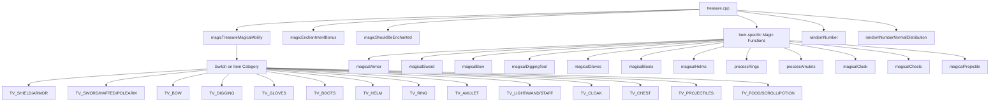
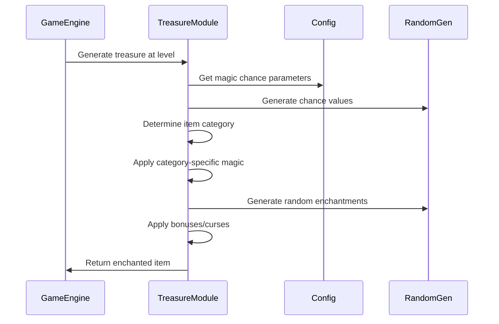
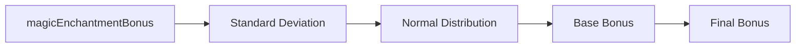
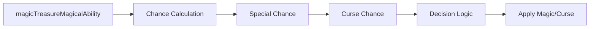
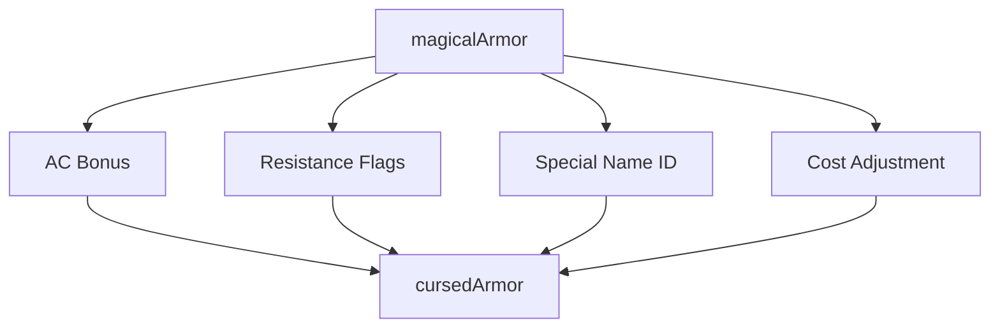
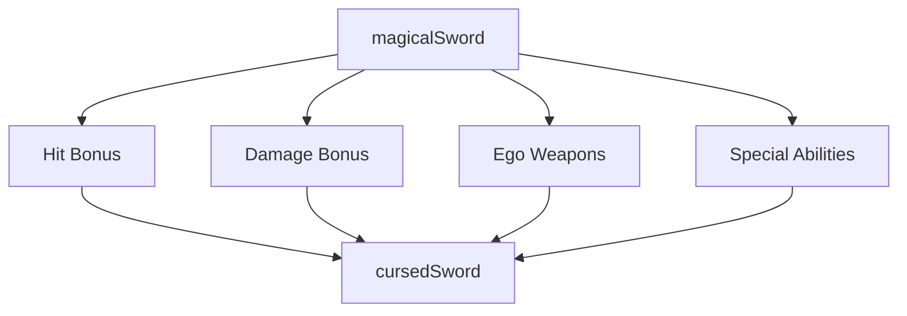
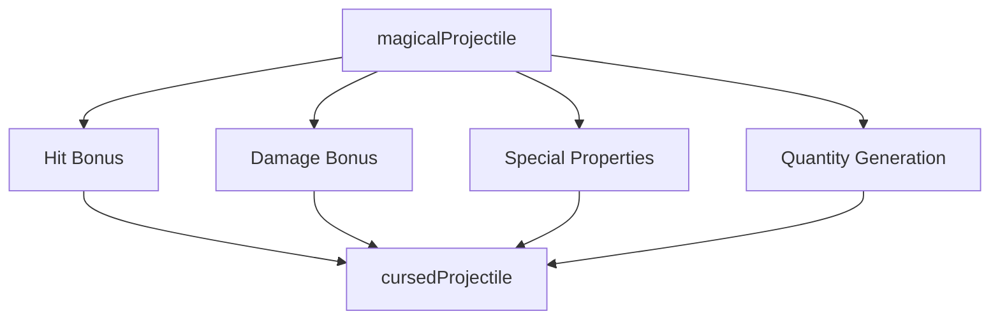
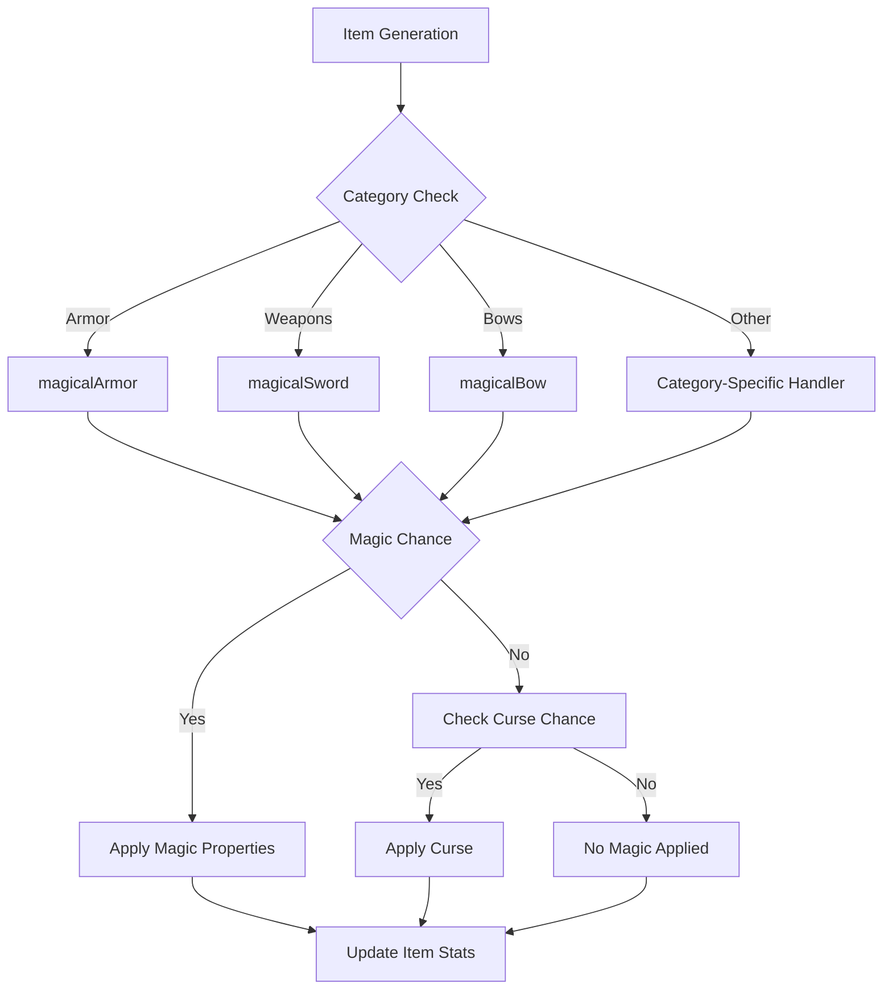
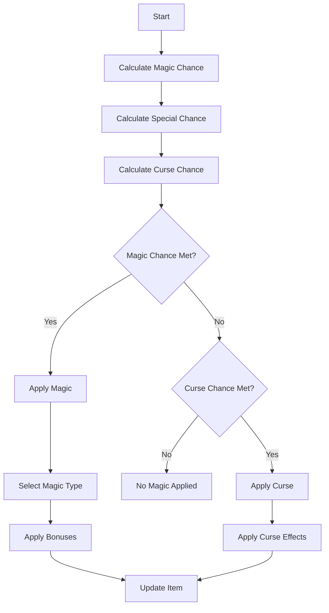

# treasure_cpp Module Documentation

## Introduction

The `treasure_cpp` module is responsible for implementing the magical properties and enchantments applied to various game items during treasure generation. This module handles the randomization of magical bonuses, curse effects, and special abilities for different item categories including weapons, armor, rings, amulets, and more.

## Architecture Overview

## Component Relationships

### Core Functions

The module operates through several key functions:

1. **`magicTreasureMagicalAbility()`** - Main entry point that determines magical properties based on item category and dungeon level
2. **`magicEnchantmentBonus()`** - Calculates enchantment bonuses using normal distribution
3. **`magicShouldBeEnchanted()`** - Determines if an item should receive magical properties
4. **Category-specific functions** - Handle magic application for specific item types

### Data Flow

## Detailed Function Descriptions

### Magic System Components

#### Enchantment Calculation

The `magicEnchantmentBonus` function calculates enchantment bonuses using a normal distribution approach with standard deviation based on level and configuration parameters.

#### Magic Probability System

The magic probability system uses configurable base chances that scale with dungeon level to determine whether items receive magical properties or curses.

### Item Category Processing

#### Armor and Shield Magic

Armor magic includes AC bonuses and resistance flags with special names and cost adjustments.

#### Weapon Magic

Weapon magic applies hit/damage bonuses and can generate ego weapons with special abilities like slaying monsters or resistance properties.

#### Projectile Magic

Projectiles use a similar system to weapons but with additional special properties like flame tongue or dragon slaying.

## Configuration Dependencies

This module relies heavily on configuration constants defined in the treasure configuration namespace:

- `config::treasure::LEVEL_STD_OBJECT_ADJUST`
- `config::treasure::LEVEL_MIN_OBJECT_STD`
- `config::treasure::OBJECT_BASE_MAGIC`
- `config::treasure::OBJECT_MAX_BASE_MAGIC`
- `config::treasure::OBJECT_CHANCE_SPECIAL`
- `config::treasure::OBJECT_CHANCE_CURSED`

For detailed configuration definitions, see [config.md](config.md).

## Integration Points

The treasure module integrates with:

1. **Game State Management** - Modifies inventory items directly through reference parameters
2. **Random Number Generation** - Uses `randomNumber()` and `randomNumberNormalDistribution()` functions
3. **Item Database** - Accesses `game.treasure.list[]` for item manipulation
4. **Configuration System** - Reads treasure-related configuration values

## Process Flows

### Main Magic Application Flow

### Enchantment Decision Tree

## Special Considerations

### Curse Handling
All cursed items follow a consistent pattern:
- Remove item value (set cost to 0)
- Apply curse flags (`TR_CURSED`)
- Apply negative bonuses to stats
- Set appropriate special names

### Special Item Categories
Some items have unique behaviors:
- **Chests**: Generate traps and special properties
- **Light sources**: Partially charge dungeon-found items
- **Food items**: Set fixed depth levels for consistency
- **Scrolls/Potions**: Set specific depth levels for balance

### Performance Notes
The module uses pre-calculated chance values and avoids expensive operations within loops. The missile counter uses a simple incrementing mechanism to track projectile quantities.

## Related Modules

This module works closely with:
- [game_state.md](game_state.md) - For accessing treasure lists and game state
- [random.md](random.md) - For random number generation functions
- [config.md](config.md) - For treasure configuration parameters
- [inventory.md](inventory.md) - For item manipulation interfaces

## Constants and Enums Used

The module references several constants from the treasure configuration:
- `config::treasure::flags::TR_RES_*` - Resistance flags
- `config::treasure::flags::TR_*` - Various item flags
- `config::treasure::chests::CH_*` - Chest flag constants
- `SpecialNameIds` - Enum for special item names

These constants define the magical properties and special behaviors available in the game world.
