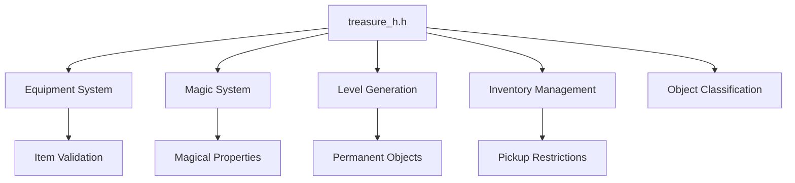
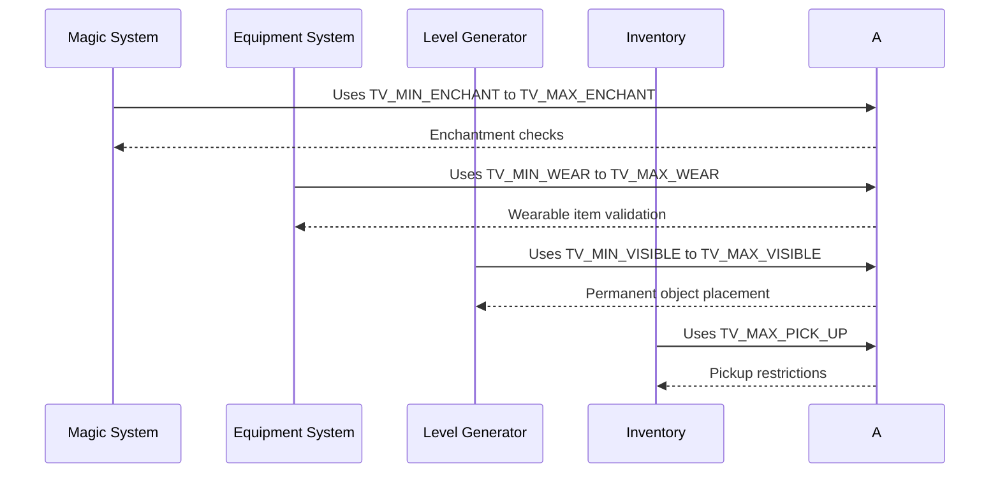
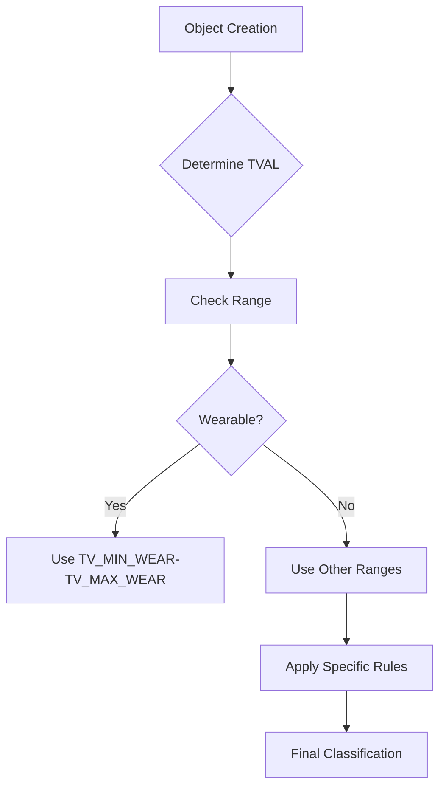

# Treasure H Module Documentation

## Brief Introduction

The `treasure_h` module serves as a foundational header file that defines treasure type values (tval) and related constants used throughout the game engine for object classification and handling. This module provides essential enumerations and boundaries for different types of game objects, particularly focusing on wearable items, magical objects, and various game elements like doors, traps, and stairs.

## Comprehensive Documentation

### Purpose and Functionality

This module establishes the core taxonomy for game objects through the definition of treasure type values (tval). These values categorize different types of items in the game world, enabling consistent identification and handling across various subsystems such as inventory management, equipment systems, magical properties, and level generation.

### Key Constants and Definitions

The module defines several important ranges and categories:

- **Basic Object Types**: TV_NOTHING, TV_MISC, TV_CHEST
- **Wearable Items Range**: TV_MIN_WEAR to TV_MAX_WEAR (10-50)
- **Enchanted Items Range**: TV_MIN_ENCHANT to TV_MAX_ENCHANT (10-39)
- **Visible Objects Range**: TV_MIN_VISIBLE to TV_MAX_VISIBLE (102-110)
- **Door Types**: TV_MIN_DOORS range (104-110)
- **Maximum Values**: TV_MAX_OBJECT (99), TV_MAX_PICK_UP (100)

### Component Relationships

The treasure type definitions interact with several other modules in the system:

- **Equipment System**: Uses TV_MIN_WEAR to TV_MAX_WEAR range for wearable item validation
- **Magic System**: Relies on TV_MIN_ENCHANT to TV_MAX_ENCHANT for magical property handling
- **Level Generation**: Utilizes TV_MIN_VISIBLE to TV_MAX_VISIBLE for permanent object placement
- **Inventory Management**: References TV_MAX_PICK_UP for item pickup restrictions

### Architecture Overview



### Data Flow and Usage Patterns



### Component Interaction Diagram

```mermaid
graph LR
    subgraph "Game Object Categories"
        A[Treasure Types]
        B[Wearable Items (10-50)]
        C[Enchanted Items (10-39)]
        D[Visible Objects (102-110)]
        E[Doors & Traps (104-110)]
    end
    
    subgraph "System Integration"
        F[Equipment System]
        G[Magical System]
        H[Level Gen]
        I[Inventory]
    end
    
    A -->|Defines| B
    A -->|Defines| C
    A -->|Defines| D
    A -->|Defines| E
    
    B --> F
    C --> G
    D --> H
    E --> H
    E --> I
```

### Process Flows

#### Object Classification Process



#### Magical Property Handling

```mermaid
flowchart TD
    A[Item Processing] --> B{Is Enchanted?}
    B -- Yes --> C[Check TV_MIN_ENCHANT-TV_MAX_ENCHANT]
    C --> D[Apply Magical Abilities]
    D --> E[magicTreasureMagicalAbility()]
    B -- No --> F[Skip Magical Processing]
```

### External Dependencies

This module depends on and integrates with:

- [equipment_h](equipment_h.md): For wearable item handling
- [magic_h](magic_h.md): For magical property implementation
- [level_gen_h](level_gen_h.md): For level generation object placement
- [inventory_h](inventory_h.md): For item pickup and management rules

### Implementation Notes

The module uses `constexpr` for compile-time constants to ensure optimal performance and type safety. The defined ranges provide clear boundaries for different object behaviors and system interactions, making it easier to maintain consistency across the codebase.

The `magicTreasureMagicalAbility()` function declaration indicates future integration with magical item processing, though the actual implementation would be found in the corresponding source file.

### Constants Summary

| Constant | Value | Description |
|----------|-------|-------------|
| TV_NEVER | -1 | Used by find_range() for non-search |
| TV_NOTHING | 0 | Empty slot |
| TV_MISC | 1 | Miscellaneous objects |
| TV_CHEST | 2 | Chest objects |
| TV_MIN_WEAR | 10 | Start of wearable items |
| TV_MAX_WEAR | 50 | End of wearable items |
| TV_MIN_ENCHANT | 10 | Start of enchanted items |
| TV_MAX_ENCHANT | 39 | End of enchanted items |
| TV_MIN_VISIBLE | 102 | Start of visible objects |
| TV_MAX_VISIBLE | 110 | End of visible objects |
| TV_MIN_DOORS | 104 | Start of door types |
| TV_MAX_PICK_UP | 100 | Maximum pickup tval |
| TV_MAX_OBJECT | 99 | Maximum object tval |

This module forms a critical foundation for object-oriented design in the game, providing standardized classifications that enable consistent behavior across multiple game systems.
