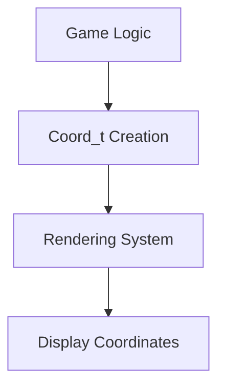
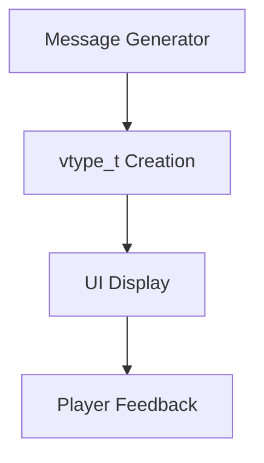
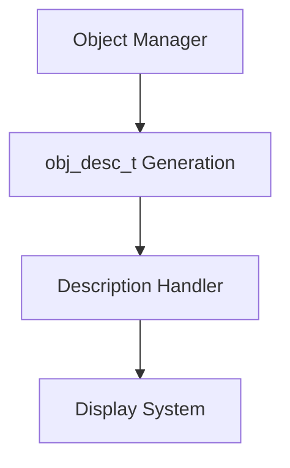

# types_h Module Documentation

## Introduction

The `types_h` module serves as a foundational type definition module for the Moria game system. It provides essential typedefs and constants that are used throughout the codebase to ensure consistent data handling and memory management. This module defines fundamental data structures and constants that are critical for maintaining type safety and reducing memory overhead in the game's implementation.

## Core Components

### Constants

The module defines several important constants that govern string sizes and provide null pointer alternatives:

- **CNIL**: A constexpr char pointer set to nullptr, serving as a proper null value replacement that avoids lint errors
- **MORIA_MESSAGE_SIZE**: Set to 80, defining the maximum size for message strings
- **MORIA_OBJ_DESC_SIZE**: Set to 160, defining the maximum size for object descriptions

### Type Definitions

The module introduces several typedefs that create standardized data types for consistent usage across the application:

- **vtype_t**: A character array of size MORIA_MESSAGE_SIZE (80 characters) used for variable-length messages
- **obj_desc_t**: A character array of size MORIA_OBJ_DESC_SIZE (160 characters) specifically designed for object descriptions
- **Coord_t**: A struct containing integer coordinates (y, x) for position tracking

## Architecture and Relationships

This module acts as a dependency for many other modules in the system that require standardized data types. The type definitions created here are referenced by various subsystems including:

- [game_logic](game_logic.md) - For message handling and coordinate systems
- [object_system](object_system.md) - For object description management
- [ui_components](ui_components.md) - For consistent display string handling

The use of variable-length character arrays instead of fixed-length ones represents a memory optimization strategy that reduces executable size while maintaining necessary functionality.

## Data Flow and Usage Patterns

The types defined in this module flow through the system as follows:

1. **Coordinate Management**: `Coord_t` structures are passed between game logic and rendering components
2. **Message Handling**: `vtype_t` is used for game messages that are displayed to players
3. **Object Descriptions**: `obj_desc_t` is utilized when describing items, monsters, or other game objects

## Process Flows

### Coordinate Processing Flow

### Message Processing Flow

### Object Description Flow

## Implementation Details

The module uses modern C++ features including:
- `constexpr` for compile-time constant definitions
- Structured typedefs for clear type naming
- Size-based constants to ensure consistent memory allocation

The decision to replace fixed-length character arrays with variable-length ones demonstrates a conscious effort to optimize memory usage while maintaining backward compatibility with existing code patterns.

## Dependencies

This module has minimal external dependencies but serves as a foundation for numerous other modules. It is typically included at the beginning of source files that require these standardized types.

## Best Practices

When using types from this module:
1. Always use `CNIL` instead of literal `NULL` or `nullptr`
2. Respect the defined size limits for `vtype_t` and `obj_desc_t`
3. Use `Coord_t` consistently for coordinate-related operations
4. Consider memory implications when working with large numbers of these structures

## Related Modules

For complete understanding of how these types are used, see:
- [game_logic](game_logic.md)
- [object_system](object_system.md)
- [ui_components](ui_components.md)
