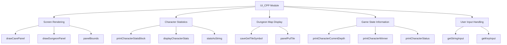
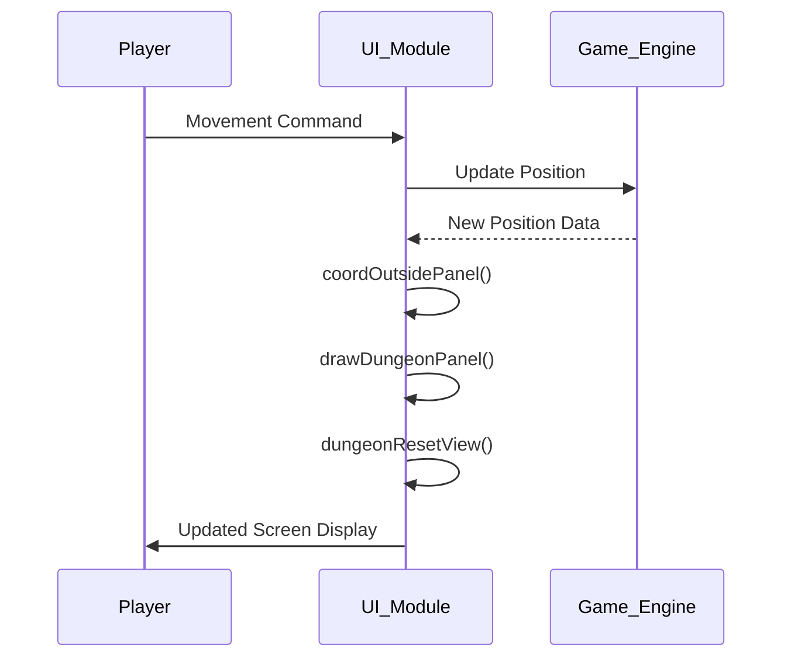

# UI C++ Module Documentation

## Introduction

The `ui_cpp` module is responsible for handling the user interface components of the Moria game. This module manages screen rendering, character statistics display, dungeon map visualization, and various UI elements that provide feedback to the player during gameplay. It serves as the primary interface between the game engine and the player, displaying essential game information such as character stats, dungeon maps, messages, and inventory details.

## Architecture Overview

## Component Relationships

### Core Components

The main components of the `ui_cpp` module include:

1. **Screen Management Functions**:
   - `drawCavePanel()` - Renders the complete screen including stats and dungeon map
   - `drawDungeonPanel()` - Displays the dungeon map portion of the screen
   - `panelBounds()` - Calculates screen boundaries for panel management

2. **Character Statistics Display**:
   - `printCharacterStatsBlock()` - Main function for displaying character information
   - `displayCharacterStats()` - Shows individual stat values
   - `statsAsString()` - Formats stat values for display

3. **Dungeon Navigation**:
   - `coordOutsidePanel()` - Manages screen panel transitions
   - `coordInsidePanel()` - Validates coordinate boundaries
   - `dungeonResetView()` - Updates view when player moves

4. **Game Status Information**:
   - `printCharacterStatus()` - Displays player conditions (blind, confused, etc.)
   - `printCharacterSpeed()` - Shows character movement speed
   - `printCharacterWinner()` - Indicates win/loss status

## Data Flow

## Detailed Function Descriptions

### Screen Management Functions

#### `drawCavePanel()`
This function clears the screen and renders the complete game interface including character statistics and the dungeon map. It orchestrates the display of all UI elements on the screen.

#### `drawDungeonPanel()`
Displays the dungeon map portion of the screen by iterating through the visible area and rendering tile symbols using `caveGetTileSymbol()` and `panelPutTile()`.

#### `panelBounds()`
Calculates and updates the boundaries of the current screen panel based on the player's position and screen dimensions.

### Character Statistics System

#### `printCharacterStatsBlock()`
The central function for displaying all character information including race, class, stats, level, experience, and various game status indicators.

#### `displayCharacterStats()`
Formats and displays individual character attributes (strength, intelligence, wisdom, etc.) using the `statsAsString()` helper function.

#### `statsAsString()`
Converts numeric stat values into formatted strings, handling special cases like high stats (18/xx format).

### Dungeon Navigation and View Management

#### `coordOutsidePanel()`
Determines when the player has moved outside the current screen panel boundaries and recalculates the appropriate panel view.

#### `coordInsidePanel()`
Validates whether a given coordinate falls within the current screen panel boundaries.

#### `dungeonResetView()`
Updates the dungeon view when the player moves, including light source positioning and room lighting calculations.

### Game State Information Display

#### `printCharacterCurrentDepth()`
Displays the player's current dungeon depth in feet or indicates "Town level" for surface areas.

#### `printCharacterWinner()`
Shows win/loss status indicators including wizard mode flags and resurrection status.

#### `printCharacterStatus()`
Displays various player condition states including hunger, blindness, confusion, fear, and poisoning.

## Integration with Other Modules

The `ui_cpp` module integrates with several other core modules:

- **[game_engine](game_engine.md)**: Receives game state data for display
- **[player](player.md)**: Accesses player statistics and status information
- **[dungeon](dungeon.md)**: Retrieves dungeon map data for rendering
- **[input](input.md)**: Handles user input for character name entry and menu navigation

## Dependencies

The module depends on several supporting headers and global variables:

- `headers.h`: Contains all necessary declarations and definitions
- Global variables: `dg`, `py`, `game`, `config::options`, `config::player::status`
- External functions: `caveGetTileSymbol()`, `panelPutTile()`, `putString()`, `getStringInput()`, `getKeyInput()`

## Usage Patterns

The UI module follows these usage patterns:

1. **Screen Refresh**: Called whenever game state changes requiring visual update
2. **Panel Management**: Automatically handles screen panel transitions during movement
3. **Status Updates**: Continuously displays real-time player conditions
4. **Input Processing**: Handles character name entry and menu interactions

## Performance Considerations

The module is designed for efficient screen updates with minimal redraw operations. Key performance considerations include:
- Only redrawing changed portions of the screen
- Efficient coordinate boundary calculations
- Optimized string formatting for stat displays
- Minimal memory allocation during normal operation

## Error Handling

The module implements basic error handling through:
- Boundary checking for coordinate validation
- Input validation for character name entry
- Safe string operations using `snprintf` and `strcpy`
- Graceful handling of invalid screen coordinates
