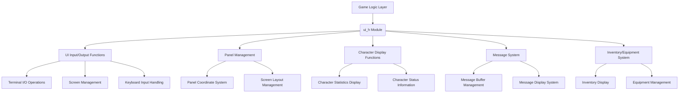
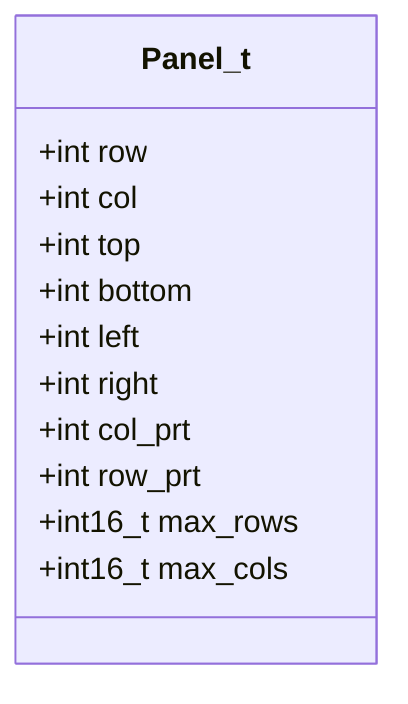
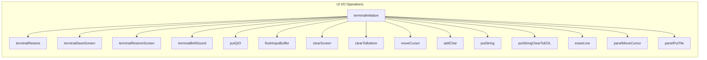
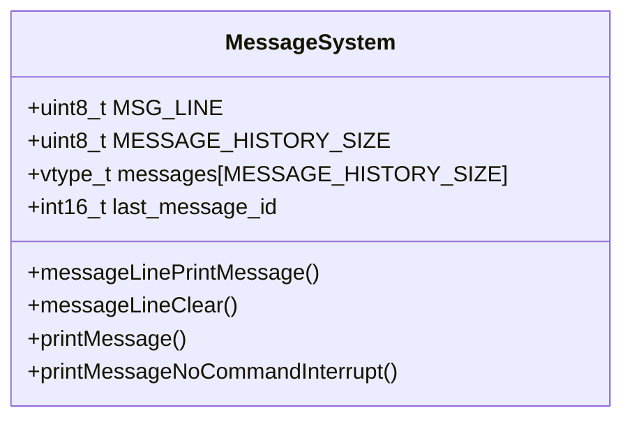
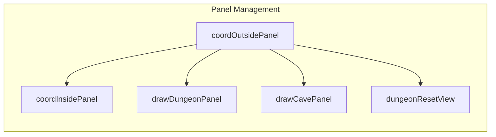
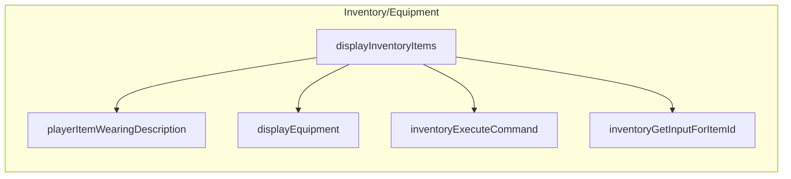
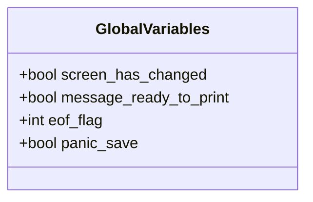
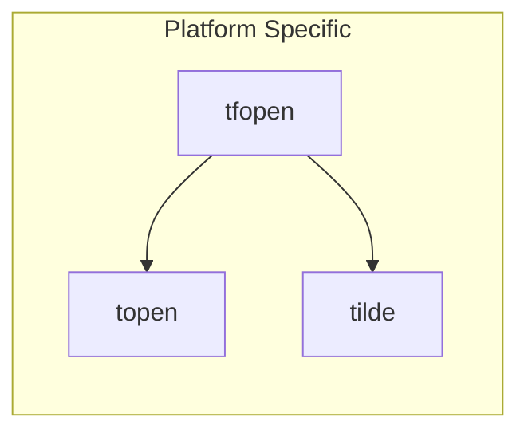

# ui_h Module Documentation

## Brief Introduction

The `ui_h` module provides the core header definitions and function declarations for the user interface layer of the game. This module defines the fundamental data structures for screen panels, declares UI input/output functions, and provides interfaces for displaying game state information including character statistics, messages, and inventory systems. It serves as the primary interface between the game logic and the terminal-based user interface.

## Architecture Overview

## Core Data Structures

### Panel_t Structure

The `Panel_t` structure represents a screen panel used for displaying dungeon or cave views:

This structure holds coordinate information for panel boundaries and printing positions, enabling proper screen layout management for different viewports like dungeon maps and cave displays.

## UI Input/Output Functions

The UI I/O functions provide low-level terminal operations for screen manipulation and user interaction:

These functions handle terminal initialization, screen clearing, cursor positioning, character output, and input buffer management.

## Message System

The message system manages game messages through a circular buffer:

Messages are stored in a fixed-size circular buffer allowing for history tracking while maintaining memory efficiency.

## Panel Management

Panel management functions handle screen layout and coordinate validation:

These functions manage coordinate validation against panel boundaries and handle drawing operations for different panel types.

## Character Display Functions

Character display functions provide comprehensive character status information:

```mermaid
graph LR
    subgraph "Character Display"
        A[statsAsString] --> B[displayCharacterStats]
        A --> C[printCharacterTitle]
        A --> D[printCharacterLevel]
        A --> E[printCharacterCurrentMana]
        A --> F[printCharacterMaxHitPoints]
        A --> G[printCharacterCurrentHitPoints]
        A --> H[printCharacterCurrentArmorClass]
        A --> I[printCharacterGoldValue]
        A --> J[printCharacterCurrentDepth]
        A --> K[printCharacterHungerStatus]
        A --> L[printCharacterBlindStatus]
        A --> M[printCharacterConfusedState]
        A --> N[printCharacterFearState]
        A --> O[printCharacterPoisonedState]
        A --> P[printCharacterMovementState]
        A --> Q[printCharacterSpeed]
        A --> R[printCharacterStudyInstruction]
        A --> S[printCharacterWinner]
        A --> T[printCharacterStatsBlock]
        A --> U[printCharacterInformation]
        A --> V[printCharacterStats]
        A --> W[statRating]
        A --> X[printCharacterVitalStatistics]
        A --> Y[printCharacterLevelExperience]
        A --> Z[printCharacterAbilities]
        A --> AA[printCharacter]
        A --> AB[getCharacterName]
        A --> AC[changeCharacterName]
        A --> AD[displaySpellsList]
        A --> AE[displayCharacterExperience]
    end
```

These functions provide detailed character information display including stats, status effects, abilities, and experience information.

## Inventory/Equipment System

The inventory and equipment system handles item management and display:

These functions manage inventory display, equipment listing, item selection, and command execution for inventory items.

## External Variables

The module exposes several global variables for UI state management:

These variables track UI state changes, message readiness, and system conditions.

## Platform-Specific Functions

On Unix-like systems, the module provides tilde expansion functions:

These functions handle file path expansion for home directory references.

## Integration with Other Modules

The `ui_h` module integrates with several other system components:

- **[game_logic.md](game_logic.md)**: Provides the core game state that UI elements display
- **[input_handler.md](input_handler.md)**: Handles keyboard input processing for UI interactions
- **[save_system.md](save_system.md)**: Manages screen state saving and restoration
- **[character.md](character.md)**: Supplies character data for display functions

## Dependencies

The module depends on:
- Standard C++ libraries for string handling and standard I/O
- Platform-specific terminal control functions
- Game state management structures defined in other modules

## Usage Patterns

The typical usage pattern involves:
1. Initializing the terminal with `terminalInitialize()`
2. Setting up panels and coordinates
3. Displaying character information using various `printCharacter*()` functions
4. Managing messages through the message system
5. Handling inventory and equipment through the inventory functions
6. Restoring terminal state with `terminalRestore()` when exiting

This module forms the foundation of the user interface layer, providing both the structural definitions and functional interfaces needed for all terminal-based game interactions.
