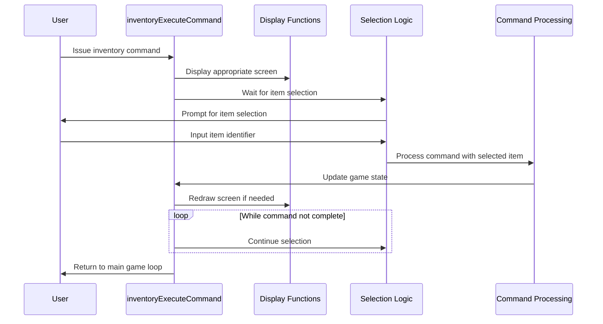

# ui_inventory_cpp Module Documentation

## Introduction

The `ui_inventory_cpp` module provides the user interface functionality for managing player inventory and equipment in the Moria game. This module handles the display, selection, and manipulation of items in both the player's inventory and equipment slots. It implements the core inventory management commands including wear/wield, take off, drop, and inventory viewing.

## Architecture Overview

```mermaid
graph TD
    A[ui_inventory.cpp] --> B[Inventory Display Functions]
    A --> C[Equipment Display Functions]
    A --> D[Inventory Command Processing]
    A --> E[Item Selection Logic]
    A --> F[Item Manipulation Commands]
    
    B --> B1[displayInventoryItems]
    B --> B2[displayEquipment]
    B --> B3[inventoryItemWeightText]
    
    C --> C1[playerItemWearingDescription]
    C --> C2[equipmentPositionDescription]
    
    D --> D1[inventoryExecuteCommand]
    D --> D2[uiCommandSwitchScreen]
    D --> D3[requestAndShowInventoryScreen]
    
    E --> E1[selectItemCommands]
    E --> E2[inventoryGetItemMatchingInscription]
    E --> E3[buildCommandHeading]
    
    F --> F1[executeRemoveItemCommand]
    F --> F2[executeWearItemCommand]
    F --> F3[executeDropItemCommand]
    F --> F4[uiCommandInventoryUnwieldItem]
```

## Core Components

### Display Functions

The module contains several key display functions that format and present inventory and equipment information:

#### `displayInventoryItems`
Displays inventory items within a specified range, handling text truncation and weight display when requested. The function calculates optimal column positioning to keep displays aligned to the right side of the screen.

#### `displayEquipment`
Shows equipped items with their positions and descriptions. It handles different display formats based on whether weights should be shown.

#### `inventoryItemWeightText`
Formats weight information for display, converting total weight into pounds and tenths of pounds.

### Equipment Management

#### `playerItemWearingDescription`
Provides descriptive text for how items are worn or carried, mapping equipment positions to human-readable descriptions.

#### `equipmentPositionDescription`
Returns position-specific descriptions for equipment items, including special cases like heavy weapons.

### Command Processing

#### `inventoryExecuteCommand`
Main entry point for inventory command processing. Handles the complete inventory command cycle including:
- Screen management and switching
- Command interpretation
- Item selection and confirmation
- State management for multi-turn operations

#### `uiCommandSwitchScreen`
Manages screen transitions between different inventory views (inventory, equipment, help).

### Item Selection and Manipulation

#### `selectItemCommands`
Handles the interactive selection of items for various commands, supporting:
- Keyboard-based item selection
- Screen switching between inventory and equipment
- Confirmation prompts for actions

#### `inventoryGetItemMatchingInscription`
Maps keyboard input to specific inventory items based on inscriptions or alphabetical position.

### Item Manipulation Functions

#### `executeRemoveItemCommand`
Processes commands to take off, drop, or throw items, handling curse checks and inventory constraints.

#### `executeWearItemCommand`
Manages equipping items, including:
- Slot assignment based on item type
- Replacement of existing equipment
- Bonus calculation adjustments
- Curse handling

#### `executeDropItemCommand`
Handles dropping items, including confirmation for multiple items.

## Data Flow

## Component Interactions

### Screen Management
The module maintains a screen state machine that manages different inventory views:
- **Blank**: No active screen
- **Help**: Help menu display
- **Inventory**: Player inventory listing
- **Wear**: Items available for wearing/wielding
- **Equipment**: Currently equipped items

### State Management
The module uses several global variables to maintain state:
- `game.doing_inventory_command`: Tracks ongoing inventory operations
- `game.screen.*`: Screen positioning and display state
- `screen_has_changed`: Indicates if screen was modified externally

### Command Flow
The command processing follows this pattern:
1. Parse command character
2. Execute appropriate action (display, select, manipulate)
3. Handle item selection and confirmation
4. Update game state and display
5. Manage continuation state for multi-turn operations

## Integration Points

This module integrates with several other system components:

- **[game_state.md](game_state.md)**: Uses global game state variables for inventory tracking
- **[player_stats.md](player_stats.md)**: Accesses player attributes for strength calculations
- **[item_system.md](item_system.md)**: Works with item definitions and inventory structures
- **[screen_manager.md](screen_manager.md)**: Manages screen rendering and display updates
- **[input_handler.md](input_handler.md)**: Processes user keyboard input for selections

## Usage Patterns

### Typical Inventory Operation Flow
1. User initiates inventory command (i, e, w, t, d, x)
2. System displays appropriate view (inventory, equipment, etc.)
3. User selects item via keyboard input
4. System validates selection and performs action
5. Game state updated and screen refreshed
6. Operation continues until user exits

### Multi-Turn Operations
Some commands (like dropping items) may require multiple turns:
- First execution sets `game.doing_inventory_command`
- Subsequent calls resume operation
- Screen state is preserved between calls

## Error Handling

The module implements several error handling mechanisms:
- Item validation before operations
- Curse checking for equipment
- Weight limit enforcement
- Inventory space availability checks
- Confirmation prompts for dangerous actions

## Performance Considerations

The module is designed to minimize screen redraw operations by:
- Keeping displays aligned to the right side of the screen
- Using efficient string formatting functions
- Managing screen state to avoid unnecessary refreshes
- Implementing early termination for invalid selections

## Dependencies

This module depends on:
- Global game state (`game`)
- Player data structures (`py`)
- Screen management utilities
- Input handling functions
- Item definition and inventory systems
- Configuration options for display preferences

The module is part of the larger Moria game system and works in conjunction with other UI and game logic modules to provide a complete inventory management experience.
