# ui_io_cpp Module Documentation

## Brief Introduction

The `ui_io_cpp` module provides terminal input/output functionality for the Moria game using the curses library. It handles all terminal interactions including screen management, keyboard input processing, message display, and user interface operations. This module serves as the primary interface between the game engine and the user's terminal environment.

## Module Overview

This module implements terminal I/O operations using the curses library for terminal manipulation. It provides functions for:
- Terminal initialization and cleanup
- Screen management and display operations
- Keyboard input handling with various prompting mechanisms
- Message display and buffering
- File operations with tilde expansion support
- Permission checking for Unix systems

## Architecture and Component Relationships

```mermaid
graph TD
    A[ui_io_cpp] --> B[Terminal Management]
    A --> C[Input Handling]
    A --> D[Display Operations]
    A --> E[Message System]
    A --> F[File Operations]
    A --> G[System Utilities]

    B --> B1[terminalInitialize]
    B --> B2[terminalRestore]
    B --> B3[terminalSaveScreen]
    B --> B4[terminalRestoreScreen]

    C --> C1[getKeyInput]
    C --> C2[getCommand]
    C --> C3[getTileCharacter]
    C --> C4[getMenuItemId]
    C --> C5[getStringInput]
    C --> C6[checkForNonBlockingKeyPress]

    D --> D1[clearScreen]
    D --> D2[clearToBottom]
    D --> D3[moveCursor]
    D --> D4[addChar]
    D --> D5[putString]
    D --> D6[putStringClearToEOL]
    D --> D7[eraseLine]
    D --> D8[panelMoveCursor]
    D --> D9[panelPutTile]

    E --> E1[printMessage]
    E --> E2[printMessageNoCommandInterrupt]
    E --> E3[messageLinePrintMessage]
    E --> E4[messageLineClear]

    F --> F1[tfopen]
    F --> F2[topen]
    F --> F3[tilde]
    F --> F4[getDefaultPlayerName]

    G --> G1[checkFilePermissions]
    G --> G2[flushInputBuffer]
    G --> G3[putQIO]
    G --> G4[getInputConfirmation]
    G --> G5[getInputConfirmationWithAbort]
    G --> G6[waitForContinueKey]
```



## Detailed Component Documentation

### Terminal Management Functions

#### `terminalInitialize()`
Initializes the terminal using curses library. Sets up screen dimensions, creates a save screen window, and configures terminal settings for game play.

#### `terminalRestore()`
Restores the terminal to its original state, cleaning up curses resources and flushing output buffers.

#### `terminalSaveScreen()` and `terminalRestoreScreen()`
Functions for saving and restoring the current screen state, useful for temporary screen changes during gameplay.

### Input Handling Functions

#### `getKeyInput()`
Reads a single character from the terminal input stream, handling special cases like Ctrl+R for screen redraw and EOF conditions.

#### `getCommand()`, `getTileCharacter()`, `getMenuItemId()`
Wrapper functions for getting user input with specific prompts, used for different types of user interactions in the game.

#### `getStringInput()`
Handles string input from the user, supporting backspace, delete, and return key processing.

#### `checkForNonBlockingKeyPress()`
Provides non-blocking input checking with timeout capability, essential for game timing and animation features.

### Display Operations

#### `clearScreen()` and `clearToBottom()`
Functions for clearing portions of the screen, maintaining proper message display behavior.

#### `moveCursor()`, `addChar()`, `putString()`, `putStringClearToEOL()`
Core display functions for positioning and rendering characters and strings on the screen.

#### `eraseLine()`, `panelMoveCursor()`, `panelPutTile()`
Specialized display functions for handling panel-based views and tile rendering.

### Message System

#### `printMessage()` and `printMessageNoCommandInterrupt()`
Main message printing functions that handle message history, combining short messages, and managing the -more- prompt.

#### `messageLinePrintMessage()` and `messageLineClear()`
Functions specifically for managing the message line display area.

### File Operations

#### `tfopen()`, `topen()`, `tilde()`
Unix-specific file operations that expand tilde (~) notation to full paths, providing convenient user home directory access.

#### `getDefaultPlayerName()`
Retrieves the default player name from system login information.

### System Utilities

#### `checkFilePermissions()`
Ensures proper file permissions on Unix systems by setting uid/gid appropriately.

#### `flushInputBuffer()`, `putQIO()`
Utility functions for managing input/output buffers and ensuring proper screen updates.

#### `getInputConfirmation()` and `getInputConfirmationWithAbort()`
Functions for user confirmation prompts with optional abort capabilities.

#### `waitForContinueKey()`
Pauses execution until the user presses any key, commonly used for game pauses and notifications.

## Data Flow and Process Flows

```mermaid
flowchart TD
    A[User Input] --> B[getKeyInput]
    B --> C{EOF Detected?}
    C -->|Yes| D[endGame or panic_save]
    C -->|No| E[Return Character]
    
    F[User Prompt] --> G[getCommand]
    G --> H[putStringClearToEOL]
    H --> I[getKeyInput]
    I --> J[Return Command]
    
    K[Message Display] --> L[printMessage]
    L --> M{Combine Messages?}
    M -->|Yes| N[Append to Current]
    M -->|No| O[New Line]
    O --> P[Store in History]
    
    Q[Screen Update] --> R[putQIO]
    R --> S[refresh()]
```

## Integration Points

This module integrates with several other system components:

- **Game Engine**: Uses `screen_has_changed` flag and interacts with `game` structure for command counting and game state management
- **Configuration System**: References `config::options::error_beep_sound` for sound preferences
- **Message System**: Works with `messages[]` array and `last_message_id` for message history
- **File System**: Interfaces with `headers.h` for file operations and `config` for configuration options

## Dependencies

The module depends on:
- `curses.h` for terminal manipulation
- `headers.h` for game structures and constants
- Standard C library functions for string and file operations
- System-specific headers for Unix permission handling and file operations

## Platform Considerations

The module includes platform-specific code for:
- macOS: Adjusts escape key delay settings
- Windows: Implements alternative non-blocking input methods
- Unix: Provides tilde expansion and permission checking

## Error Handling

The module implements robust error handling through:
- Abort on curses errors
- EOF detection and panic save procedures
- Proper cleanup on terminal restoration
- Input validation for screen boundaries
- Graceful degradation on unsupported features

## Performance Considerations

Key performance aspects include:
- Efficient screen update management via `putQIO()`
- Non-blocking input checks for responsive gameplay
- Minimal memory allocation for temporary operations
- Proper buffer flushing to maintain terminal responsiveness

This module forms the foundation of user interaction in the Moria game, providing the essential terminal I/O capabilities required for all user-facing operations.
