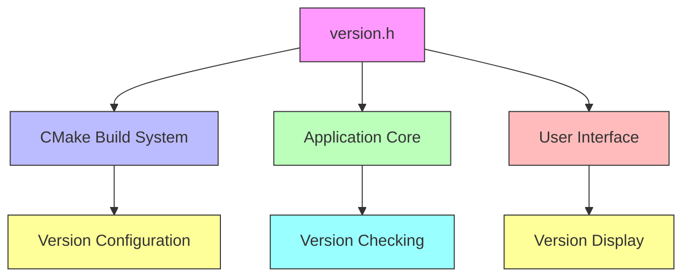
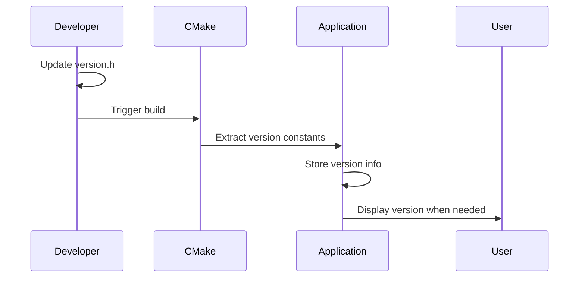

# version_h Module Documentation

## Introduction

The `version_h` module serves as the central repository for managing the version information of the Umoria game. This module contains the version constants that define the current release version of the software. The version information is crucial for build systems, compatibility checks, and user communication about software releases.

## Module Overview

The `version_h` module consists of a single header file (`version.h`) that defines three constexpr constants representing the major, minor, and patch version numbers of the Umoria application. These constants are used throughout the codebase to identify the current version and are automatically processed by the CMake build system.

### Core Components

The module contains one primary component:

- **version.h**: Header file containing version constants

## Version Constants

The module defines three constexpr uint8_t constants:

```cpp
constexpr uint8_t CURRENT_VERSION_MAJOR = 5;
constexpr uint8_t CURRENT_VERSION_MINOR = 7;
constexpr uint8_t CURRENT_VERSION_PATCH = 15;
```

These constants follow semantic versioning principles where:
- Major version (5) indicates significant changes or breaking modifications
- Minor version (7) represents new features or enhancements
- Patch version (15) denotes bug fixes or minor improvements

## Integration with Build System

The version information is tightly integrated with the CMake build system. The CMakeLists.txt file references these specific variable names to extract version information during the build process. If these variable names are modified, corresponding updates must be made in the CMake configuration files.

## Data Flow and Usage

The version constants flow through the system as follows:

1. **Build System Integration**: CMake reads the version constants from `version.h`
2. **Application Runtime**: The version information is accessible throughout the application
3. **User Interface**: Version details may be displayed in menus or help sections
4. **Compatibility Checks**: Version numbers are used for feature availability and compatibility verification

## Architecture Relationships

This module has minimal direct dependencies but interfaces with several other system components:

- **CMake Build System** ([cmake.md](cmake.md)): Required for version extraction and build configuration
- **Application Core** ([core.md](core.md)): Accesses version constants for runtime identification
- **User Interface** ([ui.md](ui.md)): May display version information to users

## Component Interactions



## Process Flow

The version management process follows this sequence:

1. **Development Phase**: Version constants are updated in `version.h`
2. **Build Phase**: CMake extracts version information from `version.h`
3. **Runtime Phase**: Application accesses version constants for various purposes
4. **Distribution Phase**: Version information becomes part of the packaged software



## Dependencies and References

This module depends on the CMake build system for proper integration and requires coordination with the build configuration files. For detailed build system integration, see the [cmake.md](cmake.md) documentation.

The version information is consumed by various parts of the application including the core engine ([core.md](core.md)) and user interface components ([ui.md](ui.md)).
