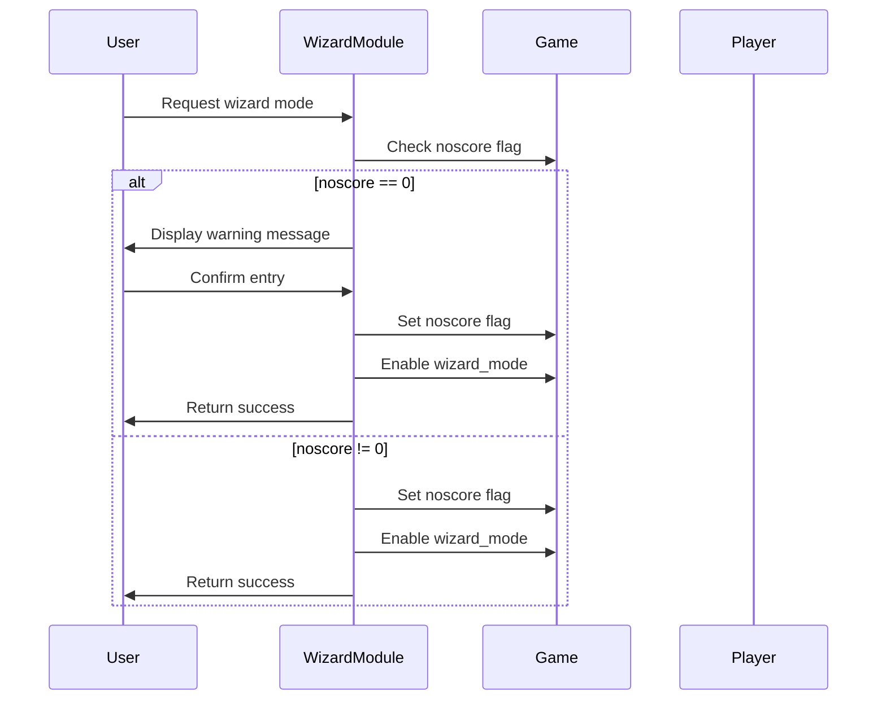
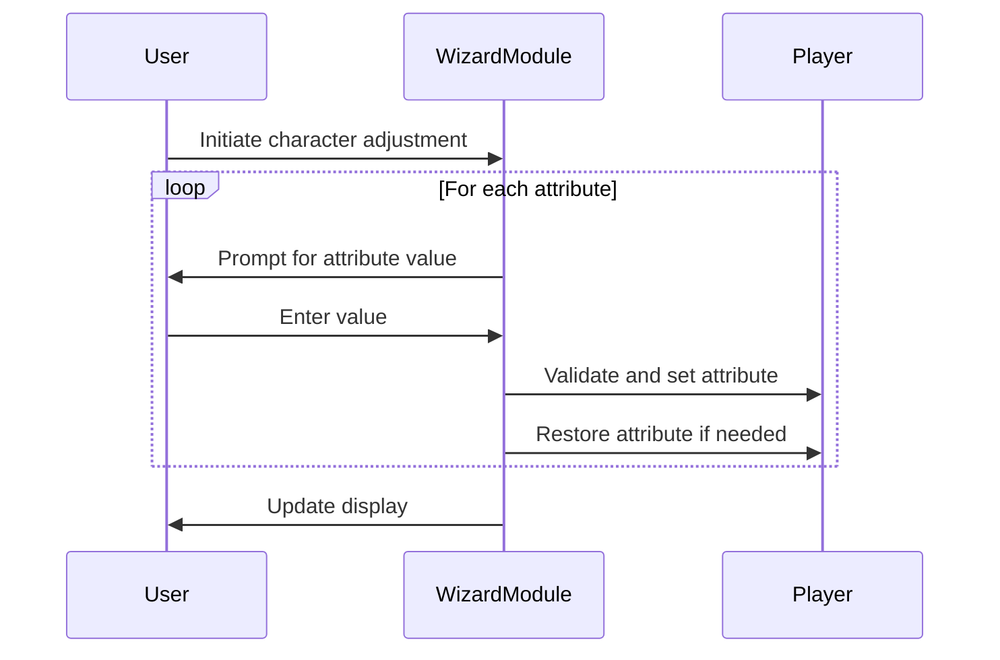
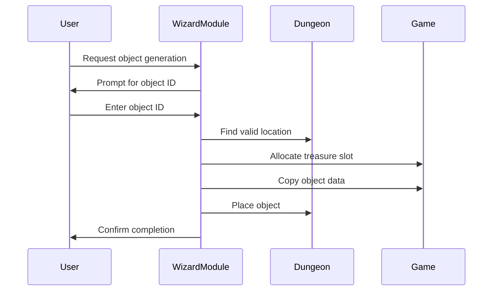

# wizard_cpp Module Documentation

## Introduction

The `wizard_cpp` module provides the implementation for wizard mode functionality in the Moria game. This module contains various debugging and experimentation tools that allow players to modify game state, create objects, adjust character attributes, and manipulate dungeon features. The module serves as a powerful diagnostic and development tool for game testing and debugging purposes.

## Module Overview

The `wizard_cpp` module implements the core wizard mode functionality through several key functions:

- **Mode activation**: Controls entry into wizard mode with appropriate warnings
- **Character manipulation**: Functions to adjust player statistics and status conditions
- **Game state modification**: Tools for changing experience, levels, and inventory
- **Dungeon manipulation**: Features to light up areas and control dungeon generation
- **Object creation**: Utilities for generating random items and custom objects

## Architecture and Component Relationships

```mermaid
graph TD
    A[wizard_cpp] --> B[enterWizardMode]
    A --> C[wizardCureAll]
    A --> D[wizardDropRandomItems]
    A --> E[wizardJumpLevel]
    A --> F[wizardGainExperience]
    A --> G[wizardSummonMonster]
    A --> H[wizardLightUpDungeon]
    A --> I[wizardCharacterAdjustment]
    A --> J[wizardGenerateObject]
    A --> K[wizardCreateObjects]
    
    B --> L[game.noscore]
    B --> M[game.wizard_mode]
    
    C --> N[playerCureBlindness]
    C --> O[playerCureConfusion]
    C --> P[playerCurePoison]
    C --> Q[playerRemoveFear]
    C --> R[playerStatRestore]
    
    D --> S[dungeonPlaceRandomObjectNear]
    D --> T[drawDungeonPanel]
    
    E --> U[game.command_count]
    E --> V[dg.current_level]
    E --> W[dg.generate_new_level]
    
    F --> X[py.misc.exp]
    
    G --> Y[monsterSummon]
    G --> Z[updateMonsters]
    
    H --> AA[dg.floor]
    H --> AB[drawDungeonPanel]
    
    I --> AC[py.stats.max]
    I --> AD[py.misc.max_hp]
    I --> AE[py.misc.mana]
    I --> AF[py.misc.au]
    I --> AG[py.misc.chance_in_search]
    I --> AH[py.misc.stealth_factor]
    I --> AI[py.misc.disarm]
    I --> AJ[py.misc.saving_throw]
    I --> AK[py.misc.bth]
    I --> AL[py.misc.bth_with_bows]
    I --> AM[py.misc.weight]
    I --> AN[playerChangeSpeed]
    
    J --> AO[wizardRequestObjectId]
    J --> AP[popt]
    J --> AQ[dungeonDeleteObject]
    J --> AR[inventoryItemCopyTo]
    J --> AS[magicTreasureMagicalAbility]
    J --> AT[itemIdentify]
    
    K --> AU[Inventory_t forge]
    K --> AV[game.treasure.list]
    K --> AW[dungeonDeleteObject]
    K --> AX[popt]
    K --> AY[tile.treasure_id]
```

## Data Flow and Process Flows

### Wizard Mode Entry Process

### Character Adjustment Process

### Object Generation Process

## Key Functions and Their Purpose

### `enterWizardMode()`
Controls entry into wizard mode with confirmation prompts. Sets appropriate flags to disable scoring and enable wizard functionality.

### `wizardCureAll()`
Removes all negative status effects from the player including blindness, confusion, poison, fear, and restores all attributes to maximum values.

### `wizardDropRandomItems()`
Places random objects near the player's current position, useful for testing item generation and inventory systems.

### `wizardJumpLevel()`
Allows jumping to specific dungeon levels or prompting for level selection, enabling quick navigation through different game depths.

### `wizardGainExperience()`
Increases player experience points, either by a specified amount or doubling the current experience.

### `wizardSummonMonster()`
Summons a random monster near the player's position for testing combat scenarios.

### `wizardLightUpDungeon()`
Toggles permanent lighting throughout the dungeon, useful for exploring dark areas without torches.

### `wizardCharacterAdjustment()`
Provides comprehensive interface for adjusting all player character attributes including stats, hit points, mana, gold, and combat modifiers.

### `wizardGenerateObject()`
Creates a specific object type at the player's location using predefined object IDs.

### `wizardCreateObjects()`
Advanced object creation tool allowing manual specification of all object properties for detailed testing.

## Integration Points

This module integrates with several core game systems:

- **Game State Management** (`game` structure) - for accessing game flags and settings
- **Player System** (`py` structure) - for modifying character attributes and status
- **Dungeon System** (`dg` structure) - for manipulating dungeon features and objects
- **Inventory System** - for object creation and placement
- **Input/Output System** - for user interaction and messaging
- **Monster System** - for summoning creatures
- **Spell System** - for removing curses and status effects

## Dependencies

The `wizard_cpp` module depends on several other core modules:

- [headers.h](headers.md) - Provides essential game definitions and includes
- [game_state.md](game_state.md) - Game state management structures
- [player_system.md](player_system.md) - Player character manipulation functions
- [dungeon_system.md](dungeon_system.md) - Dungeon generation and manipulation
- [inventory_system.md](inventory_system.md) - Object handling and inventory management
- [monster_system.md](monster_system.md) - Monster spawning and management
- [input_output.md](input_output.md) - User interface and input handling

## Security Considerations

The wizard mode intentionally disables scoring to prevent accidental game corruption. All wizard functions should only be used during development or testing phases, as they can potentially corrupt save games or create impossible game states.

## Usage Guidelines

1. **Development Only**: Wizard mode should only be used during development or testing
2. **Save Before Use**: Always save the game before entering wizard mode
3. **Understand Consequences**: Each function has potential to alter game state significantly
4. **Disable When Done**: Exit wizard mode when finished to restore normal gameplay

## Related Modules

For complete understanding of the wizard mode functionality, see:
- [game_state.md](game_state.md) - Game state management
- [player_system.md](player_system.md) - Player character systems
- [dungeon_system.md](dungeon_system.md) - Dungeon generation and manipulation
- [inventory_system.md](inventory_system.md) - Object and inventory handling
- [monster_system.md](monster_system.md) - Monster behavior and spawning
- [input_output.md](input_output.md) - User interface and input processing
