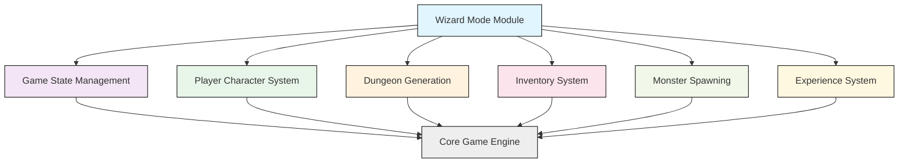
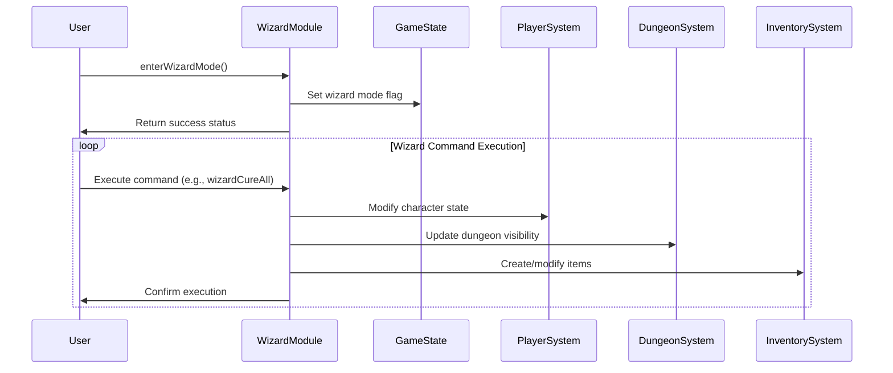

# Wizard Mode Module Documentation

## Brief Introduction

The `wizard_h` module provides a collection of administrative functions that enable wizard mode operations within the game. These functions offer powerful debugging and testing capabilities for developers and advanced users, allowing direct manipulation of game state, character attributes, dungeon generation, and object creation. This module serves as a critical tool for game development, testing, and debugging purposes.

## Module Overview

The wizard mode functionality is implemented through a set of utility functions that provide direct access to core game systems. These functions bypass normal gameplay restrictions and offer immediate effects on various game elements including player characters, dungeon environments, and inventory systems.

## Architecture and Component Relationships



## Core Functionality

### Wizard Mode Entry Point
```c
bool enterWizardMode();
```
This function initializes the wizard mode environment, setting up necessary flags and configurations to enable all wizard commands. It returns a boolean value indicating success or failure of the operation.

### Character Management Functions

#### Cure All Conditions
```c
void wizardCureAll();
```
Removes all negative status conditions from the player character, including poison, disease, blindness, and other afflictions.

#### Character Adjustment
```c
void wizardCharacterAdjustment();
```
Provides a suite of character attribute modifications including stat adjustments, level changes, and other character-related modifications.

### Dungeon Manipulation Functions

#### Light Up Dungeon
```c
void wizardLightUpDungeon();
```
Illuminates the entire dungeon map, revealing hidden areas and providing full visibility regardless of lighting conditions.

#### Jump Level
```c
void wizardJumpLevel();
```
Instantly transports the player to a different dungeon level, bypassing normal level progression mechanics.

### Experience and Progression Functions

#### Gain Experience
```c
void wizardGainExperience();
```
Grants experience points to the player character, potentially advancing them to higher levels instantly.

### Monster Management Functions

#### Summon Monster
```c
void wizardSummonMonster();
```
Creates monster entities at specified locations within the dungeon, useful for testing combat scenarios.

### Object Creation Functions

#### Generate Object
```c
void wizardGenerateObject();
```
Creates specific game objects at the player's location, enabling rapid testing of item interactions.

#### Create Objects
```c
void wizardCreateObjects();
```
Generates multiple objects simultaneously, useful for bulk testing or creating specific item collections.

## Data Flow and Process Flow



## Integration Points

The wizard mode module integrates with several core game systems:

- **[game_state.md](game_state.md)**: Manages the global game state and wizard mode flags
- **[player.md](player.md)**: Handles character attributes and status conditions
- **[dungeon.md](dungeon.md)**: Controls dungeon generation and visibility systems
- **[inventory.md](inventory.md)**: Manages item creation and inventory manipulation
- **[monster.md](monster.md)**: Provides monster spawning and management capabilities
- **[experience.md](experience.md)**: Handles experience point calculations and level progression

## Usage Considerations

### Security and Access Control
The wizard mode functions should only be accessible during development or testing phases. In production builds, these functions should typically be disabled or restricted to prevent unintended game manipulation.

### Performance Impact
While these functions are designed for development use, they may have performance implications when used extensively in large-scale testing scenarios. Care should be taken when executing multiple wizard commands in sequence.

### Debugging Benefits
These functions provide invaluable tools for:
- Testing edge cases in game mechanics
- Verifying system integrity during development
- Rapid prototyping of new features
- Diagnosing complex game state issues

## Implementation Notes

The wizard mode module operates as a utility layer that interfaces directly with core game systems. Each function maintains loose coupling with other modules while providing direct access to underlying game mechanics. This design allows for flexible testing and debugging without requiring complex setup procedures.

## Related Modules

For complete understanding of wizard mode functionality, reference the following modules:
- [game_state.md](game_state.md) - For game state management
- [player.md](player.md) - For character and status management
- [dungeon.md](dungeon.md) - For dungeon generation and visibility
- [inventory.md](inventory.md) - For item creation and management
- [monster.md](monster.md) - For monster spawning and behavior
- [experience.md](experience.md) - For experience and level progression systems

The wizard mode module serves as a bridge between the developer tools and core game systems, providing direct access to fundamental game mechanics for testing and debugging purposes.
